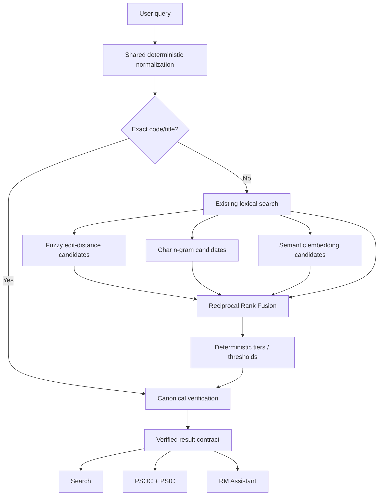
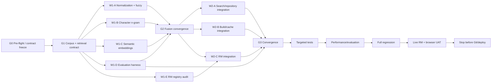

# Hybrid Classification Retrieval — Graph Engineering Implementation Plan

**Project:** PSA Statistical Classifications Search  
**Repository:** `D:\dev\historical_phclassif`  
**Branch:** `feature/pre-staging-hardening`  
**Baseline:** 3,089 tests passing; 0 fail / 0 warn / 0 skip  
**Confirmed defect:** PSOC 2022 `heavy truck driver` returns no result, while `Heavy Truck and Lorry Drivers` and code `8332` correctly return `8332 — HEAVY TRUCK AND LORRY DRIVERS`.

## 1. Objective

Implement one shared hybrid retrieval engine for Search, PSOC + PSIC, and RM:

```text
Tier 0  Existing exact/code/title/token search
Tier 1  Damerau-Levenshtein / fuzzy lexical retrieval
Tier 2  Character 3–5 gram TF-IDF cosine retrieval
Tier 3  Multilingual sentence-transformer embeddings
        ↓
Candidate fusion / deterministic reranking
        ↓
Canonical repository verification
```

Approximate and semantic retrieval are **candidate generators only**. They never create or authorize classification codes.

Preserve the RM rule:

> No retrieved/verified code = no authoritative code.

## 2. Core contracts

1. Exact code outranks everything.
2. Exact normalized official label outranks approximate matches.
3. Existing deterministic ranking must not regress.
4. Approximate retrieval must respect requested system/version/level.
5. No silent switch to archived editions.
6. Canonical labels/codes are never rewritten.
7. Search similarity is not automatic statistical coding.
8. Semantic retrieval must fail open to lexical retrieval if its backend is unavailable.
9. The same retrieval service must serve Search, PSOC + PSIC, and RM.
10. Do not create an LLM-only semantic-search path.

## 3. Architecture



Use **Reciprocal Rank Fusion (RRF)** initially because lexical, edit-distance, n-gram, and embedding scores are not naturally calibrated to a common scale. Exact code/title tiers stay outside RRF and remain dominant.

## 4. Preferred implementations

### 4.1 Damerau-Levenshtein

Prefer an R-native implementation if adequate. Do not introduce Python only to get RapidFuzz.

Use edit distance for typos/transpositions such as:

```text
hevy truck driver
trcuk driver
```

Bound comparisons with a lexical shortlist and/or score cutoff where practical.

### 4.2 Character n-grams

Implement:

```text
character 3–5 grams
TF-IDF weighting
sparse matrix
cosine similarity
precomputed immutable index
top-K retrieval
```

This tier should solve many morphology/partial-wording cases such as:

```text
heavy truck driver
heavy truck drivers
```

without a large NLP runtime.

### 4.3 Sentence-transformer embeddings

Use a **multilingual sentence-transformer family** suitable for English, Filipino, Cebuano, and mixed-language queries.

Do not hardwire a heavy Python/PyTorch runtime into Shiny unless deployment analysis proves it acceptable.

Preferred abstraction:

```text
retrieval embedding interface
  ├── local development backend
  ├── secured self-hosted production endpoint
  └── optional future hosted provider
```

Precompute document embeddings at build time; runtime normally embeds only the query.

If the semantic backend is down:

```text
semantic unavailable
  -> continue with lexical + fuzzy + n-gram
  -> do not crash Search or RM
```

## 5. Normalization contract

Build one deterministic normalizer and test it independently.

Audit/handle:

- Unicode normalization
- case folding
- repeated whitespace
- NBSP
- punctuation where safe
- hyphens/apostrophes
- classification-code punctuation preservation
- controlled singular/plural morphology

Avoid aggressive stemming.

Canonical output remains unchanged.

## 6. Ranking policy

Recommended tiers:

```text
0A exact code
0B exact normalized official title
0C existing deterministic strong matches
1  fused lexical/fuzzy/ngram candidates
2  semantic-only candidates above evaluated threshold
```

Do not allow a semantic-only candidate to outrank an exact code/title result.

Do not expose raw similarity as a statistical probability.

User-facing language may distinguish:

```text
Matched official code
Matched official title
Related classification result
Possible match — review duties/context
```

## 7. Canonical verification

Every final candidate must map back to an existing repository entry by:

```text
system
version
code
```

before presentation.

For RM occupation fallback:

```text
assistant_search_classification()
  -> no sufficient official candidate
  -> optional assistant_search_common_pairings()
  -> candidate code
  -> assistant_get_classification_entry()
  -> verified canonical entry
```

Common pairings remain supporting evidence only.

## 8. RM tool registry audit

Audit `assistant_search_classification()` against the canonical registry.

Prior inspection showed a likely stale enum containing:

```text
psgc, psic, psoc, psced, pcoicop, pcpc, psccs
```

while current application support also includes systems such as:

```text
pscc, ptscs, pscrcs
```

Prefer one authoritative helper over duplicated system lists if compatible with `ellmer` tool-schema construction.

## 9. Graph engineering DAG



## 10. File ownership

### Convergence-owner only

Reserve:

```text
R/search.R
R/repository.R
R/assistant/assistant_tools.R
renv.lock
manifest.json
```

Parallel agents may return patch proposals for these files but must not edit them concurrently.

### W1-A — normalization + fuzzy

Own new modules/tests such as:

```text
R/retrieval/retrieval_normalize.R
R/retrieval/retrieval_fuzzy.R
tests/testthat/test-retrieval-normalize.R
tests/testthat/test-retrieval-fuzzy.R
```

### W1-B — n-gram

```text
R/retrieval/retrieval_ngram.R
scripts/build_retrieval_ngram_index.R
tests/testthat/test-retrieval-ngram.R
```

### W1-C — embeddings

```text
R/retrieval/retrieval_embeddings.R
R/retrieval/retrieval_embedding_provider.R
scripts/build_retrieval_embeddings.*
tests/testthat/test-retrieval-embeddings.R
```

### W1-D — evaluation

```text
data-raw/retrieval_eval_cases.csv
R/retrieval/retrieval_eval.R
scripts/evaluate_retrieval.R
tests/testthat/test-retrieval-eval.R
```

### W1-E — RM audit

Audit only in parallel. Return a bounded patch proposal for the convergence owner.

## 11. Token-optimized worker protocol

Each worker receives only:

1. this specification;
2. files it owns;
3. public retrieval contract;
4. directly relevant tests;
5. one compact baseline note.

Exploration rule:

```text
search exact symbol
-> open defining file
-> open directly called dependencies
-> open relevant tests
-> stop
```

Each worker returns only:

```text
files read
files changed/proposed
constraints found
implementation summary
targeted tests
unresolved issue
handoff to convergence owner
```

No worker runs the full suite or summarizes unrelated project history.

## 12. Evaluation corpus

Create a versioned evaluation dataset with at least:

```text
case_id
system
version
query
expected_code
expected_level
query_type
language
must_find
notes
provenance
```

Suggested query types:

```text
exact_code
exact_label
case_variant
singular_plural
typo
partial_label
paraphrase
filipino
cebuano
mixed
ambiguous
negative_no_authoritative_code
```

Measure:

- Recall@1
- Recall@3
- Recall@5
- Mean Reciprocal Rank
- negative/no-result correctness
- latency p50/p95

Do not optimize only for `heavy truck driver`.

## 13. Required regression cases

Pin at minimum:

```text
8332
  -> exact code remains first

Heavy Truck and Lorry Drivers
  -> exact title remains first

heavy truck driver
  -> 8332 within accepted rank

heavy truck drivers
  -> 8332 within accepted rank

hevy truck driver
  -> 8332 within accepted rank

trcuk driver
  -> 8332 within accepted rank
```

Add confusable/negative occupation cases to prevent broad false positives.

## 14. Performance and caching

Benchmark at least:

- PSOC 2022
- current PSIC
- PSCC 2022
- PSGC with long release history
- largest composite classification

Capture:

```text
cold index load
warm query p50
warm query p95
peak memory
ngram index size
embedding index size
semantic query latency
```

Indexes are immutable read-mostly artifacts loaded once per R process where safe.

Do not rebuild per query or per Shiny session.

## 15. Existing contracts that must not regress

Preserve:

- truthful total-result counts vs 200-row materialization cap
- PSOC + PSIC independent query/state
- PTSCS/PSCrCS component behavior
- PSCC hierarchy and cross-reference semantics
- PSGC release behavior
- Current/Archived semantics
- RM session isolation
- Subtle Gradient UI/responsive fixes
- no horizontal overflow at tested widths

This is retrieval work, not a UI redesign.

## 16. Staged gates

### Gate A — lexical hardening

Before semantic retrieval becomes default:

- exact ranking unchanged
- fuzzy + n-gram implemented
- `heavy truck driver` fixed
- typo/morphology cases improve
- negative cases remain safe

### Gate B — semantic value

Compare:

```text
baseline
lexical + fuzzy + n-gram
full hybrid with embeddings
```

Semantic retrieval must materially improve paraphrase/multilingual Recall@K/MRR before it becomes default.

If not, keep it optional and report that result.

### Gate C — integration

Search, PSOC + PSIC, and RM all use the same shared retrieval contract.

### Gate D — final

Run:

```powershell
Rscript scripts/run_tests.R
Rscript -e "renv::status()"
```

Required:

```text
FAIL 0
WARN 0
SKIP 0
```

Pass count may increase from 3,089.

Do not regenerate `manifest.json` unless dependencies actually change.

## 17. Live RM acceptance

Using the already configured real provider only after deterministic gates pass, test:

```text
What is the PSOC code for a heavy truck driver?
What is PSOC 8332?
Search PSOC 2022 for Heavy Truck and Lorry Drivers
What PSIC classification applies to a bakery?
I work as a nurse in a private hospital. What are my PSOC and PSIC classifications?
What is PSCC code 0101.29.00-001?
What is the difference between PSCC and PSCCS?
What are the components of PTSCS?
What are the components of PSCrCS?
Give me the official PSOC code for professional AI prompt engineer.
```

Then test Filipino, Cebuano, mixed language, and two-session isolation.

## 18. Stop condition

Do not:

- commit
- push
- tag
- merge
- deploy
- republish Connect Cloud

Return the engineering report first.

## 19. Required final report

1. pre-flight state
2. root cause
3. graph/workstreams executed
4. files changed
5. dependencies added/avoided
6. normalization
7. Damerau-Levenshtein
8. n-gram implementation
9. semantic embedding backend
10. fusion/ranking
11. canonical verification
12. RM registry/fallback changes
13. evaluation corpus
14. Recall@1/@3/@5/MRR before vs after
15. negative cases
16. performance/memory/index sizes
17. targeted tests
18. full regression
19. `renv::status()`
20. live RM results
21. remaining edge cases
22. recommended default retrieval profile
23. whether semantic retrieval materially improved results
24. explicit confirmation that no Git/deployment action occurred
