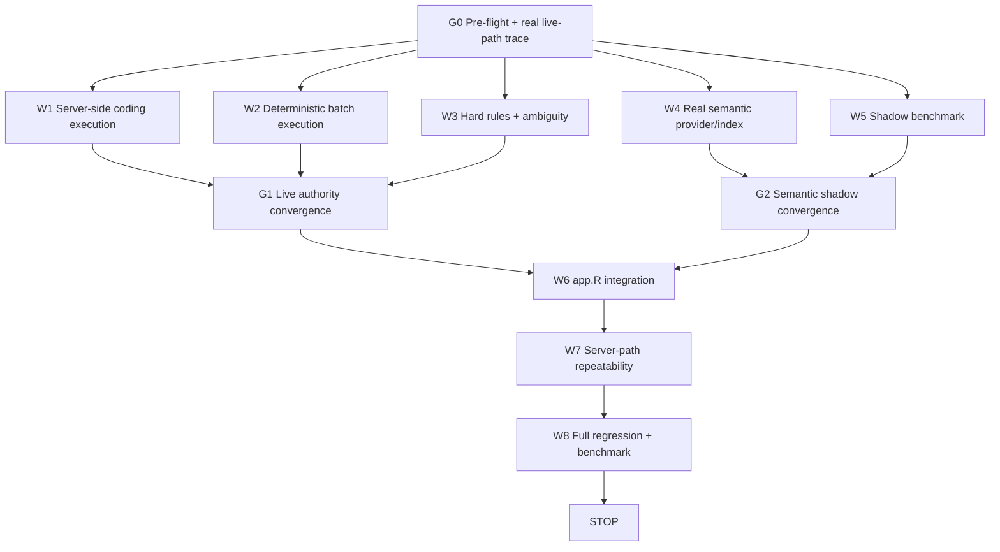

# Live RM Execution Hardening + Semantic Shadow Retrieval

**Repository:** `D:\dev\historical_phclassif`  
**Branch:** `feature/pre-staging-hardening`  
**Current HEAD:** `16ce9a74d7371da9471d0b5a155265e1e1aa00da`  
**Current tag:** `pre-staging-v9`  
**Next target:** `pre-staging-v10`

---

# 1. Mission

`pre-staging-v9` failed live browser acceptance despite strong local deterministic tests.

This phase has two parallel objectives:

```text
TRACK A — LIVE EXECUTION HARDENING
Make the Shiny server, not the LLM, control all authoritative coding workflows.

TRACK B — SEMANTIC SHADOW RETRIEVAL
Run real semantic retrieval and benchmark it, but do NOT allow semantic candidates
to alter final PSOC/PSIC codes yet.
```

Core rule:

> Semantic retrieval may propose candidates. Only deterministic R code may authorize a classification.

For `pre-staging-v10`, semantic retrieval is **shadow-only and non-authoritative**.

---

# 2. Live v9 failures that govern this phase

The following were observed in the real browser path:

```text
mayor psoc psic
-> first request: PSOC 1111 + generic PSIC clarification
-> same request repeated: PSOC 1111 + PSIC 84113
-> incognito still asked establishment type

city administrator in city government
-> 1112 + 84113, correct

statistician at PSA
-> 2122 + 8411 aggregate
-> then asks regional/local even though PSA is national

teacher in a private high school
-> 2330 correct
-> 85312 selected immediately, potentially over-specific

palay farmer
-> 6111 + 0112 aggregate
-> upland -> 01123, correct

corn farmer
-> 6112 + 01130, correct

truck driver psoc heavy truck driver psoc bus driver psoc
-> repeated "Checking..." loop
-> no usable response

carpenter psoc psic
-> incorrectly returned PSIC 08106 Construction sand and gravel quarrying

janitor deployed at hospital through manpower agency
-> incorrectly returned hospital PSIC 86111
-> wage-payer rule bypassed

six-item batch
-> repeated "Checking..." loop
-> no deterministic multi-result response
```

The remaining problems therefore include:

```text
A. live execution-route inconsistency
B. batch/model-tool-loop failure
C. deterministic precondition bypass
D. over-specific detailed classification
E. semantic recall still worth evaluating separately
```

---

# 3. Non-goals

Do NOT:

```text
make semantic top-1 authoritative
enable semantic fusion into allowed_codes
remove deterministic routing
remove response guard
remove current-edition enforcement
remove canonical verification
change gpt-4o-mini
change conversational provider
redesign the UI
merge main
deploy production
commit/push/tag until explicitly approved
```

---

# 4. Parallel graph-engineering DAG



Run W1-W5 in parallel where possible.

---

# 5. File ownership

## W1 — server-side execution

Primary ownership:

```text
R/assistant/assistant_router.R
R/assistant/assistant_coding_service.R
R/assistant/assistant_turn_state.R
new assistant_execution*.R only if needed
execution tests
```

Do not independently edit `app.R`.

## W2 — batch

Primary:

```text
R/assistant/assistant_batch.R
R/assistant/assistant_response_guard.R
batch/render tests
```

## W3 — hard rules / ambiguity

Primary:

```text
R/assistant/assistant_compat.R
R/assistant/assistant_contextual_coding.R
R/assistant/assistant_context.R
R/assistant/assistant_survey_guidance.R
government/outsourcing/education/carpenter tests
```

## W4 — semantic provider/index

Primary:

```text
R/retrieval/retrieval_embedding_provider.R
R/retrieval/retrieval_embeddings.R
scripts/build_retrieval_embeddings.R
semantic tests
```

## W5 — shadow benchmark

Primary:

```text
data-raw/retrieval_semantic_eval_cases.csv
scripts/evaluate_retrieval.R
shadow-eval tooling
```

## W6 — integration

Exclusive owner:

```text
app.R
manifest.json
runtime semantic mode/config wiring
```

---

# 6. Token optimization

Claude Code must:

```text
search before reading full files
build one G0 architecture map and reuse it
avoid repeatedly rereading modules
reuse existing retrieval/embedding abstractions
keep subagent reports compact
avoid duplicate eval corpora
run targeted tests before full suites
freeze interfaces at G1/G2 before app.R integration
```

Each worker returns only:

```text
root cause
files changed
interface
tests
measurements
blockers
```

---

# 7. G0 pre-flight

Run:

```powershell
git branch --show-current
git status --short
git log -3 --oneline --decorate
git rev-parse HEAD
git tag --points-at HEAD
git diff --check
```

Required:

```text
branch = feature/pre-staging-hardening
HEAD   = 16ce9a74d7371da9471d0b5a155265e1e1aa00da
tag    = pre-staging-v9
tree   = clean
```

If not, STOP.

---

# 8. Trace the real browser execution path

Before editing, trace:

```text
user message
-> Shiny event
-> route determination
-> batch detection
-> pending state
-> model/provider call
-> tool loop
-> coding service
-> packet
-> response guard
-> render/append
```

Answer with concrete code paths:

1. Why can the same `mayor psoc psic` query return different first-turn outcomes?
2. Can the model/tool loop execute before route/state are fully established?
3. Is `batch_contextual_coding` actually bypassing the ordinary chat loop?
4. How can the outsourcing wage-payer rule still be skipped live?
5. How can carpenter receive PSIC 08106 despite the local clarification contract?
6. Can the response guard/render path use the wrong/latest packet for a turn?

Do not modify code until these mechanisms are known.

---

# 9. W1 — server-side coding interception

For authoritative coding routes, stop letting the model control workflow.

Required architecture:

```text
USER
  ↓
SHINY SERVER
  ↓
assistant_route_request()
  ↓
if coding route:
    deterministic coding service executes FIRST
    structured packet exists FIRST
    authoritative result rendered from R
    optional LLM explanation only afterward
```

Coding routes:

```text
exact_code_lookup
contextual_coding
batch_contextual_coding
```

The model must not choose whether to invoke the coding service.

---

# 10. Direct server handler

Create/refactor toward one server-facing handler, conceptually:

```text
assistant_handle_turn(text, turn_state, ...)

route
  -> exact lookup
  -> contextual coding
  -> batch coding
  -> clarification continuation
  -> non-coding conversational route
```

The handler must be testable outside full browser UAT.

---

# 11. Authoritative rendering

For coding routes, R owns:

```text
code
label
level
coding role
edition
status
source
clarification state
clarification question
```

Optional model explanation may use the verified packet.

If the model is unavailable, the deterministic result must still render.

---

# 12. Mayor must resolve correctly on FIRST turn

Input:

```text
mayor psoc psic
```

Expected first-turn deterministic result:

```text
PSOC 1111
PSIC 84113
```

if current canonical context supports it.

No generic:

```text
What business/establishment does the mayor work for?
```

Add a first-turn server-handler regression.

Repeating the same query must not change the structured outcome.

---

# 13. Government context

Normalize:

```text
mayor -> local government
city administrator -> city/local government
governor -> provincial government
barangay captain -> barangay/local government
PSA -> national government agency
national government agency -> national government
```

For `statistician at PSA`:

```text
PSOC 2122
PSIC 8411 aggregate/current ceiling if that is the current canonical maximum
```

Do NOT ask the user to choose regional/local if the supplied context is national.

Do NOT invoke outsourcing logic unless outsourcing evidence exists.

---

# 14. W2 — batch bypasses the model tool loop

Batch coding must be deterministic.

Example:

```text
truck driver psoc
heavy truck driver psoc
bus driver psoc
```

Required:

```text
detect batch
split
run coding service independently
collect packets
render one deterministic batch response
```

Do not launch one model/tool loop per item.

---

# 15. Required six-item batch

Input as one message:

```text
grab taxi driver psoc
food panda bicycle driver psoc
vulcanizer psoc
online seller psoc
data scientist psoc
esports player psoc
```

Expected independent outputs:

```text
8325
9335
8141
5247
2124
3424
```

No repeated `Checking...` loop.

No `clear` artifact.

No empty answer.

---

# 16. Batch state isolation

After a fully resolved batch:

```text
pending = empty
item-specific state cleared
latest packet is a batch aggregate packet
```

Then:

```text
angkas driver psoc -> 8323
food panda bicycle driver psoc -> 9335
```

No inherited `3424`.

---

# 17. W3 — outsourcing precondition BEFORE retrieval

For PSIC:

```text
outsourcing/manpower/recruitment/deployed-through-agency evidence
AND wage payer unknown
```

must produce:

```text
PSIC search NOT executed
allowed_codes$psic = empty
clarification = wage_payer
```

This must occur before semantic/lexical retrieval.

---

# 18. Outsourced janitor

Input:

```text
I am a janitor deployed at a hospital through a manpower agency.
What is my PSIC?
```

First response:

```text
Who pays the wage/salary:
the hospital or the manpower agency?
```

No hospital PSIC yet.

Then:

```text
hospital pays -> hospital activity may be classified
agency pays   -> employment agency activity may be classified
```

Add a server-handler integration test.

---

# 19. Carpenter

Input:

```text
carpenter psoc psic
```

Expected:

```text
PSOC 7115
PSIC clarification_required
missing = establishment_activity
allowed PSIC = empty
```

Must never infer:

```text
08106
construction industry
quarrying
```

from occupation alone.

Follow-up:

```text
residential carpentry
```

should resolve only if current canonical evidence is sufficient.

---

# 20. Teacher / private high school ambiguity

Input:

```text
teacher in a private high school psoc psic
```

PSOC should resolve:

```text
2330
```

PSIC should recognize:

```text
private
secondary education
```

But do not automatically descend to `85312` if other current compatible subclasses remain possible.

Required logic:

```text
if exactly one compatible detailed current subclass remains:
    resolve
else:
    return supported parent/aggregate
    ask minimum real-world clarification
```

No preschool.

No teachers' aide.

---

# 21. Preserve agriculture fixes

Palay:

```text
6111
0112 aggregate
-> clarify irrigated lowland / rainfed lowland / upland

upland -> 01123
```

Corn:

```text
6112
01130
```

No rice milling regression.

---

# 22. G1 — live authority convergence

Before app integration, with semantic OFF prove:

```text
mayor first-turn stable
city administrator stable
PSA/national government does not trigger regional/local false clarification
batch direct execution works
outsourcing rule cannot be bypassed
carpenter never infers PSIC
teacher ambiguity behaves safely
palay/corn remain correct
```

Do not proceed if G1 fails.

---

# 23. W4 — real semantic provider

Reuse the existing provider-neutral embedding abstraction.

Do not change the conversational model.

Embedding provider/model is separate from `gpt-4o-mini`.

Determine whether real embedding configuration is available locally.

If unavailable, identify the exact environment/configuration required without exposing secrets.

---

# 24. Semantic modes

Implement/reuse explicit semantic mode:

```text
off
shadow
active
```

For v10:

```text
shadow
```

Meaning:

```text
semantic query runs
semantic top-k is measured
semantic result NEVER modifies:
    selected_code
    allowed_codes
    clarification status
```

If the existing code already supports equivalent behavior, reuse it rather than adding redundant configuration.

---

# 25. Real semantic indexes

If real provider configuration is available, build at least:

```text
PSOC 2022
PSIC 2026
```

Each artifact must carry:

```text
system
version
provider
embedding model
dimensions
index schema version
document recipe version
canonical fingerprint
document fingerprint
codes/row identity
provenance
```

Do NOT stage/commit these index artifacts in this implementation turn without explicit approval.

---

# 26. Semantic shadow telemetry

For each semantic search capture internally:

```text
normalized query
system/version
deterministic authoritative result
semantic top-k codes
semantic top-k scores/ranks
deterministic result rank in semantic list
context-compatibility status
semantic authority applied = FALSE
```

Do not expose vectors/scores/internal JSON to the user.

---

# 27. Shadow benchmark cases

Prioritize:

```text
mayor
city administrator
statistician at PSA
teacher in private high school
palay farming
corn farming
truck driver
carpenter
mananagat
angkas
food panda bicycle driver
```

Negatives:

```text
professional AI prompt engineer
carpenter ant
corn dog vendor
teacher's pet
rice cooker technician
security blanket
moon rock trading
electrician's tape
```

---

# 28. Semantic evidence-gate study

The previous phase found that lexical post-fusion evidence drops semantic-only candidates.

For v10 shadow mode:

```text
do not make the semantic exemption authoritative
```

Instead measure:

```text
semantic score
rank
context compatibility
positive/negative distributions
```

Recommend a later threshold, but do not activate it.

---

# 29. G2 — semantic convergence

Prove:

```text
semantic provider/index works OR exact external blocker is documented
shadow mode works
semantic top-k can be recorded
semantic results do not alter deterministic packet
provider failure leaves deterministic answer unchanged
```

---

# 30. W6 — app.R integration

After G1/G2:

```text
coding route:
    server-side deterministic handler
    + optional semantic shadow query
    + deterministic render

non-coding route:
    ordinary conversational model flow
```

Do not allow the model-controlled tool loop to own coding execution.

---

# 31. Model explanation is optional

If used:

```text
verified deterministic packet
-> explanation prompt
```

The explanation may not introduce codes outside `allowed_codes`.

If explanation fails:

```text
deterministic answer remains visible
```

---

# 32. Provider failure

Conversational model failure:

```text
coding result still renders
```

Embedding provider failure:

```text
coding result still renders
shadow telemetry = unavailable
```

Classification coding must not depend on either external provider succeeding.

---

# 33. Required v10 matrix

## Government

```text
mayor psoc psic
-> FIRST TURN 1111 + 84113

city administrator in city government psoc psic
-> 1112 + 84113

statistician at PSA psoc psic
-> 2122 + 8411 aggregate/current ceiling
-> no wage payer
-> no regional/local forced choice if national supplied
```

## Teacher

```text
teacher in private high school
-> 2330
-> private secondary education context
-> no 5312
-> no 85102
-> detailed subclass only if sufficient evidence
```

## Palay/corn

```text
palay -> 6111 + 0112 + subtype clarification
upland -> 01123
corn -> 6112 + 01130
```

## Carpenter

```text
7115
PSIC clarification
no 08106
```

## Outsourcing

```text
wage payer first
no hospital PSIC before answer
```

## Batch

Three-driver batch and six-item batch both return one stable deterministic response.

## Controls

```text
BHW -> 3253
health aide -> 5321
call center agent -> 4222
AI prompt engineer -> no verified code
```

---

# 34. Repeatability

Run critical cases repeatedly through the same server-facing handler used by `app.R`.

At minimum 10 fresh-state repetitions each:

```text
mayor
teacher
palay
corn
carpenter
outsourcing
three-driver batch
six-item batch
```

Require identical:

```text
route
requested systems
status
selected codes
missing slot
allowed_codes
```

---

# 35. No-loop acceptance

For batch path assert:

```text
one user batch
-> one deterministic batch response
```

No:

```text
repeated Checking loop
clear artifact
empty final response
```

---

# 36. Manifest

If runtime files/config are added:

```text
rsconnect::writeManifest()
```

Verify:

```text
all runtime R files included
0 missing
no secrets
no PDF
no temporary shadow telemetry
no embedding artifact unless explicitly approved
```

---

# 37. Dependencies

Prefer zero new dependencies.

Use existing:

```text
httr2
base R
current embedding abstraction
current retrieval infrastructure
```

No vector database/ANN dependency.

---

# 38. Full gate

Run:

```powershell
Rscript scripts/run_tests.R
Rscript -e "renv::status()"
git diff --check
git status --short
git diff --stat
```

Required:

```text
FAIL 0
WARN 0
SKIP 0
```

---

# 39. Semantic benchmark

If real embeddings are available, report:

```text
provider/model
index dimensions
PSOC index size
PSIC index size
build times
query latency
Recall@1
Recall@5
Recall@10
MRR
deterministic hit in semantic top-k
negative/confusable behavior
recommended activation threshold
```

If unavailable, do not fabricate values.

---

# 40. Release rule

For `pre-staging-v10`:

```text
semantic shadow = allowed
semantic authority = forbidden
```

Semantic retrieval must not alter final classification.

---

# 41. Stop boundary

Do NOT:

```text
git commit
git push
git tag
git merge
republish Connect Cloud
deploy production
enable semantic authority
change gpt-4o-mini
change conversational provider
```

Leave work uncommitted.

---

# 42. Required engineering report

Return concise results:

## Root cause

1. Starting branch/HEAD/tag
2. Actual live execution path
3. Mayor first-turn root cause
4. Outsourcing bypass root cause
5. Batch loop root cause
6. Carpenter 08106 root cause

## Live execution

7. Server-side coding handler
8. Routes intercepted before model workflow
9. Deterministic rendering
10. Mayor first-turn result
11. City administrator result
12. Statistician-at-PSA result
13. Teacher ambiguity result
14. Palay result
15. Corn result
16. Carpenter result
17. Outsourcing result
18. Batch results
19. Batch follow-up isolation
20. Repeatability result
21. No-loop result

## Semantic shadow

22. Real embedding configuration available?
23. Provider/model
24. PSOC index result
25. PSIC index result
26. Shadow mode implementation
27. Shadow telemetry
28. Query latency
29. Benchmark metrics
30. Positive top-k analysis
31. Negative/confusable analysis
32. Recommended future threshold
33. Proof semantic did not change authoritative codes

## Engineering

34. Parallel workstreams used
35. File ownership
36. G1 result
37. G2 result
38. Token/context optimization
39. Files changed
40. Dependencies
41. Tests
42. Full regression
43. `renv::status()`
44. `git diff --check`
45. Manifest
46. Performance
47. Remaining limitations
48. Ready for controlled commit/pre-staging-v10?
49. Confirmation no commit/push/tag/merge/deploy
50. Confirmation semantic authority remains disabled

Stop there.

---

# 43. Final success condition

`pre-staging-v10` work is successful only if:

```text
coding workflow is server-controlled
AND
mayor is correct on first turn
AND
batch bypasses model tool orchestration
AND
outsourcing cannot bypass wage-payer rule
AND
carpenter cannot infer an industry
AND
teacher does not over-resolve unsupported subclass
AND
semantic retrieval runs only in shadow mode
AND
semantic candidates cannot change authoritative results
```
