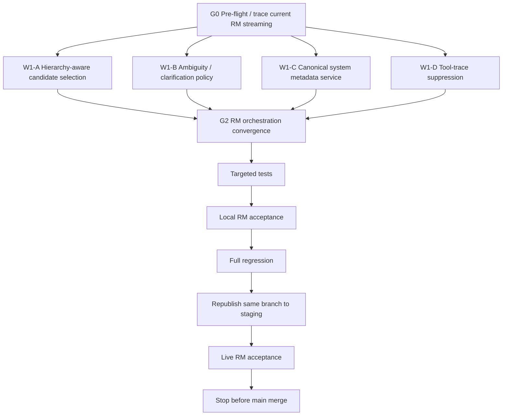

# RM Assistant Orchestration, Hierarchy, Clarification, and Tool-Trace Hardening

**Project:** PSA Statistical Classifications Search  
**Repository:** `D:\dev\historical_phclassif`  
**Branch:** `feature/pre-staging-hardening`  
**Accepted release candidate before this phase:** `f203608`  
**Pre-staging tag:** `pre-staging-v5`  
**Staging status:** deterministic Search / PSOC+PSIC / UI gates passed; live RM acceptance exposed orchestration and grounding defects.

---

# 1. Purpose

Implement the next RM Assistant hardening milestone **without redesigning the hybrid retrieval engine**.

The hybrid retrieval milestone is already accepted for deterministic retrieval:

```text
existing exact/code/title/token tiers
+ thresholded OSA/Damerau-style fuzzy retrieval
+ character 3–5 gram TF-IDF cosine retrieval
+ evidence-sufficiency gate
+ Reciprocal Rank Fusion
+ canonical repository verification
```

The remaining defects are in the **RM orchestration and presentation layer**:

1. ancestor and descendant classification codes can be presented as equally valid final answers;
2. RM does not ask discriminating follow-up questions when the verified candidate set is genuinely ambiguous;
3. internal ellmer tool names / tool-call traces are visible to end users;
4. system-level questions can bypass canonical grounding and trigger LLM hallucination;
5. metadata questions such as PSCC vs PSCCS, PTSCS components, and PSCrCS components need a verified deterministic information source;
6. RM must remain unable to present an authoritative code when no verified canonical result exists.

This phase must preserve:

```text
Search
PSOC + PSIC
Compare Editions
Sources
Subtle Gradient UI
hybrid retrieval
canonical verification
Current/Archived semantics
RM session isolation
```

Do not change the OpenAI model to solve these issues.

Do not enable semantic retrieval in this phase.

---

# 2. Confirmed live staging defects

The following behavior was observed against the staged `f203608` build.

## 2.1 PSOC hierarchy presented as competing answers

Query:

```text
heavy truck driver
```

RM presented both:

```text
833  — HEAVY TRUCK AND BUS DRIVERS
8332 — HEAVY TRUCK AND LORRY DRIVERS
```

as if both were equivalent final classification choices.

The retrieval engine is allowed to return both because one is a valid parent/ancestor and the other is a more specific descendant.

The RM answer layer must distinguish:

```text
ancestor classification
vs.
most-specific verified classification
```

and must not present a parent code as an equal alternative when a more specific verified descendant is the stronger direct match.

Desired answer behavior:

```text
PSOC 8332 — HEAVY TRUCK AND LORRY DRIVERS

Hierarchy:
833 — HEAVY TRUCK AND BUS DRIVERS
```

The parent may be displayed as context/provenance, not as an equally specific code.

---

## 2.2 No clarification for genuinely ambiguous classifications

Examples observed:

```text
PSIC for bakery
```

returned several codes immediately.

```text
PSIC of repair of motor
```

returned materially different activities immediately.

RM should not simply dump all verified candidates when the user has not supplied enough information to distinguish between them.

Instead:

```text
retrieval
-> verified candidates
-> ambiguity analysis
-> either answer
   or ask one discriminating follow-up question
```

Clarification must be driven by **verified candidate differences**, not invented LLM knowledge.

---

## 2.3 Internal tool traces visible to the user

The user-visible chat currently exposes implementation details such as:

```text
assistant_search_classification()
assistant_get_classification_entry()
```

plus repeated tool/SVG rendering artifacts.

These are internal implementation details.

The user should see only:

```text
their message
assistant status/progress if desired
final natural-language answer
```

Internal tool requests/results must remain available to the application for execution, audit, and debugging, but must not render as normal conversation content.

---

## 2.4 System-level metadata hallucinations

Live RM produced incorrect ungrounded answers for questions such as:

```text
What is the difference between PSCC and PSCCS?
What are the components of PTSCS?
What are the components of PSCrCS?
```

These are not classification-entry searches.

They are **classification-system metadata questions**.

`assistant_search_classification()` is the wrong primary tool for this intent.

A dedicated deterministic system-information path is required.

---

# 3. Core architectural principle

The final RM decision pipeline should be:

```text
USER
  |
  v
RM intent/orchestration
  |
  +-----------------------------+
  |                             |
  v                             v
entry/code/label question       system/meta question
  |                             |
  v                             v
shared hybrid retrieval         canonical system metadata service
  |                             |
  v                             v
verified canonical candidates   verified canonical metadata
  |                             |
  +--------------+--------------+
                 |
                 v
        ambiguity / hierarchy analysis
                 |
       +---------+----------+
       |                    |
       v                    v
 sufficient evidence      ambiguous
       |                    |
       v                    v
 most-specific answer     follow-up question
       |                    |
       +---------+----------+
                 |
                 v
        clean user-facing RM answer

NO INTERNAL TOOL NAMES RENDERED
NO UNVERIFIED AUTHORITATIVE CODES
```

---

# 4. Non-negotiable safety contracts

1. **No verified canonical entry = no authoritative classification code.**
2. Approximate retrieval remains candidate generation only.
3. RM must never manufacture a classification code.
4. System metadata must come from a deterministic canonical metadata source.
5. A parent classification must not be presented as an equal final answer when a more specific verified descendant is the stronger match.
6. Clarification questions must be based only on verified candidate distinctions or verified system metadata.
7. Internal tool function names and raw tool payloads must not be visible to end users.
8. The same shared Search retrieval engine remains the source for entry-level RM retrieval.
9. Do not create an LLM-only retrieval path.
10. Do not change the OpenAI model/provider to work around orchestration defects.
11. Do not enable semantic embeddings in this phase.
12. Preserve safe abstention.

---

# 5. Implementation DAG



---

# 6. File ownership / convergence rules

Before editing, inspect the actual current file layout.

Likely shared/convergence-owned files include:

```text
R/assistant/assistant_client.R
R/assistant/assistant_tools.R
R/assistant/assistant_server.R
R/assistant/*
app.R
```

Do not assume exact filenames if the repository differs.

New isolated modules are preferred for new contracts where practical, for example:

```text
R/assistant/assistant_hierarchy.R
R/assistant/assistant_ambiguity.R
R/assistant/assistant_system_info.R
R/assistant/assistant_render.R
```

Relevant tests may include new files such as:

```text
tests/testthat/test-assistant-hierarchy.R
tests/testthat/test-assistant-ambiguity.R
tests/testthat/test-assistant-system-info.R
tests/testthat/test-assistant-render.R
tests/testthat/test-assistant-live-contract.R
```

Do not allow parallel workers to edit the same shared RM files concurrently.

---

# 7. G0 — Pre-flight and root-cause trace

Before implementation:

```powershell
git branch --show-current
git status --short
git log -1 --oneline --decorate
git diff --check
```

Expected branch:

```text
feature/pre-staging-hardening
```

The working tree should be clean at the beginning of this phase.

Trace:

```text
user chat input
-> RM server/client
-> ellmer chat
-> tool registration
-> tool request
-> tool execution
-> tool result
-> assistant response
-> Shiny rendering
```

Identify exactly why:

```text
assistant_get_classification_entry()
assistant_search_classification()
```

are appearing visibly.

Determine whether the leak is caused by:

```text
ellmer streaming callback rendering all content
tool request/result content being appended to transcript
debug/echo mode
custom UI rendering
another mechanism
```

Do not patch presentation blindly before tracing the actual content flow.

Produce a compact owner map and root-cause statement before coding.

---

# 8. W1-A — Hierarchy-aware candidate selection

## 8.1 Objective

Add a deterministic hierarchy analysis step for verified classification candidates.

The system must identify relationships such as:

```text
833
└── 8332
```

where one returned result is an ancestor of another.

Do not infer hierarchy solely from string-length heuristics unless that is already the canonical hierarchy contract for the relevant system.

Prefer repository metadata / parent relationships where available.

If some systems use code-structure rules, centralize those rules.

## 8.2 Desired behavior

For:

```text
heavy truck driver
```

if verified candidates include:

```text
833  — HEAVY TRUCK AND BUS DRIVERS
8332 — HEAVY TRUCK AND LORRY DRIVERS
```

and 8332 is the stronger specific match:

```text
final answer = 8332
hierarchy context may include = 833
```

Do not present:

```text
833 and 8332 are both equally valid depending on context
```

unless verified evidence genuinely shows the user's description does not distinguish between sibling/descendant alternatives.

## 8.3 Ranking/selection contract

Recommended conceptual rule:

```text
if candidate A is an ancestor of candidate B
and B is a sufficiently strong verified match
and no evidence requires staying at A
then:
    answer with B
    optionally show A as hierarchy/context
```

Exact code queries remain exact:

```text
What is PSOC 833?
-> answer 833

What is PSOC 8332?
-> answer 8332
```

Do not auto-descend when the user explicitly asks for the ancestor code itself.

## 8.4 Tests

Include:

```text
heavy truck driver
-> final specific PSOC includes 8332
-> 833 not presented as equal alternative

What is PSOC 833?
-> remains 833

What is PSOC 8332?
-> remains 8332

ancestor + descendant candidate pair
-> deterministic most-specific selection

siblings with unresolved distinction
-> do not arbitrarily choose one
```

Test other systems where hierarchy applies.

---

# 9. W1-B — Ambiguity detection and clarification

## 9.1 Objective

RM must distinguish:

```text
multiple results because of hierarchy
```

from:

```text
multiple results because the user's wording is genuinely ambiguous
```

and from:

```text
multiple related results where one specific result is still clearly strongest
```

Do not ask follow-up questions for every multi-result retrieval.

## 9.2 Clarification policy

Ask a follow-up question only when:

```text
two or more verified plausible candidates remain
AND
candidate differences are materially relevant
AND
the user's wording lacks the distinguishing information
AND
choosing one would risk presenting an incorrect authoritative code
```

Do not ask if:

```text
exact code match
exact official-title match
one clear specific descendant dominates
one candidate is materially stronger and safe
```

## 9.3 Clarification source

The question and answer options must be derived from verified candidate fields such as:

```text
official labels
descriptions
inclusions
exclusions
notes
hierarchy
system metadata
```

Do not invent distinguishing features from general LLM knowledge.

## 9.4 Examples

### Bakery

Query:

```text
PSIC for bakery
```

If verified candidates include distinct bakery-product subclasses, RM may ask:

```text
What does the establishment primarily produce?

- bread, cakes, pastries, pies, doughnuts or similar fresh bakery products
- biscuits, cookies, crackers, pretzels or similar dry bakery products
- another bakery product/activity
```

Only use wording supported by verified candidate descriptions.

### Repair

Query:

```text
PSIC of repair of motor
```

If candidates cover:

```text
motor vehicles
vs.
other transport equipment
```

ask a discriminating question based on those verified labels/descriptions.

## 9.5 Conversation state

Clarification must be session-scoped.

Store only the minimal deterministic context required, for example:

```text
original query
system/version
candidate codes
candidate distinctions
clarification question id/state
```

When the user answers:

```text
clarification response
-> constrain/re-run deterministic retrieval
-> canonical verification
-> final RM response
```

Do not let clarification state leak across RM sessions.

## 9.6 Tests

Cover:

```text
exact match -> no clarification
ancestor/descendant -> choose specific, no unnecessary clarification
ambiguous siblings -> clarification
clarification answer -> correct constrained final result
session A pending clarification does not affect session B
```

---

# 10. W1-C — Canonical classification-system metadata service

## 10.1 Objective

Create one authoritative deterministic source for questions about a classification system itself.

Preferred internal helper/tool:

```text
assistant_get_classification_system_info()
```

Name may differ if repository conventions require it.

The user must never see this function name.

## 10.2 Source of truth

Prefer extending or wrapping:

```text
classification_registry()
```

or another existing canonical registry/metadata object.

Do not maintain a second stale hand-written system list.

Create verified metadata fields as supported by repository/source artifacts, for example:

```text
id
official_name
short_name
edition/version
status
purpose
scope
classification structure
components
underlying/reference classifications
source_url
source/provenance
notes
```

Only include fields that can be supported by authoritative project data.

If richer metadata is not currently stored, create a centralized canonical metadata artifact rather than embedding prose inside prompts.

## 10.3 Required systems

Audit all supported systems.

At minimum the existing registry includes or has included systems such as:

```text
psgc
psic
psoc
psced
pcoicop
pcpc
pscc
psccs
ptscs
pscrcs
```

Confirm against the current canonical registry.

## 10.4 Required live questions

The metadata service must ground:

```text
What is PSCC?
What is PSCCS?
What is the difference between PSCC and PSCCS?
What is PTSCS?
What are the components of PTSCS?
What is PSCrCS?
What are the components of PSCrCS?
```

The LLM may summarize verified metadata, but must not answer these from unsupported latent knowledge.

## 10.5 Comparison behavior

For:

```text
difference between PSCC and PSCCS
```

orchestration should conceptually do:

```text
get system info(pscc)
get system info(psccs)
-> compare verified fields only
```

Do not call entry-level classification search unless the user also asks for codes/entries.

## 10.6 Tests

Pin:

```text
PSCC != PSCCS
PTSCS official system name correct
PSCrCS official system name correct
components come from canonical metadata
unknown/nonexistent system -> explicit no verified metadata
```

Tests must fail if the answer path can fall back to hallucinated prose without verified metadata.

---

# 11. W1-D — Hide internal tool traces

## 11.1 Objective

Users should never see:

```text
assistant_search_classification()
assistant_get_classification_entry()
assistant_get_classification_system_info()
assistant_search_common_pairings()
```

or raw tool payload/result objects.

## 11.2 Rendering contract

Render to the user only:

```text
user messages
assistant natural-language messages
optional neutral progress indicator
verified-result cards if already part of UI
```

Do not render:

```text
ContentToolRequest
ContentToolResult
raw JSON
tool function names
tool arguments
tool debugging messages
SVG/tool placeholder artifacts
```

## 11.3 Optional progress UI

If useful, show generic status such as:

```text
Checking official PSA classifications…
```

or:

```text
Reviewing verified classification sources…
```

Do not reveal tool implementation names.

The status should disappear or resolve cleanly when the final assistant response arrives.

## 11.4 Logging/audit

Tool calls may remain available internally for:

```text
debugging
tests
provenance
observability
```

but they must not be surfaced in normal user-visible chat.

Do not log secrets.

## 11.5 Tests

Add rendering-level tests where feasible:

```text
tool request content -> not rendered
tool result content -> not rendered
assistant final text -> rendered
tool name literal absent from rendered transcript
progress message contains no function name
```

Pin literal strings:

```text
assistant_get_classification_entry
assistant_search_classification
```

to ensure they cannot leak into the user transcript.

---

# 12. W1-E — RM grounding policy update

Update the RM system/tool instructions so the model understands the deterministic orchestration contract.

The model should be told, in effect:

```text
Use verified tools for classification facts.

Do not invent codes.

Do not answer classification-system metadata from memory when canonical system information is available.

If verified candidates are ambiguous, ask one concise discriminating question instead of choosing arbitrarily.

When a more specific verified descendant directly answers the user's query, prefer it over presenting both ancestor and descendant as equal answers.

Do not mention internal tool/function names to the user.
```

Do not rely on prompt text alone for safety-critical enforcement.

The deterministic code path must enforce:

```text
verified candidates
hierarchy handling
ambiguity decision contract
metadata availability
```

Prompt policy supplements code; it does not replace it.

---

# 13. Intent routing

Add a bounded deterministic or model-assisted intent contract that distinguishes at least:

```text
entry_lookup
classification_search
system_info
system_comparison
component_question
ambiguous_classification_request
```

Avoid fragile keyword-only routing if existing RM orchestration already supports reliable tool choice.

However, system-level questions must not silently fall through to arbitrary classification-entry searches.

Examples:

```text
"What is PSOC 8332?"
-> entry lookup

"PSIC for bakery"
-> classification search + ambiguity analysis

"What is PSCCS?"
-> system info

"What is the difference between PSCC and PSCCS?"
-> system comparison

"What are the components of PTSCS?"
-> component/system metadata
```

---

# 14. Common-pairing fallback

Preserve the existing rule:

```text
assistant_search_classification()
-> no sufficient verified candidate
-> optional assistant_search_common_pairings()
-> candidate code
-> assistant_get_classification_entry()
-> canonical verification
```

Common pairings remain supporting evidence only.

They must not bypass:

```text
hierarchy analysis
ambiguity analysis
canonical verification
```

---

# 15. Multilingual behavior

Do not solve Filipino/Cebuano/mixed-language recall by changing this architecture.

Known deterministic lexical limitations remain documented.

If a Filipino/Cebuano/mixed query retrieves no verified candidate:

```text
RM may ask the user to describe the duties/activity in more detail
```

but must not fabricate a code.

Do not enable embeddings in this phase.

---

# 16. Required local acceptance cases

## 16.1 Hierarchy

```text
heavy truck driver
```

Expected:

```text
specific final classification includes:
8332 — HEAVY TRUCK AND LORRY DRIVERS

833 may appear only as hierarchy/context, not as an equal final answer.
```

```text
What is PSOC 833?
-> exact 833

What is PSOC 8332?
-> exact 8332
```

## 16.2 Clarification

```text
PSIC for bakery
```

Expected:

```text
if multiple materially distinct verified subclasses remain:
-> ask one discriminating follow-up question
```

```text
PSIC of repair of motor
```

Expected:

```text
ask for the distinction needed to choose safely
```

Do not require clarification if the retrieval/evidence already yields one unambiguous verified result.

## 16.3 No-code safety

```text
Give me the official PSOC code for professional AI prompt engineer.
```

Required:

```text
no verified code
-> no authoritative PSOC code
```

## 16.4 System metadata

```text
What is PSCC?
What is PSCCS?
What is the difference between PSCC and PSCCS?
What are the components of PTSCS?
What are the components of PSCrCS?
```

Every factual classification-system statement must be grounded in canonical system metadata.

## 16.5 Tool-trace hiding

Ask any query that invokes multiple RM tools.

The visible transcript must contain none of:

```text
assistant_search_classification()
assistant_get_classification_entry()
assistant_get_classification_system_info()
ContentToolRequest
ContentToolResult
raw tool JSON
```

---

# 17. Targeted testing

Run focused tests first.

Suggested groups:

```text
assistant hierarchy
assistant ambiguity
assistant system metadata
assistant rendering/tool suppression
assistant tool registry
assistant session isolation
retrieval integration
```

Do not repeatedly run the full suite during development.

---

# 18. Full regression gate

After targeted tests pass:

```powershell
Rscript scripts/run_tests.R
```

Required:

```text
FAIL 0
WARN 0
SKIP 0
```

Then:

```powershell
Rscript -e "renv::status()"
git diff --check
git status --short
git diff --stat
```

Do not modify `renv.lock` unless a dependency genuinely changes.

Prefer no new dependency.

---

# 19. Staging republish gate

Only after the local suite is green:

1. leave semantic retrieval disabled;
2. preserve:
   ```text
   OPENAI_API_KEY
   RM_ASSISTANT_ENABLED=true
   ```
   in the staging environment;
3. publish the updated `feature/pre-staging-hardening` revision to the same staging app;
4. do not deploy to production;
5. do not merge to `main`.

---

# 20. Live staging acceptance

Run the following with real RM enabled.

## 20.1 Entry/hierarchy

```text
What is the PSOC code for a heavy truck driver?
What is PSOC 8332?
truck driver PSOC
```

Verify hierarchy presentation is correct.

## 20.2 Clarification

```text
PSIC for bakery
PSIC of repair of motor
```

Verify RM asks a discriminating follow-up only when needed.

Complete the follow-up conversation and verify the resulting classification is canonically verified.

## 20.3 System metadata

```text
What is the difference between PSCC and PSCCS?
What are the components of PTSCS?
What are the components of PSCrCS?
```

No hallucinated system names/components are acceptable.

## 20.4 No-code

```text
Give me the official PSOC code for professional AI prompt engineer.
```

Required:

```text
no authoritative code
```

## 20.5 Tool visibility

Across all live questions:

```text
zero visible internal function names
zero raw tool payloads
zero tool-result/SVG trace artifacts
```

## 20.6 Session isolation

Use two independent RM sessions.

Verify clarification state and conversation context do not bleed between sessions.

---

# 21. Release blockers

Block main-merge review if any occur:

```text
ancestor code presented as an equally specific final answer when a verified descendant is the correct direct match

ambiguous verified candidates resolved arbitrarily without sufficient evidence

system metadata hallucinated without canonical grounding

PSCC/PSCCS identity confusion

PTSCS/PSCrCS system-name or component hallucination

internal tool names visible to users

raw tool payload/result visible to users

unverified authoritative code presented

RM session/clarification-state bleed

Search or PSOC+PSIC retrieval regression

Current/Archived regression

Subtle Gradient/UI regression

secret exposure
```

---

# 22. Explicit non-goals

Do NOT:

```text
redesign Search
redesign PSOC + PSIC
change the Subtle Gradient design
replace the hybrid retrieval engine
enable sentence-transformer embeddings
add Python/PyTorch
change gpt-4o-mini merely to improve answers
create an LLM-only semantic retrieval path
hard-code answer text for the live acceptance queries
hard-code 8332 as a special case
hard-code bakery clarification prose independently of verified candidates
```

---

# 23. Git / deployment stop conditions

During implementation:

```text
DO NOT commit
DO NOT push
DO NOT tag
DO NOT merge
DO NOT deploy production
```

Leave the completed fix in the working tree and return the engineering report first.

A separate controlled commit/push/staging-republish instruction will follow after review.

---

# 24. Required final engineering report

Return:

1. Pre-flight state
2. Root cause of visible tool traces
3. Current RM call/render path
4. Hierarchy representation discovered in repository
5. Hierarchy-aware selection implementation
6. Heavy-truck hierarchy result
7. Ambiguity-detection contract
8. Clarification-state implementation
9. Bakery clarification behavior
10. Repair-of-motor clarification behavior
11. System metadata source of truth
12. Metadata fields added/used
13. RM intent-routing changes
14. PSCC vs PSCCS deterministic result
15. PTSCS deterministic metadata result
16. PSCrCS deterministic metadata result
17. Tool-trace suppression implementation
18. User-visible progress behavior
19. Common-pairing fallback impact
20. Session-isolation/clarification isolation
21. Files changed
22. Dependencies added/avoided
23. Targeted tests
24. Full regression result
25. `renv::status()`
26. `git diff --check`
27. Remaining limitations
28. Whether semantic retrieval remains correctly deferred
29. Whether the working tree is ready for a controlled commit and staging republish
30. Explicit confirmation that no commit/push/tag/merge/production deploy occurred

Stop there.

---

# 25. Expected post-fix RM behavior summary

## Heavy truck driver

User:

```text
What is the PSOC code for a heavy truck driver?
```

Desired behavior:

```text
PSOC 8332 — HEAVY TRUCK AND LORRY DRIVERS

Hierarchy/context:
833 — HEAVY TRUCK AND BUS DRIVERS
```

Do not present 833 and 8332 as equally specific alternatives.

## Bakery

User:

```text
PSIC for bakery
```

Desired behavior:

```text
Multiple verified bakery activities are possible.
Ask one concise distinguishing question derived from the official candidate descriptions.
```

Then use the user's answer to resolve the final verified code.

## PSCC vs PSCCS

User:

```text
What is the difference between PSCC and PSCCS?
```

Desired behavior:

```text
retrieve canonical system metadata for both
compare verified fields
answer without free-form hallucination
```

## PTSCS / PSCrCS components

User:

```text
What are the components of PTSCS?
```

or:

```text
What are the components of PSCrCS?
```

Desired behavior:

```text
answer from canonical system metadata
```

not from generic LLM knowledge.

## Tool calls

User sees:

```text
Checking official PSA classifications…
```

optionally, followed by the final answer.

User does NOT see:

```text
assistant_search_classification()
assistant_get_classification_entry()
assistant_get_classification_system_info()
raw tool arguments/results
```
