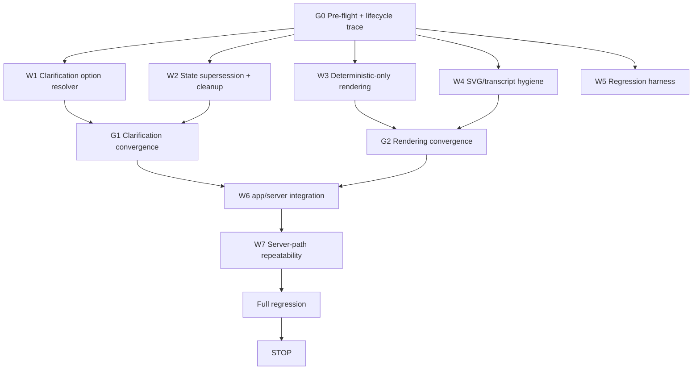

# RM Clarification Lifecycle and Deterministic Rendering Hardening

**Project:** PSA Statistical Classifications Search + RM Assistant  
**Repository:** `D:\dev\historical_phclassif`  
**Branch:** `feature/pre-staging-hardening`  
**Current release candidate:** `pre-staging-v10`  
**Current committed HEAD:** `1f1eae4529db10e009291ec0307eb26abe3cc25a`  
**Purpose:** Close the remaining live-browser blockers after the server-authoritative RM execution rewrite. This phase is intentionally narrow: clarification continuation, stale-state supersession, deterministic rendering, and transcript hygiene.

---

# 0. Release status

`pre-staging-v10` is a **PARTIAL PASS**.

The server-authoritative architecture now works for several critical first-turn cases, but live acceptance still fails because of clarification-state and rendering defects.

Do **not** reopen the whole retrieval stack.  
Do **not** enable semantic authority.  
Do **not** merge the UI branch.

---

# 1. Live blockers governing this phase

## B1 — Correct deterministic answers are contaminated by automatic LLM prose

Examples:

```text
mayor psoc psic
-> deterministic: PSOC 1111 + PSIC 84113
-> model then asks in Tagalog for mayor duties / establishment activity
```

```text
janitor through manpower agency
-> deterministic wage-payer clarification
-> model repeats the clarification
```

```text
the manpower agency pays me
-> deterministic PSIC 78200
-> model says it will still look for the appropriate PSIC
```

A resolved or clarification-required coding packet must not be followed by contradictory model prose.

## B2 — Literal `svg` leaks into the transcript

The live transcript repeatedly displays:

```text
svg
```

before and after RM responses.

Fix the real rendering source. Do not merely blind-replace the string.

## B3 — Ordinal/reference clarification replies are treated as fresh search queries

Teacher flow:

```text
teacher in a private high school psoc psic
-> PSOC 2330
-> PSIC 8531 aggregate
-> options:
   1. ...without special needs
   2. ...with special needs

user: latter
-> WRONG: PSIC 20224 Manufacture of prepared pigments...
```

`latter`, `former`, `first`, `second`, `1`, `2`, `option 1`, etc. must be resolved deterministically against the current pending options before any global retrieval.

## B4 — Full-label clarification replies lose the previous context

After the teacher clarification, the user entered:

```text
Private general secondary education for children with special needs
```

The app treated this as a new occupation request instead of completing only the pending PSIC subtype while preserving PSOC 2330.

## B5 — Stale pending state can contaminate a new explicit coding request

After the failed teacher clarification sequence:

```text
statistician at PSA psoc psic
```

returned no PSOC + PSIC 74994 instead of:

```text
PSOC 2122
PSIC 8411
```

An explicit new coding request must supersede stale pending clarification state.

## B6 — Short ambiguous clarification replies can authorize unrelated PSIC codes

Carpenter flow:

```text
carpenter psoc psic
-> PSOC 7115
-> PSIC unresolved

user: residential
-> WRONG: PSIC 87100 Residential nursing care activities
```

A short ambiguous word must not be sent into unrestricted fresh PSIC retrieval when the pending context cannot determine its meaning.

---

# 2. Governing precedence

Implement deterministic turn precedence:

```text
EXPLICIT NEW CODING REQUEST
    > STALE PENDING CLARIFICATION

VALID BOUNDED CLARIFICATION REPLY
    > FRESH GLOBAL RETRIEVAL
```

Conceptually:

```text
if explicit_new_coding_request(turn):
    clear/supersede stale pending state
    start new coding request

else if bounded_clarification_reply(turn, pending):
    resolve against pending options/state

else if pending and reply plausibly answers pending slot:
    continue pending slot conservatively

else:
    route normally
```

For authoritative coding turns:

```text
deterministic packet
-> deterministic render
-> DONE
```

No automatic post-result model prose.

---

# 3. Non-goals

Do NOT:

```text
enable semantic authority
build semantic indexes
change semantic thresholds
change gpt-4o-mini
change the conversational provider
rewrite hybrid retrieval
change canonical classifications
change edition policy
change correspondence mappings
merge feature/ui-refinement-ui01-ui05
redesign RM UI
add arbitrary query-specific final-code shortcuts
commit/push/tag/merge/deploy
```

---

# 4. Parallel DAG

Use parallel workflows and strict file ownership.



---

# 5. File ownership

## W1 — clarification resolver

Primary:

```text
R/assistant/assistant_execution.R
R/assistant/assistant_turn_state.R
new assistant_clarification.R only if justified
clarification tests
```

## W2 — state precedence

Primary:

```text
R/assistant/assistant_router.R
R/assistant/assistant_execution.R
R/assistant/assistant_turn_state.R
state/supersession tests
```

Coordinate ownership of `assistant_execution.R` before editing.

## W3 — deterministic rendering

Primary:

```text
R/assistant/assistant_render.R
R/assistant/assistant_response_guard.R
render tests
```

## W4 — transcript hygiene

Primary:

```text
shinychat/S7 rendering override code
R/assistant/assistant_render.R
transcript-hygiene tests
```

No classification-semantic edits.

## W5 — regression

Primary:

```text
tests/testthat/test-assistant-execution.R
new clarification-lifecycle tests
render/transcript tests
```

## W6 — integration

One owner only:

```text
app.R
manifest.json only if runtime inventory changes
```

---

# 6. Token optimization

Claude Code must:

```text
search exact function/state names before opening whole files
build one G0 execution map and reuse it
read only relevant function blocks where possible
avoid repeatedly rereading app.R
reuse current pending-state structures when possible
keep subagent reports compact
run targeted tests before full suite
avoid duplicate helper modules
```

Worker output only:

```text
root cause
files changed
interface/API
tests
blockers
```

---

# 7. G0 pre-flight

Run:

```powershell
git branch --show-current
git status --short
git log -3 --oneline --decorate
git rev-parse HEAD
git tag --points-at HEAD
git diff --check
```

Required:

```text
branch = feature/pre-staging-hardening
HEAD   = 1f1eae4529db10e009291ec0307eb26abe3cc25a
tag    = pre-staging-v10
tracked tree = clean
```

A known untracked UI specification may exist; do not touch it.

If tracked files are unexpectedly dirty: STOP.

---

# 8. G0 root-cause trace

Before editing, trace:

```text
clarification_required packet creation
option generation
pending state storage
pending state lookup
continuation detection
fresh-request detection
pending state clearing
latest packet update
response rendering
post-result model invocation
shinychat content rendering
```

Answer explicitly:

1. Why does `latter` reach global retrieval?
2. Are clarification options stored with canonical codes or only labels?
3. Why does a full option label become a new occupation request?
4. Why can stale teacher state affect a later explicit `statistician at PSA psoc psic` request?
5. Where is pending state cleared after resolution?
6. Does explicit `psoc` / `psic` currently override pending state?
7. Why does `residential` reach unrestricted retrieval?
8. Where does automatic post-result LLM prose originate?
9. Why does literal `svg` enter user-visible transcript content?
10. Can one rendered turn append both deterministic and provider text?

Do not modify code until these paths are known.

---

# 9. Structured clarification options

When a clarification presents options, pending state must retain canonical option identity.

Conceptual structure:

```text
pending = {
    slot = "establishment_activity",
    system = "psic",
    parent_code = "8531",
    options = [
        {index = 1, code = "...", label = "...without special needs"},
        {index = 2, code = "...", label = "...with special needs"}
    ]
}
```

Do not retain only free-form display prose if canonical code identity is available.

---

# 10. Ordinal/reference resolver

Support at minimum:

```text
1
2
3
4
first
second
third
fourth
option 1
option 2
option 3
option 4
the first
the second
the third
the fourth
first one
second one
third one
fourth one
former
latter
the former
the latter
```

Case-insensitive and punctuation/whitespace tolerant.

Rules:

```text
former -> option 1 only when exactly two choices exist
latter -> option 2 only when exactly two choices exist
```

Never send these references through global lexical/fuzzy/ngram/semantic retrieval.

---

# 11. Exact/full-label clarification resolution

If a user types an exact or normalized pending option label, resolve inside the bounded pending option set first.

Example:

```text
Private general secondary education for children with special needs
```

must complete the pending teacher PSIC subtype while preserving:

```text
occupation = teacher
PSOC = 2330
```

No whole-corpus occupation search.

---

# 12. Bounded clarification universe

Pending clarification matching must first use only:

```text
current pending options
current yes/no choices
current categorical choices
current pending real-world slot constraints
```

Only if the reply cannot be interpreted safely should the system ask a narrower clarification.

Do not authorize unrelated codes merely because a short reply lexically matches them.

---

# 13. Short ambiguous replies

Examples:

```text
residential
private
public
government
hospital
school
farm
commercial
```

must not automatically authorize a detailed PSIC unless the current pending question/options make that interpretation unambiguous.

Carpenter:

```text
carpenter psoc psic
-> establishment activity missing

user: residential
```

Expected:

```text
still unresolved
OR narrower deterministic clarification
```

For example:

```text
Do you mean residential building construction, residential care, or another residential activity?
```

Never resolve `87100` from `residential` alone.

---

# 14. Explicit new-request supersession

A substantive new coding request with explicit coding intent must override stale pending state.

At minimum recognize explicit signals such as:

```text
psoc
psic
code
classification
occupation code
industry code
```

Examples:

```text
statistician at PSA psoc psic
mayor psoc psic
corn farmer psoc psic
teacher in a private high school psoc psic
```

These start a new coding turn and clear/supersede unrelated pending state.

---

# 15. Continuation detection

Replies such as:

```text
latter
second
option 2
upland
rainfed
the manpower agency pays me
the hospital pays me
```

should be treated as continuations only when they are compatible with the current pending slot/options.

Do not apply a stale pending state to a clearly new coding request.

---

# 16. Pending-state cleanup

Clear pending state when:

```text
clarification resolves successfully
a new explicit coding request supersedes it
user cancels/clears it
session ends
```

After a resolved teacher subtype, no teacher pending state may remain.

---

# 17. Teacher acceptance — ordinal

```text
teacher in a private high school psoc psic
```

Expected first turn:

```text
PSOC 2330
PSIC 8531 aggregate
bounded subtype clarification
```

Then:

```text
latter
```

Expected:

```text
PSOC 2330 preserved
PSIC = canonical current code for the second listed option
pending cleared
```

No `20224`.  
No unrelated search.  
No extra LLM prose.

---

# 18. Teacher acceptance — full label

After the same initial teacher turn:

```text
Private general secondary education for children with special needs
```

must select the matching pending PSIC option and preserve PSOC 2330.

Do not return:

```text
PSOC no verified code
```

---

# 19. Fresh request after clarification

After teacher resolution or an abandoned teacher clarification:

```text
statistician at PSA psoc psic
```

must start fresh:

```text
PSOC 2122
PSIC 8411
```

No `74994`.  
No teacher context.  
No wage-payer question.

---

# 20. Deterministic-only coding rendering

For:

```text
resolved
clarification_required
no_verified_match
```

classification packets, default behavior must be:

```text
deterministic packet
-> deterministic render
-> END TURN
```

Do not automatically invoke the LLM to add prose.

---

# 21. Explanation model policy

The LLM may explain only when the user explicitly asks for explanation, e.g.:

```text
why?
explain this
what does this mean?
what is the difference?
```

When explanation is requested, it receives the verified packet and may not change:

```text
codes
labels
status
allowed_codes
clarification state
```

If explanation fails, deterministic facts remain sufficient.

---

# 22. Language behavior

Automatic model prose removal should eliminate spontaneous Tagalog.

If an explicit explanation is generated:

```text
match the user's language
```

Do not switch languages without user request.

---

# 23. Contradiction invariants

Add/test:

```text
if packet$status == "resolved":
    no clarification question may be appended
```

and:

```text
if packet$status == "clarification_required":
    render the deterministic clarification exactly once
    do not append a second model-generated clarification
```

For PSIC 78200, never append:

```text
Please hold on while I look for the appropriate PSIC.
```

---

# 24. SVG/transcript hygiene

Trace and eliminate the real source of literal `svg`.

Investigate:

```text
shinychat ContentText handling
S7 rendering overrides
icon/status markup
HTML-to-transcript conversion
content suppression paths
```

Do not solve by blindly replacing all `"svg"` strings.

---

# 25. Transcript hygiene invariant

User-visible coding transcript must not contain:

```text
svg
<svg
assistant_
raw tool JSON
tool request
tool result
clear
```

unless the user literally asked about those terms.

Add tests around the actual render path where feasible.

---

# 26. Named server-path regression matrix

Run through the same deterministic/server-facing handler used by `app.R`.

## Mayor

```text
mayor psoc psic
```

Required:

```text
1111
84113
one authoritative response
no extra clarification
no Tagalog
no svg
```

## Outsourcing

```text
I am a janitor deployed at a hospital through a manpower agency. What is my PSIC?
```

Required:

```text
no PSIC yet
one wage-payer clarification
no duplicate model question
no svg
```

Then:

```text
the manpower agency pays me
```

Required:

```text
78200
resolved
no "please hold on"
```

## Carpenter

```text
carpenter psoc psic
```

Required:

```text
7115
PSIC unresolved
```

Then:

```text
residential
```

Required:

```text
unresolved or narrower deterministic clarification
```

Never `87100` solely from that reply.

## Teacher ordinal

```text
teacher in a private high school psoc psic
-> latter
```

Required:

```text
2330 preserved
second pending PSIC option selected canonically
pending cleared
```

## Teacher full label

```text
teacher in a private high school psoc psic
-> Private general secondary education for children with special needs
```

Required same matching detailed PSIC.

## New request supersession

After a teacher pending/resolved state:

```text
statistician at PSA psoc psic
```

Required:

```text
2122
8411
```

---

# 27. Non-regression matrix

Preserve:

```text
palay farmer -> 6111 + 0112 + subtype clarification
upland -> 01123
corn farmer -> 6112 + 01130

six-item batch:
8325 / 9335 / 8141 / 5247 / 2124 / 3424

angkas follow-up -> 8323

AI prompt engineer -> no verified code
```

---

# 28. Repeatability

Run at least **20 fresh-state repetitions** for:

```text
mayor
outsourcing first turn
teacher -> latter
teacher -> full label
carpenter -> residential
statistician after teacher
```

Require identical:

```text
route
status
selected codes
missing slot
allowed_codes
pending state after turn
```

---

# 29. Session isolation

Session A:

```text
teacher clarification flow
```

Session B:

```text
statistician at PSA psoc psic
```

No cross-session contamination.

Preserve session registry cleanup.

---

# 30. Semantic retrieval

Keep semantic authority OFF.

Do NOT:

```text
change semantic threshold
build embedding indexes
activate evidence exemption
use semantics to interpret clarification references
```

This is a clarification/rendering phase.

---

# 31. UI isolation

Do not modify or merge:

```text
feature/ui-refinement-ui01-ui05
```

The UI checkpoint remains separate.

---

# 32. Manifest

Only regenerate if runtime inventory changes.

Use canonical:

```text
rsconnect::writeManifest()
```

Verify:

```text
all runtime R files included
0 missing
0 PDFs
0 secrets
0 embedding index artifacts
```

---

# 33. Dependencies

Prefer zero new dependencies.

Base R is sufficient for ordinal/reference mapping and bounded clarification matching.

---

# 34. Targeted test requirements

Add/update tests for:

```text
former/latter
numeric options
ordinal options
option N
exact pending labels
normalized pending labels
full-label subtype completion
new-request supersession
pending cleanup
ambiguous short reply rejection
carpenter residential
deterministic-only rendering
duplicate clarification prevention
post-resolved model suppression
language non-drift
SVG hygiene
fresh statistician after teacher
session isolation
```

---

# 35. Full engineering gate

Run:

```powershell
Rscript scripts/run_tests.R
Rscript -e "renv::status()"
git diff --check
git status --short
git diff --stat
```

Required:

```text
FAIL 0
WARN 0
SKIP 0
```

---

# 36. Stop boundary

Do NOT:

```text
git commit
git push
git tag
git merge
republish Connect Cloud
deploy production
enable semantic authority
change gpt-4o-mini
change provider
merge UI branch
```

Leave all work uncommitted for review.

---

# 37. Required final engineering report

## Root cause

1. Starting branch/HEAD/tag
2. `latter` root cause
3. Full-label clarification root cause
4. Stale-state/statistician root cause
5. `residential` root cause
6. Post-result LLM prose root cause
7. `svg` root cause

## Clarification lifecycle

8. Clarification option schema
9. Ordinal/reference implementation
10. former/latter behavior
11. numeric/option-N behavior
12. exact/full-label behavior
13. short ambiguous reply behavior
14. pending cleanup behavior
15. new-request supersession
16. session isolation

## Rendering

17. Deterministic-only render behavior
18. Explanation-model policy
19. Resolved contradiction guard
20. Clarification duplicate guard
21. Language behavior
22. SVG hygiene
23. Internal/raw transcript hygiene

## Named regressions

24. Mayor
25. Outsourcing first turn
26. Agency-pays follow-up
27. Carpenter initial
28. Carpenter `residential`
29. Teacher initial
30. Teacher `latter`
31. Teacher full-label
32. Statistician after teacher
33. Palay/corn non-regression
34. Batch non-regression

## Engineering

35. Parallel workstreams
36. File ownership
37. Files changed
38. Dependencies
39. Tests added/updated
40. Targeted test result
41. Repeatability result
42. Full regression
43. `renv::status()`
44. `git diff --check`
45. Manifest
46. Remaining limitations
47. Ready for controlled commit?
48. Confirmation no commit/push/tag/merge/deploy
49. Confirmation semantic authority remains disabled
50. Confirmation UI branch remained untouched

Stop there.

---

# 38. Success condition

This phase is successful only if:

```text
correct deterministic result
-> no contradictory model prose

AND

bounded clarification reply
-> resolves only within pending state

AND

former/latter/option N
-> select pending option, never global search

AND

explicit new coding request
-> supersedes stale pending state

AND

short ambiguous reply
-> cannot authorize unrelated detailed PSIC

AND

user transcript
-> no svg/internal artifacts

AND

semantic authority
-> remains OFF
```

The goal is to finish the RM execution contract, not to add more retrieval sophistication.
