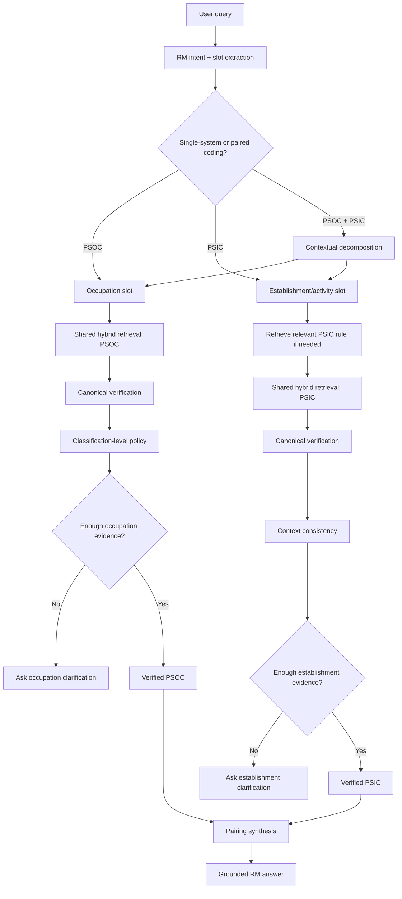
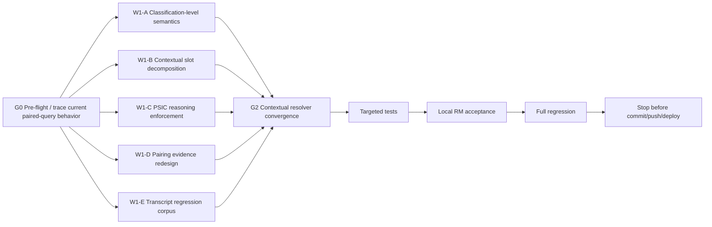

# RM Contextual Coding Contract Restoration

**Project:** PSA Statistical Classifications Search  
**Repository:** `D:\dev\historical_phclassif`  
**Branch:** `feature/pre-staging-hardening`  
**Current accepted RM orchestration commit:** `46c15aa979d68a302215a94eff47085c40468ce5`  
**Purpose:** restore and enforce the original RM architecture for contextual PSOC/PSIC coding, without replacing the completed hybrid retrieval engine.

---

# 1. Mission

Implement the missing contextual coding layer that the original RM architecture already intended:

```text
occupation / duties
    -> PSOC

establishment / principal economic activity
    -> PSIC

common PSOC–PSIC pairing
    -> supporting evidence only

insufficient establishment context
    -> clarify

verified exact code
    -> answer

unverified or unsafe result
    -> abstain
```

Also formalize classification-level semantics so RM distinguishes aggregate hierarchy codes from detailed operational coding levels.

This phase is NOT a new search-engine rewrite.

Preserve:

```text
hybrid retrieval
canonical repository verification
hierarchy-aware RM orchestration
ambiguity handling
classification-system metadata grounding
tool-trace suppression
Search
PSOC + PSIC
Compare Editions
Sources
Subtle Gradient UI
Current/Archived semantics
RM session isolation
```

Do not change the OpenAI model.

Do not enable semantic embeddings.

---

# 2. Why this phase exists

Manual staging acceptance showed that retrieval is now strong, but contextual coding is still weak.

Representative failures include:

```text
corn farmer PSOC PSIC
nurse in a private hospital PSOC PSIC
teacher in private high school PSOC PSIC
barangay health worker PSOC PSIC
mayor PSOC PSIC
statistician PSOC PSIC
carpenter PSOC PSIC
palay farmer PSOC PSIC
fisherman PSOC PSIC
call center agent PSOC PSIC
carinderia helper PSOC PSIC
mananagat PSOC
```

The dominant structural defect is:

```text
one natural-language phrase
    -> independently searched against PSOC
    -> independently searched against PSIC
    -> top results explained
```

That is not the intended coding architecture.

PSOC and PSIC encode different things.

The correct conceptual decomposition is:

```text
PERSON / OCCUPATION / DUTIES
        -> PSOC

ESTABLISHMENT / BUSINESS / EMPLOYER / PRINCIPAL ECONOMIC ACTIVITY
        -> PSIC
```

There is generally no universal one-to-one “corresponding PSIC” for a PSOC occupation.

---

# 3. Core contracts

## 3.1 PSOC contract

PSOC classifies occupations.

For coding-oriented requests, determine:

```text
what work the person actually performs
main duties/tasks
occupation title
specific occupational context
```

Do not infer PSIC from PSOC alone.

For PSOC classification requests:

```text
explicit code lookup
    -> return exact requested level

occupation coding request
    -> prefer detailed operational coding level
```

For PSOC 2022, formalize:

```text
1 digit  -> Major Group
2 digits -> Sub-major Group
3 digits -> Minor Group
4 digits -> Unit Group
```

For survey/data-processing style occupation coding:

```text
target detailed coding level = Unit Group / 4-digit PSOC
```

Higher levels remain valid hierarchy/aggregation codes and must be labeled clearly.

Example:

```text
833  -> Minor Group / aggregate hierarchy
8332 -> Unit Group / detailed occupation code
```

Do not present 833 and 8332 as equivalent detailed coding outputs.

---

## 3.2 PSIC contract

PSIC classifies economic activity of the establishment/unit.

Determine:

```text
what the establishment actually does
principal activity
goods produced
services provided
public/private context where classification distinguishes it
type of institution/business
specific production/service activity
```

Do not infer PSIC merely from a worker's occupation.

If the establishment activity is insufficiently specified:

```text
ask one discriminating follow-up question
```

Do not guess.

---

## 3.3 Common-pairing contract

Existing reviewed PSOC–PSIC common-pairing data is:

```text
supporting evidence
NOT authoritative universal mapping
```

A common pairing may help when the occupation + establishment context matches the reviewed case.

It must never create the rule:

```text
occupation X
-> always PSIC Y
```

No-fixed-PSIC signals must remain meaningful.

If a pairing says PSIC depends on establishment activity:

```text
ask for the establishment activity
```

---

## 3.4 Canonical verification

Every final authoritative code must still resolve through the canonical repository.

No supporting table, heuristic, model inference, or clarification state may bypass:

```text
system
version
code
-> canonical repository entry
```

---

# 4. Target architecture



---

# 5. Graph engineering DAG



---

# 6. G0 — Pre-flight

Before coding:

```powershell
git branch --show-current
git status --short
git log -1 --oneline --decorate
git diff --check
```

Required branch:

```text
feature/pre-staging-hardening
```

Trace the current paired-query path for examples such as:

```text
nurse in a private hospital psoc psic
teacher in private high school psoc psic
barangay health worker psoc psic
mayor psoc psic
carpenter psoc psic
corn farmer psoc psic
```

Identify exactly:

```text
how the model decides to call PSOC vs PSIC search
whether the same full query is passed to both systems
how common pairings are consulted
whether PSIC rules are consulted
how clarification is triggered
how retrieved candidates are selected
```

Produce a compact root-cause statement before implementation.

Do not rediscover the hybrid retrieval architecture.

---

# 7. W1-A — Classification-level semantics

Create a deterministic classification-level contract.

Prefer one centralized helper/module, for example:

```text
R/assistant/assistant_coding_level.R
```

or another repository-consistent location.

The helper should expose, where supported:

```text
system
version
code
classification_level
code_depth
coding_role
is_detailed_coding_level
parent_code
```

Recommended coding-role values:

```text
aggregate
detailed
structural
component
not_applicable
```

For PSOC 2022:

```text
1 digit  = Major Group
2 digits = Sub-major Group
3 digits = Minor Group
4 digits = Unit Group
```

Operational default for occupation coding:

```text
Unit Group / 4 digit
```

Do not hard-code only PSOC 833/8332.

Use registry/schema/hierarchy rules.

Explicit code lookup:

```text
"PSOC 833"
-> return 833
-> label Level: Minor Group
-> label Coding role: Aggregate
-> optionally list child Unit Groups
```

Occupation classification request:

```text
"heavy truck driver"
-> prefer 8332
-> label Level: Unit Group
-> label Coding role: Detailed
```

Tests:

```text
PSOC 833
PSOC 8332
heavy truck driver
bus driver
```

---

# 8. W1-B — Contextual slot decomposition

Implement a deterministic RM-side contract that decomposes paired coding requests into at least:

```text
occupation
occupation_duties
establishment_context
principal_activity
public_private_context
product_service_context
location/government context where relevant
```

Do not require all slots for every query.

Examples:

```text
"nurse in a private hospital"

occupation = nurse
establishment_context = private hospital
public_private_context = private
```

```text
"teacher in private high school"

occupation = teacher
establishment_context = high school
principal_activity = secondary education
public_private_context = private
```

```text
"mayor"

occupation = mayor
establishment_context = local government
```

```text
"carpenter"

occupation = carpenter
establishment_context = unknown
```

```text
"barangay health worker"

occupation = barangay health worker
establishment_context = insufficiently specific
```

The LLM may help extract slots, but safety-critical downstream logic must not depend solely on free-form model prose.

Prefer a structured internal contract.

Possible return shape:

```text
occupation_query
psic_activity_query
context_known
needs_psic_clarification
clarification_reason
```

---

# 9. W1-C — PSIC reasoning enforcement

Re-activate or strengthen the original PSIC reasoning layer.

Audit the existing:

```text
assistant_get_psic_rule()
PSIC rule artifact / rules markdown
```

Relevant rule topics should include:

```text
unit_of_classification
economic_activity
principal_activity
secondary_activity
ancillary_activity
independent_mixed
horizontal_integration
vertical_integration
outsourced_subcontracted
vague_information
common_mistakes
```

For paired occupation/industry requests:

```text
PSOC may be resolved from occupation
PSIC must be resolved from establishment activity
```

If activity is unknown:

```text
ask
```

Do not return a guessed PSIC merely because the occupation often appears in that industry.

---

# 10. W1-D — Common pairing redesign

Audit the current common-pairing data contract.

The system should distinguish:

```text
direct reviewed pairing
context-dependent pairing
no-fixed-PSIC
historical/edition-mapped pairing
```

Recommended deterministic metadata:

```text
pairing_status
pairing_confidence
required_context
source_occupation
source_psoc
source_industry_context
source_psic
mapping_notes
```

Do not expose an arbitrary numeric probability to users.

Possible statuses:

```text
direct
context_resolved
needs_clarification
supporting_only
no_fixed_psic
```

Rules:

```text
direct
-> may support a result after canonical verification

context_resolved
-> only valid if user context matches

needs_clarification
-> ask before presenting PSIC

supporting_only
-> never treated as authority

no_fixed_psic
-> occupation alone cannot determine PSIC
```

Preserve any existing reviewed evidence.

Do not create hard-coded mappings merely to fix staging examples.

---

# 11. W1-E — Transcript-derived regression corpus

Convert the manual staging transcript into a versioned RM regression dataset.

Suggested file:

```text
data-raw/rm_contextual_coding_eval_cases.csv
```

Recommended fields:

```text
case_id
query
expected_psoc_code
expected_psoc_level
expected_psic_code
expected_behavior
expected_clarification
context_type
notes
provenance
```

The corpus should preserve actual staging failures.

At minimum include:

```text
PSOC 833
PSOC 8332
heavy truck driver
bus driver
PSIC bakery
repair of motor
corn farmer PSOC PSIC
crop farmer PSOC
eggplant farmer
nurse in private hospital PSOC PSIC
teacher in private high school PSOC PSIC
barangay health worker PSOC PSIC
mayor PSOC PSIC
statistician PSOC PSIC
bet collector PSOC PSIC
call center agent PSOC PSIC
carinderia helper PSOC PSIC
carpenter PSOC PSIC
palay farmer PSOC PSIC
fisherman PSOC PSIC
street food vendor PSOC PSIC
mananagat PSOC
professional AI prompt engineer
```

Do not encode a wrong PSIC merely because one appeared in the transcript.

Every expected code must be independently canonical-verified before entering the corpus.

---

# 12. Required behavior matrix

## 12.1 PSOC hierarchy

### Query

```text
PSOC 833
```

Required:

```text
Code: 833
Level: Minor Group
Coding role: Aggregate
```

Optionally show children:

```text
8331
8332
```

Do not imply 833 is the detailed occupation coding output.

### Query

```text
heavy truck driver
```

Required:

```text
8332
Level: Unit Group
Coding role: Detailed
```

---

## 12.2 Corn farmer

### Query

```text
corn farmer PSOC PSIC
```

Required pattern:

```text
occupation slot
-> PSOC 6112 Corn Farmers

establishment/activity slot
-> corn-growing activity
-> verify current PSIC
```

Do not say corn farming has no PSIC merely because the original full query did not lexically match.

---

## 12.3 Nurse in private hospital

### Query

```text
nurse in a private hospital PSOC PSIC
```

Required:

```text
occupation = nurse
-> verified nursing PSOC at detailed level

establishment activity = private hospital
-> verified private-hospital PSIC
```

Never return an unrelated horticulture/gardening PSOC as a candidate.

If retrieval returns an obviously context-incompatible result:

```text
reject / retry / clarify
```

Do not present it with a disclaimer.

---

## 12.4 Private high-school teacher

### Query

```text
teacher in private high school PSOC PSIC
```

Required:

```text
occupation = secondary education teacher
-> PSOC detailed code

activity = private general secondary education
-> PSIC
```

Do not return private preschool activities.

---

## 12.5 Barangay Health Worker

### Query

```text
barangay health worker PSOC PSIC
```

Required:

```text
PSOC
-> Community Health Workers if canonically verified
```

For PSIC:

```text
do not assume one universal industry
```

If employer/activity is not sufficiently known, ask:

```text
Where is the worker assigned/employed or what is the principal activity of the unit?
```

Options may reflect verified contexts such as:

```text
barangay/LGU administration
public health/medical service
other organization
```

Only offer options supported by verified candidate metadata/rules.

---

## 12.6 Mayor

### Query

```text
mayor PSOC PSIC
```

Required:

```text
occupation = mayor
-> resolve canonical PSOC at detailed level
```

Establishment/activity context:

```text
local government/public administration
-> resolve canonical PSIC if sufficiently supported
```

Do not report “no classification” if the canonical repositories contain the relevant occupation/activity.

---

## 12.7 Carpenter

### Query

```text
carpenter PSOC PSIC
```

Required:

```text
PSOC
-> carpenter occupation

PSIC
-> ask establishment/principal-activity clarification
```

Do not dump multiple industry codes as though they are universal “corresponding PSICs.”

---

## 12.8 Call center agent

### Query

```text
call center agent PSOC PSIC
```

Required:

```text
occupation search
-> determine PSOC independently

establishment activity
-> call-center activity PSIC
```

Do not return PSIC only and claim no PSOC if the occupation can be resolved through title/synonym/contextual retrieval.

---

## 12.9 Palay farmer / mananagat / local wording

Use controlled synonym/local-language support only as candidate-generation/context assistance.

Do not hard-code direct unconditional code mappings.

Examples:

```text
palay farmer
mananagat
magbobote
```

If multiple occupational interpretations remain:

```text
clarify
```

---

# 13. Context consistency check

Add a deterministic post-retrieval consistency step.

Purpose:

```text
prevent obviously unrelated verified candidates
from being handed to RM as plausible final answers
```

Example failure to prevent:

```text
query occupation = nurse
candidate = Gardeners, Horticultural and Nursery Growers
```

The candidate may be canonical, but it is not contextually plausible.

Use only measured/structural evidence.

Possible evidence:

```text
slot-specific query
retrieval rank/tier
token evidence
candidate hierarchy
candidate label similarity
common-pairing support
PSIC rule compatibility
```

Do not use LLM free-form confidence as the final gate.

If no candidate passes:

```text
abstain or clarify
```

---

# 14. Pairing synthesis

The final answer layer should distinguish:

```text
Occupation classification (PSOC)
Industry/activity classification (PSIC)
```

Example:

```text
Occupation (PSOC)
2221 — Nursing Professionals
Level: Unit Group / detailed occupation code

Industry (PSIC)
8612 — Private Hospital Activities
Level: <canonical PSIC level>
```

Do not label PSIC as a “corresponding code” unless the context actually determines it.

Preferred language:

```text
"Based on the occupation..."
"Based on the establishment's principal activity..."
```

---

# 15. Clarification behavior

Ask only when required.

Good:

```text
"What is the main activity of the establishment where the carpenter works?"
```

Bad:

```text
"Which PSIC code do you want?"
```

The user should not need to know the classification system to answer.

Clarification should ask about real-world facts:

```text
duties
product
service
employer
public/private status
type of institution
principal activity
```

---

# 16. RM prompt policy update

Update the RM system prompt to reinforce, not replace, deterministic logic.

Required concepts:

```text
PSOC codes occupations.
PSIC codes establishment economic activity.
Never infer PSIC solely from occupation.
Common pairings are supporting evidence only.
If PSIC context is insufficient, ask.
For occupation coding, prefer detailed PSOC Unit Group when available.
If the user explicitly asks for an aggregate code, explain that level faithfully.
Do not present a canonical but contextually incompatible candidate merely because retrieval returned it.
```

---

# 17. Tool policy

The tool sequence for paired requests should conceptually become:

```text
1. interpret/decompose query
2. search PSOC using occupation slot
3. verify likely PSOC
4. determine whether establishment context is sufficient
5. if PSIC reasoning needed, retrieve relevant PSIC rule
6. consult common pairing only as support
7. search PSIC using establishment/activity slot
8. verify likely PSIC
9. if insufficient/ambiguous, ask one discriminating question
10. answer with separate PSOC and PSIC sections
```

Do not search the identical full sentence against both systems unless the decomposition genuinely yields the same text.

---

# 18. Testing strategy

## 18.1 Unit tests

Add focused tests for:

```text
coding-level semantics
slot decomposition contract
PSIC context requirement
common-pairing statuses
context consistency
clarification decision
```

## 18.2 Regression tests

Use transcript cases.

Every fixed staging failure should become permanent.

## 18.3 Negative tests

Include:

```text
occupation only with no establishment activity
-> PSOC may resolve
-> PSIC must not be guessed

unrelated canonical candidate
-> must not be surfaced as plausible final result

aggregate PSOC code
-> clearly labeled as aggregate

explicit aggregate code query
-> preserved, not auto-replaced by child
```

---

# 19. Local acceptance set

Before full regression, exercise at least:

```text
PSOC 833
heavy truck driver
bus driver
corn farmer PSOC PSIC
nurse in private hospital PSOC PSIC
teacher in private high school PSOC PSIC
barangay health worker PSOC PSIC
mayor PSOC PSIC
carpenter PSOC PSIC
call center agent PSOC PSIC
palay farmer PSOC PSIC
mananagat PSOC
professional AI prompt engineer
```

Inspect both:

```text
deterministic tool outputs
final RM orchestration behavior where credentials are locally available
```

Do not require live OpenAI locally if credentials are absent.

---

# 20. Full regression gate

After targeted tests:

```powershell
Rscript scripts/run_tests.R
```

Required:

```text
FAIL 0
WARN 0
SKIP 0
```

Then:

```powershell
Rscript -e "renv::status()"
git diff --check
git status --short
git diff --stat
```

Prefer zero new dependencies.

Do not change `renv.lock` unless required.

---

# 21. Staging acceptance criteria for the later phase

After a separate controlled commit/push/tag/republish:

## Must pass

```text
PSOC 833
-> explicitly Minor Group / aggregate

heavy truck driver
-> 8332 Unit Group / detailed

nurse in private hospital
-> correct occupation + correct private-hospital industry

teacher in private high school
-> correct occupation + correct private-secondary-education industry

corn farmer
-> correct occupation + corn-growing PSIC activity

barangay health worker
-> correct PSOC + PSIC clarification when establishment context is insufficient

mayor
-> canonical occupation + local-government activity when context supports it

carpenter
-> PSOC + PSIC clarification, not arbitrary industry dump
```

## Must remain safe

```text
professional AI prompt engineer
-> no fabricated official code

tool names hidden

PSCC/PSCCS metadata still correct

PTSCS/PSCrCS metadata still grounded

session isolation preserved
```

---

# 22. Release blockers

Block main-merge review if:

```text
3-digit PSOC aggregate is presented as equivalent to detailed 4-digit coding output

occupation is used to infer a universal PSIC without establishment context

common pairing bypasses PSIC context/rules

contextually incompatible canonical result is surfaced as plausible

government/public-private context is ignored where it changes PSIC

paired queries still search the same undifferentiated text against both systems

clarification is skipped when PSIC cannot be safely determined

unverified authoritative code is presented

existing retrieval/hierarchy/tool-trace protections regress
```

---

# 23. Explicit non-goals

Do NOT:

```text
replace hybrid retrieval
enable embeddings
add Python/PyTorch
change gpt-4o-mini
hard-code mayor/BHW/nurse/etc. as one-off fixes
build a giant occupation->industry lookup table
make common pairings authoritative
infer PSIC from occupation title alone
redesign the UI
```

---

# 24. Git/deployment stop conditions

During this implementation phase:

```text
DO NOT commit
DO NOT push
DO NOT tag
DO NOT merge
DO NOT republish Connect Cloud
DO NOT deploy production
```

Leave all completed work in the working tree.

A separate controlled commit/staging instruction follows only after review.

---

# 25. Required final engineering report

Return:

1. Pre-flight state
2. Root cause of paired-query failures
3. Current paired-query call path
4. Classification-level contract
5. PSOC detailed-coding-level implementation
6. PSOC 833 behavior
7. Heavy-truck behavior
8. Contextual slot-decomposition implementation
9. PSIC reasoning/rule integration
10. Common-pairing redesign
11. Pairing statuses/semantics
12. Context-consistency gate
13. Clarification policy
14. Transcript regression corpus
15. Corn farmer result
16. Nurse/private hospital result
17. Teacher/private high-school result
18. Barangay Health Worker result
19. Mayor result
20. Carpenter result
21. Call-center-agent result
22. Palay farmer / mananagat behavior
23. No-code safety result
24. Files changed
25. Dependencies added/avoided
26. Targeted tests
27. Full regression
28. `renv::status()`
29. `git diff --check`
30. Remaining limitations
31. Whether semantic retrieval remains deferred
32. Whether working tree is ready for controlled commit/staging
33. Confirmation no commit/push/tag/merge/deploy occurred

Stop there.

---

# 26. Design principle to preserve

The final RM architecture should remain:

```text
LLM
= understand, decompose, converse, clarify

Deterministic application
= search, retrieve rules, retrieve pair evidence,
  enforce classification levels,
  verify codes, reject unsafe candidates

User
= supplies missing real-world context when needed
```

The model is never the source of truth for classification codes.

The repository remains the source of truth.
