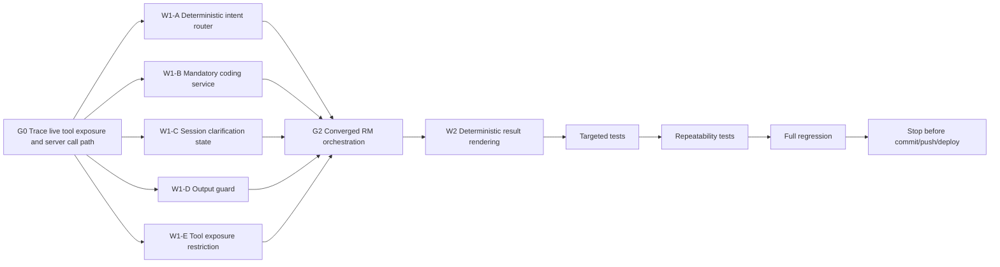

# RM Deterministic Tool-Routing Enforcement

**Project:** PSA Statistical Classifications Search  
**Repository:** `D:\dev\historical_phclassif`  
**Branch:** `feature/pre-staging-hardening`  
**Current release candidate:** `pre-staging-v7`  
**Current HEAD:** `4a8b2a5728ed9db770ab0f4c9e509fa0ddfc66c6`  
**Status:** `pre-staging-v7` failed live RM acceptance because the live model can bypass the deterministic contextual resolver and choose inconsistent low-level tools.

---

# 1. Mission

Fix the live RM orchestration defect without rewriting retrieval or contextual coding.

The invariant for this phase is:

```text
For any PSOC/PSIC coding request:

the LLM may interpret the user's wording
and may explain verified results,

but it may NOT independently select,
infer, authorize, or synthesize
classification codes.
```

All authoritative coding decisions must go through a deterministic server-side coding service.

The completed components must be preserved:

```text
hybrid retrieval
canonical repository verification
classification-level semantics
contextual PSOC/PSIC decomposition
occupation-example evidence
PSA survey-guidance evidence
BHW curated override
PSIC vague-activity rules
outsourcing/payroll rule
hierarchy-aware RM behavior
system metadata grounding
tool-trace suppression
session isolation
Search
PSOC + PSIC
Compare Editions
Sources
Subtle Gradient UI
```

Do not enable semantic retrieval in this phase.

Do not change `gpt-4o-mini`.

Do not change provider.

---

# 2. Why this phase exists

Local deterministic tests are green, but live Connect Cloud staging showed that the model is not consistently using the high-level contextual resolver.

The same release candidate produced different outcomes in separate fresh browser sessions.

Examples observed live:

```text
mayor psoc psic
-> one session: PSOC 1112
-> another session: no PSOC

angkas driver psoc
-> one session: 8323
-> another session: no PSOC

food panda bicycle driver psoc
-> one session: unrelated 5165 DRIVING INSTRUCTORS
-> another session: no PSOC

call center agent psoc
-> no PSOC

barangay health worker psoc
-> 3253 + 5329 as peer results

barangay health aide psoc
-> no PSOC

teacher in private high school psoc psic
-> correct PSOC 2330
-> wrong preschool PSIC 85102

corn farmer psoc psic
-> PSOC 6112
-> no PSIC

carpenter psoc psic
-> one session: archived PSIC 41001 inferred
-> another: list of construction PSIC codes

janitor via manpower agency at hospital
-> model asked public/private hospital
-> ignored deterministic wage-payer rule
```

These failures prove:

```text
the deterministic resolver exists
but the model can bypass it
```

This is an orchestration problem, not a retrieval problem.

---

# 3. Root-cause model

Current effective architecture:

```text
USER
  ↓
gpt-4o-mini
  ↓
model chooses tools
  ├─ contextual resolver
  ├─ raw classification search
  ├─ exact entry lookup
  ├─ common pairings
  ├─ PSIC rules
  └─ free-form synthesis
       ↓
user-visible answer
```

This permits nondeterministic authoritative routes.

The required architecture is:

```text
USER
  ↓
SERVER-SIDE INTENT ROUTER
  ↓
bounded request type
  ├─ exact code lookup
  ├─ contextual coding
  ├─ system information
  ├─ edition comparison
  └─ general search/exploration
       ↓
MANDATORY deterministic service
       ↓
structured verified result packet
       ↓
deterministic result rendering
       +
LLM explanation only
```

For coding requests:

```text
user
  ↓
intent router
  ↓
structured slot extraction
  ↓
contextual coding service
  ↓
canonical verification
  ↓
allowed result packet
  ↓
output guard
  ↓
user
```

The model must not be able to substitute a lower-level path.

---

# 4. Non-goals

Do NOT:

```text
rewrite hybrid retrieval
retune fuzzy/ngram thresholds
enable embeddings
change the OpenAI model
change provider
add a second common-pairing table
add new hard-coded one-off occupation mappings
redesign the UI
remove the existing contextual resolver
make common pairings authoritative
allow archived PSIC as a current answer
```

---

# 5. Graph engineering DAG



---

# 6. G0 — Pre-flight and trace

Before code changes:

```powershell
git branch --show-current
git status --short
git log -2 --oneline --decorate
git diff --check
```

Required starting state:

```text
branch = feature/pre-staging-hardening
HEAD = 4a8b2a5728ed9db770ab0f4c9e509fa0ddfc66c6
tag at HEAD = pre-staging-v7
working tree = clean
```

Trace the current live RM server path from:

```text
user input
-> shinychat / ellmer
-> available tool definitions
-> model tool selection
-> tool loop
-> final text rendering
```

Document:

```text
which tools are directly exposed to the model
which tool can return authoritative codes
whether the model can call low-level search directly
whether common-pairing results can flow directly to final prose
whether current-edition constraints exist at the high-level route
where session-scoped clarification state currently lives, if anywhere
```

Do not modify code until this trace is complete.

---

# 7. W1-A — Deterministic intent router

Add a server-side intent router, for example:

```text
R/assistant/assistant_router.R
```

The router must select a bounded internal route before authoritative classification tools are available.

Recommended route types:

```text
exact_code_lookup
contextual_coding
system_information
edition_comparison
general_search
non_classification
```

The router does not itself choose codes.

It chooses which deterministic service may choose codes.

## 7.1 Coding intent

The following should route to:

```text
contextual_coding
```

Examples:

```text
mayor psoc psic
call center agent psoc
barangay health worker psoc
nurse in a private hospital
teacher in private high school psoc psic
corn farmer psoc psic
carpenter psoc psic
what is the PSIC of a janitor deployed through manpower agency
```

## 7.2 Exact code lookup

Examples:

```text
PSOC 833
PSOC 8332
PSIC 8612
PSCC 0101.29.00-001
```

These should route to:

```text
exact_code_lookup
```

and preserve the requested classification level.

## 7.3 System-information questions

Examples:

```text
What is PSCC?
What is PSCCS?
What are the components of PTSCS?
```

These should route to:

```text
system_information
```

not entry search.

## 7.4 General search

Exploratory search may still use low-level search, but it must not be treated as a final coding decision unless it is passed through canonical resolution.

---

# 8. Router implementation rule

The user-facing model must not be allowed to decide:

```text
Should I use raw search or contextual resolver?
```

That decision belongs to the server.

Preferred architecture:

```text
server classifies route
        ↓
constructs route-specific tool surface
        ↓
model operates within that route
```

If a fully pre-model deterministic intent classifier is not practical, use a constrained structured extraction call whose output is parsed and validated before any coding tools are exposed.

The result must be a fixed schema, not free-form prose.

Example:

```text
route = contextual_coding
requested_systems = ["psoc", "psic"]
occupation_text = "teacher"
establishment_text = "private high school"
```

---

# 9. W1-B — Mandatory coding service

Add or formalize one authoritative coding service, for example:

```text
R/assistant/assistant_coding_service.R
```

It should call the already-built deterministic components.

Conceptually:

```text
assistant_coding_service(
    occupation = NULL,
    establishment_activity = NULL,
    requested_systems = c("psoc", "psic"),
    public_private = NULL,
    government_level = NULL,
    employment_arrangement = NULL,
    requested_versions = NULL,
    pending_state = NULL
)
```

The service owns:

```text
slot validation
survey-guidance checks
vague-activity checks
outsourcing/payroll preconditions
occupation-example evidence
common-pairing evidence as support only
PSOC resolution
PSIC resolution
classification-level policy
current-edition policy
canonical verification
clarification determination
allowed result packet
```

No other model-callable tool may independently authorize a PSOC or PSIC code for a coding request.

---

# 10. Structured coding-service result

Return a deterministic packet.

Suggested shape:

```text
status:
  resolved | clarification_required | no_verified_match

request_type:
  contextual_coding

occupation:
  status
  selected_code
  selected_label
  classification_level
  coding_role
  version
  status_current
  evidence_source

industry:
  status
  selected_code
  selected_label
  classification_level
  coding_role
  version
  status_current
  supported_aggregate_code

clarification:
  missing_slot
  question
  options

allowed_codes:
  psoc
  psic

provenance:
  canonical
  survey_guidance
  archived_example
  pairing_support
```

The model should not receive raw noisy candidate sets unless a route specifically needs them.

---

# 11. Selected result vs candidate pool

Search returns candidates.

The coding service returns decisions.

For example:

```text
barangay health worker
```

Internal search may find:

```text
3253
5329
...
```

The final coding-service packet must say:

```text
selected_code = 3253
```

if the deterministic evidence supports it.

The model should not see:

```text
3253 + 5329
```

as equal user-facing candidates once the resolver has already decided.

Likewise:

```text
call center agent
-> selected 4222

call center sales agent
-> selected 5244
```

---

# 12. W1-C — Session-scoped clarification state

Add explicit clarification state, for example:

```text
R/assistant/assistant_turn_state.R
```

State must be per Shiny session.

Never global.

Example:

```text
pending_request:
  route = contextual_coding
  requested_systems = ["psoc", "psic"]
  occupation = "carpenter"
  verified_psoc = "7115"
  missing_slot = "establishment_activity"
```

The RM asks:

```text
What is the main activity of the establishment where the carpenter works?
```

User answers:

```text
residential construction
```

That reply must be interpreted as:

```text
fill establishment_activity
```

not as an unrelated new request.

Then rerun the coding service.

---

# 13. Clarification lifecycle

Required lifecycle:

```text
initial request
  ↓
coding service
  ↓
clarification_required
  ↓
store pending state
  ↓
ask one question
  ↓
user answers
  ↓
merge answer into missing slot
  ↓
rerun same coding service
  ↓
resolved OR next clarification
```

Clear pending state when:

```text
request resolves
user explicitly changes topic
new exact code lookup clearly supersedes it
session ends
```

Do not leak state across browser sessions.

---

# 14. Clarification output rule

If:

```text
status = clarification_required
```

then the final answer must not contain an authoritative code for the unresolved system.

Example:

```text
carpenter psoc psic
```

may return:

```text
PSOC 7115
```

but for PSIC:

```text
no final code yet
question = what is the establishment's principal activity?
```

The model must not list:

```text
41001
41002
42100
...
```

as possible final codes unless the deterministic service explicitly intends to present bounded verified clarification options.

---

# 15. Outsourcing/payroll rule is a hard precondition

The PSA survey-guidance rule must execute before PSIC retrieval.

If wording indicates:

```text
manpower agency
recruitment agency
outsourced
deployed through agency
agency employee
contracted through agency
```

and wage payer/employer is unknown:

```text
industry.status = clarification_required
missing_slot = wage_payer
```

Required question:

```text
Who actually pays this person's wage:
the establishment where they are deployed,
or the manpower/recruitment agency?
```

Do not ask:

```text
Is the hospital public or private?
```

until wage payer is resolved.

If:

```text
hospital pays
```

then classify hospital activity.

If:

```text
agency pays
```

then classify the agency's own activity.

---

# 16. Government context rule

Do not treat:

```text
government
```

alone as sufficiently detailed establishment activity.

However, where the occupation itself establishes a strong government role and the canonical activity can resolve at the appropriate level, the service may still return a supported aggregate/current result while requesting further detail if needed.

Examples:

```text
mayor
-> PSOC 1111

mayor + local government
-> PSIC 84113 if current canonical context supports it
```

For:

```text
statistician in government
```

PSOC 2122 may resolve, while PSIC may require:

```text
national/regional/local government
or specific office activity
```

Do not ask the user to choose a code number.

Ask about real-world context.

---

# 17. Current-edition enforcement

For ordinary current coding requests:

```text
current edition only
```

must be enforced server-side.

Historical evidence may support retrieval or interpretation.

It must never become the final current code unless:

```text
historical evidence
  ↓
maps to current semantic activity
  ↓
current repository search
  ↓
current canonical verification
```

Final packet must not contain:

```text
Status: Archived
```

for ordinary current coding requests.

If the user explicitly asks about an archived edition, use a separate historical route.

---

# 18. W1-D — Output guard

Add:

```text
R/assistant/assistant_response_guard.R
```

The guard receives:

```text
structured coding packet
generated model response
```

and enforces:

```text
all authoritative codes in prose must be in allowed_codes
```

Example:

```text
allowed_codes.psoc = ["1111"]
allowed_codes.psic = ["84113"]
```

If model prose contains:

```text
1112
```

reject or replace the response.

For:

```text
clarification_required
```

the unresolved system's allowed-code set should be empty unless the service explicitly permits a supported aggregate code.

---

# 19. Response guard behavior

Preferred handling:

```text
model response valid
-> render

model response invalid
-> discard unsafe generated coding text
-> render deterministic fallback
```

Do not attempt to silently edit individual wrong digits inside prose.

Fallback should come from the structured result packet.

---

# 20. Deterministic result rendering

Prefer deterministic rendering for authoritative classification facts.

For example:

```text
Occupation classification — PSOC

Code: 1111
Label: <canonical current label>
Level: Unit Group
Coding role: Detailed
Edition: 2022
Status: Current
Source: Philippine Statistics Authority
```

The LLM may add:

```text
why this matches
what additional context is needed
what the distinction means
```

but code/label/level/version/status should come directly from R.

This can be implemented as:

```text
assistant_render_coding_result()
```

or integrated into the existing render module.

---

# 21. W1-E — Restrict low-level tool exposure

Audit all tools currently registered with ellmer.

For the `contextual_coding` route, do not expose low-level authoritative alternatives such as:

```text
assistant_search_classification
assistant_search_common_pairings
```

as independent model-selectable final routes.

They may remain callable internally by:

```text
assistant_coding_service
```

If ellmer architecture requires them to remain registered globally, add server-side guards that refuse their use as authoritative coding routes when the current route is contextual coding.

Preferred:

```text
route-specific tool registration
```

if feasible.

---

# 22. Exact-code route

For:

```text
PSOC 833
```

do not send the request through contextual occupation classification.

Use:

```text
exact_code_lookup
```

and return:

```text
833
Level: Minor Group
Coding role: Aggregate
```

For:

```text
PSOC 8332
```

return:

```text
8332
Level: Unit Group
Coding role: Detailed
```

Do not auto-descend an explicitly requested aggregate code.

---

# 23. System-info route

Preserve deterministic system metadata.

Questions such as:

```text
What is PSCCS?
What are the components of PTSCS?
```

must continue using:

```text
assistant_get_classification_system_info()
```

or its deterministic service wrapper.

Do not route them through contextual coding.

---

# 24. Live failure matrix that must become regression tests

Add permanent tests for the exact failure patterns from `pre-staging-v7`.

## Mayor

```text
mayor psoc psic
-> PSOC 1111
-> PSIC 84113 when local-government context is present
```

Must not produce:

```text
1112
no PSOC
```

---

## Call center

```text
call center agent
-> 4222

call center sales agent
-> 5244

telemarketer
-> 5244
```

---

## BHW

```text
barangay health worker
-> 3253 only as selected result

BHW
-> 3253

barangay health aide
-> 5321
```

Do not surface 5329 as an equal BHW final answer.

---

## Teacher / private high school

```text
teacher in private high school
-> PSOC 2330
-> PSIC private secondary education
```

Must never return preschool PSIC.

---

## Corn farmer

```text
corn farmer
-> PSOC 6112
-> current corn-growing PSIC
```

---

## Palay farmer

```text
palay farmer
-> PSOC 6111
-> supported rice-growing aggregate
-> clarification for detailed irrigation regime
```

Do not mix:

```text
rice milling
post-harvest preparation
other cereals
```

into the same final activity interpretation.

---

## Carpenter

```text
carpenter
-> PSOC 7115
-> PSIC clarification
```

Do not infer construction industry from occupation alone.

---

## Angkas / Foodpanda

```text
angkas driver
-> 8323

food panda bicycle driver
-> 9335
```

Must not produce:

```text
no classification
5165 DRIVING INSTRUCTORS
```

---

## Outsourcing

```text
janitor deployed at hospital through manpower agency
-> PSIC blocked
-> ask wage payer first
```

---

## AI prompt engineer

```text
professional AI prompt engineer
-> no verified authoritative PSOC
```

---

# 25. Repeatability test harness

Add a deterministic repeatability test around the routing and coding-service layers.

For each critical query, run route + service multiple times in a fresh state.

Expected:

```text
same route
same selected code
same clarification status
same missing slot
same current edition
same allowed code set
```

The LLM wording need not be identical.

Test at least:

```text
mayor psoc psic
call center agent psoc
BHW psoc
teacher in private high school psoc psic
corn farmer psoc psic
carpenter psoc psic
angkas driver psoc
food panda bicycle driver psoc
```

---

# 26. Model nondeterminism test

Where local API credentials are available, add a bounded live-model smoke harness that checks only structured outcomes, not wording.

Run the same critical query several times.

The model may phrase things differently.

It must not change:

```text
route
selected code
clarification status
allowed-code set
```

If credentials are unavailable locally, keep this for staging acceptance.

---

# 27. Prompt role after this fix

The RM prompt should become simpler in authority terms.

Prompt may say:

```text
use the structured verified result
explain it clearly
ask the provided clarification question
do not invent codes
```

But no safety-critical rule should depend solely on prompt compliance.

Code-level invariants own:

```text
route
selected code
current edition
clarification requirement
allowed codes
```

---

# 28. Tool-trace suppression

Preserve the existing tool-trace suppression.

The user may see:

```text
Checking official PSA classifications…
```

They must not see:

```text
assistant_router
assistant_coding_service
assistant_search_classification
assistant_search_common_pairings
assistant_get_classification_entry
assistant_response_guard
raw tool JSON
```

---

# 29. Targeted tests

Add focused tests for:

```text
router
coding service
clarification state
response guard
route-specific tool exposure
current-edition enforcement
allowed-code enforcement
deterministic fallback rendering
```

Suggested files:

```text
tests/testthat/test-assistant-router.R
tests/testthat/test-assistant-coding-service.R
tests/testthat/test-assistant-turn-state.R
tests/testthat/test-assistant-response-guard.R
```

Use existing repository conventions.

---

# 30. Required deterministic acceptance set

Before full regression, prove:

```text
PSOC 833
-> exact_code_lookup
-> 833 Minor Group

heavy truck driver
-> contextual_coding
-> 8332

mayor psoc psic
-> contextual_coding
-> PSOC 1111
-> PSIC 84113 if context present

city administrator psoc
-> does not collapse to mayor

statistician psoc
-> 2122

statistician psoc psic
-> PSOC 2122
-> PSIC clarification if employer activity absent

call center agent
-> 4222

call center sales agent
-> 5244

telemarketer
-> 5244

barangay health worker
-> 3253

BHW
-> 3253

barangay health aide
-> 5321

nurse in private hospital
-> 2221
-> supported aggregate hospital activity
-> detail clarification

private general hospital
-> 86121

teacher in private high school
-> 2330
-> current private-secondary-education PSIC

corn farmer
-> 6112
-> current corn-growing PSIC

palay farmer
-> 6111
-> rice-growing aggregate
-> detailed clarification

carpenter
-> 7115
-> PSIC clarification

angkas driver
-> 8323

food panda bicycle driver
-> 9335

janitor + manpower agency
-> wage-payer clarification before PSIC

professional AI prompt engineer
-> no verified code
```

---

# 31. Full regression gate

Run:

```powershell
Rscript scripts/run_tests.R
Rscript -e "renv::status()"
git diff --check
git status --short
git diff --stat
```

Required:

```text
FAIL 0
WARN 0
SKIP 0
```

Prefer zero dependencies.

If new runtime `R/assistant/*.R` files are added:

```text
regenerate manifest.json
or verify it is updated through the repository's canonical manifest workflow
```

Do not permit another stale-manifest deployment.

---

# 32. Staging acceptance for the later release candidate

After a separate controlled commit/push/tag, create:

```text
pre-staging-v8
```

Do not move/reuse `pre-staging-v7`.

The user will manually republish Connect Cloud and test in at least:

```text
normal browser
incognito/private browser
```

Repeat critical queries in both.

Required:

```text
same structured outcome across sessions
```

especially:

```text
mayor
call center agent
BHW
teacher/private high school
corn farmer
carpenter
angkas
food panda
outsourcing
```

---

# 33. Release blockers

Block `pre-staging-v8` if any of these remain possible:

```text
model can bypass contextual resolver for a coding request
model can use common pairings as final authority
model can surface archived PSIC for a current request
model can emit a code outside resolver allowed_codes
model can list PSIC candidates when clarification_required forbids them
outsourcing rule can be skipped
BHW can resolve differently across fresh sessions
mayor can resolve to 1112 or no PSOC
private high-school teacher can return preschool PSIC
corn farmer can lose its PSIC activity
Foodpanda can become DRIVING INSTRUCTORS
same query can take different authoritative routes across fresh sessions
```

---

# 34. Semantic retrieval remains deferred

Do not enable semantic retrieval during this phase.

Reason:

```text
current defect = orchestration authority
semantic retrieval = recall enhancement
```

Enabling semantics now would confound diagnosis.

After `pre-staging-v8` passes live deterministic routing acceptance, semantic retrieval may become the next isolated phase.

---

# 35. Git/deployment stop conditions

During this implementation phase:

```text
DO NOT commit
DO NOT push
DO NOT tag
DO NOT merge
DO NOT republish Connect Cloud
DO NOT deploy production
```

Leave completed work uncommitted for review.

---

# 36. Required final engineering report

Return:

1. Pre-flight state
2. Current live RM tool exposure
3. Exact root cause of routing nondeterminism
4. Server-side router implementation
5. Route taxonomy
6. Contextual coding-service implementation
7. Structured coding-result packet
8. Selected-result vs candidate-pool handling
9. Session clarification-state implementation
10. Clarification lifecycle
11. Outsourcing/payroll precondition
12. Government-context handling
13. Current-edition enforcement
14. Low-level tool exposure restriction
15. Common-pairing authority restriction
16. Response-guard implementation
17. Allowed-code enforcement
18. Deterministic fallback rendering
19. Exact-code route behavior
20. System-info route behavior
21. Mayor result
22. Call-center results
23. BHW / health-aide results
24. Teacher/private-high-school result
25. Corn-farmer result
26. Palay-farmer result
27. Carpenter result
28. Angkas result
29. Foodpanda result
30. Outsourcing result
31. AI-prompt-engineer safety result
32. Repeatability-test result
33. Files changed
34. Dependencies added/avoided
35. Targeted tests
36. Full regression
37. `renv::status()`
38. `git diff --check`
39. Manifest status
40. Remaining limitations
41. Confirmation semantic retrieval remains disabled
42. Whether working tree is ready for controlled commit / `pre-staging-v8`
43. Confirmation no commit/push/tag/merge/deploy occurred

Stop there.

---

# 37. Design principle

The final authority boundary must be:

```text
LLM
= understand wording
= extract structured context
= converse
= explain

Deterministic application
= choose route
= enforce missing-context rules
= retrieve evidence
= select classification
= enforce current edition
= verify canonical code
= decide clarification
= whitelist allowed codes
= render authoritative facts

User
= supplies missing real-world facts
```

The model is not the classification authority.

The deterministic application is.
