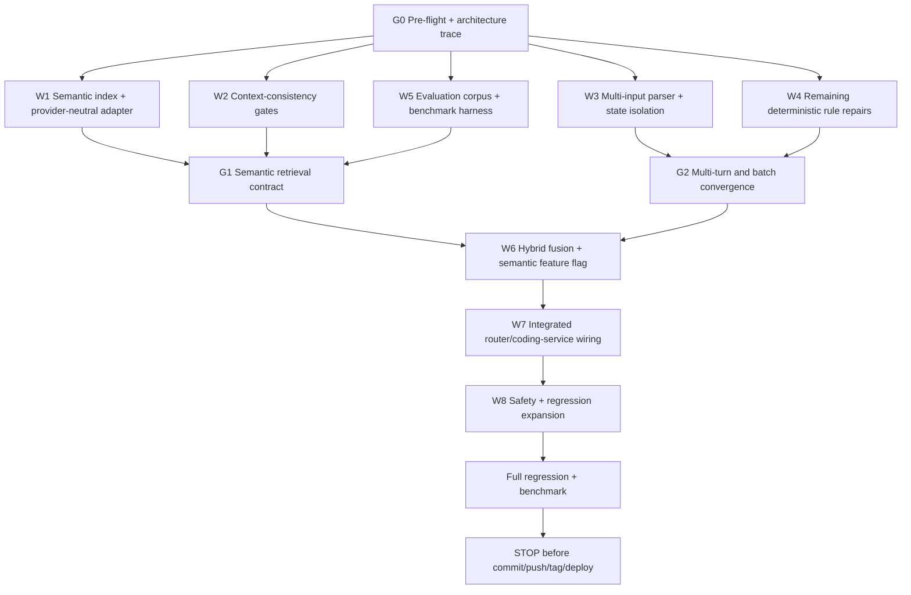

# Semantic Retrieval and Context-Consistency Hardening

**Project:** PSA Statistical Classifications Search + RM Assistant  
**Repository:** `D:\dev\historical_phclassif`  
**Branch:** `feature/pre-staging-hardening`  
**Current release candidate:** `pre-staging-v8`  
**Current committed HEAD:** `ba170822ee370b0a3ae76dd01757309cacfa88bd`  
**Purpose:** Add semantic candidate retrieval and harden contextual interpretation for the remaining live RM failures, while preserving deterministic code authorization and current-edition canonical verification.

---

# 0. Governing principle

This phase is NOT permission to make embeddings authoritative.

```text
LLM / semantic retrieval
    = understand wording
    = retrieve candidates
    = improve recall
    = infer semantic context

Deterministic application
    = choose route
    = separate PSOC occupation from PSIC establishment activity
    = enforce clarification rules
    = enforce survey methodology rules
    = reject incompatible semantic candidates
    = verify current canonical entry
    = authorize final code
    = render authoritative facts
```

> **No current canonical verification = no authoritative classification code.**

Semantic retrieval improves recall. It does not override deterministic safety.

---

# 1. Why this phase is now justified

`pre-staging-v8` improved orchestration stability but live browser tests still show substantial accuracy and context problems.

Observed failures include:

```text
teacher in a private high school
-> PSOC 5312 TEACHERS' AIDES
-> PSIC 85102 Private pre-primary / pre-school

palay farmer / palay farming
-> PSOC 6111 RICE FARMERS
-> PSIC 10611 Rice milling

corn farmer
-> one fresh session resolves PSIC 01130 Growing of corn
-> another fresh session fails even after:
   "private farm"
   "corn farming in their own farm"

city administrator / city government
-> PSIC may fail until phrased as "local government unit"

statistician in a national government agency / PSA
-> PSOC resolves
-> PSIC fails or invokes irrelevant wage-payer logic

multi-input request:
grab taxi driver psoc
food panda bicycle driver psoc
vulcanizer psoc
online seller psoc
data scientist psoc
esports player psoc
-> collapsed to one answer: 3424 ESPORTS PLAYERS AND COACHES
-> subsequent independent prompts temporarily inherited 3424

outsourced janitor at hospital through manpower agency
-> still sometimes skips wage-payer rule and returns hospital PSIC directly

carpenter clarification:
"residential carpentry"
-> can still fail to resolve PSIC
```

These demonstrate four problem classes:

```text
A. semantic recall / paraphrase matching
B. semantic incompatibility / context consistency
C. multi-intent parsing and state contamination
D. deterministic business-rule/state gaps
```

This phase addresses all four together.

---

# 2. Non-goals

Do NOT:

```text
replace deterministic routing
remove the allowed_codes response guard
remove current-edition enforcement
make semantic top-1 automatically authoritative
merge PSOC and PSIC into one semantic result space
use historical PSIC codes as current authority
change gpt-4o-mini
change the RM provider
redesign the UI
change Search/Compare/Sources architecture
commit/push/tag/deploy until the final local gate is explicitly approved
```

Do not rewrite already-working exact/fuzzy/ngram retrieval unless a direct integration defect requires a minimal compatibility change.

---

# 3. Parallel execution / graph engineering

This implementation MUST use parallel workflows to reduce elapsed time and token consumption.



---

# 4. Parallel workflow rules

Claude Code should execute W1-W5 in parallel where tooling allows.

Do NOT assign overlapping ownership casually.

## W1 — Semantic retrieval

Primary ownership:

```text
R/retrieval/semantic/
R/retrieval/*semantic*
scripts/build_*semantic*
tests/testthat/test-*semantic*
```

May inspect but should not independently rewrite:

```text
assistant_coding_service.R
assistant_contextual_coding.R
app.R
```

## W2 — Context-consistency gates

Primary ownership:

```text
R/assistant/assistant_context.R
R/assistant/assistant_contextual_coding.R
new context-compatibility helper if required
tests/testthat/test-assistant-context*.R
```

## W3 — Multi-input parsing / state isolation

Primary ownership:

```text
R/assistant/assistant_router.R
R/assistant/assistant_turn_state.R
optional new assistant_batch*.R
tests/testthat/test-assistant-router.R
tests/testthat/test-assistant-turn-state.R
new batch tests
```

## W4 — Deterministic rule repairs

Primary ownership:

```text
R/assistant/assistant_coding_service.R
R/assistant/assistant_survey_guidance.R
assistant rule helpers
failure-injection tests
```

Do not duplicate W2's context-scoring implementation.

## W5 — Evaluation

Primary ownership:

```text
data-raw/*semantic*eval*
scripts/*retrieval*eval*
tests/testthat/*eval*
benchmark/report artifacts
```

W5 should consume interfaces from W1/W2 rather than editing them.

## W6/W7 — Integration

After convergence gates, one integration workflow owns:

```text
hybrid retrieval orchestration
feature flag
assistant service wiring
app/runtime configuration
manifest changes
```

---

# 5. Token optimization rules

Claude Code must optimize context/token use explicitly.

## 5.1 Read once, summarize once

At G0, inspect and produce a compact architecture map for:

```text
current hybrid retrieval
semantic abstraction
classification registry
assistant router
coding service
contextual resolver
survey guidance
response guard
turn state
manifest workflow
```

Then reuse that map.

Do not repeatedly reread full files unless implementation requires exact lines.

## 5.2 Search before reading entire files

Prefer:

```text
rg
git grep
targeted function search
test-name search
```

before opening complete modules.

Read only relevant function blocks when possible.

## 5.3 Reuse existing abstractions

Before creating new modules, search for:

```text
embedding
semantic
http
provider
index
RRF
retrieval
normalize
tokenize
canonical verify
registry
```

The previous hybrid milestone already created an optional provider-neutral semantic HTTP abstraction.

Use that abstraction if technically sound.

Do not recreate an embedding client from scratch merely because it is dormant.

## 5.4 No duplicate evaluation corpora

Extend existing regression/evaluation datasets.

Do not create multiple "final" eval files.

Use one canonical semantic/context evaluation artifact with explicit case categories.

## 5.5 Compact convergence reports

Each parallel workstream returns only:

```text
files changed
API/interface added
tests
measured result
known blockers
```

Do not paste entire file bodies or giant test output into coordination context.

---

# 6. G0 — Pre-flight

Before any edit:

```powershell
git branch --show-current
git status --short
git log -3 --oneline --decorate
git rev-parse HEAD
git tag --points-at HEAD
git diff --check
```

Required:

```text
branch:
feature/pre-staging-hardening

HEAD:
ba170822ee370b0a3ae76dd01757309cacfa88bd

tag:
pre-staging-v8

working tree:
clean
```

If not clean: STOP and report.

---

# 7. G0 architecture trace

Trace current implementations for:

```text
exact retrieval
lexical retrieval
fuzzy retrieval
character n-gram retrieval
RRF fusion
semantic HTTP abstraction
embedding feature flag
canonical verification
coding service
contextual slot extraction
route selection
batch/multiple-input behavior
clarification state
response guard
```

Return a compact dependency graph before editing.

Important question:

> Does the current dormant semantic abstraction already support query embeddings and index embeddings, or only a generic HTTP call?

Do not assume.

---

# 8. W1 — Semantic retrieval

## 8.1 Purpose

Semantic retrieval is candidate generation only.

Required interface should conceptually support:

```text
semantic_search(
    system,
    version,
    query,
    top_k,
    index
)
```

returning:

```text
row_index
code
semantic_score
semantic_rank
source = semantic
```

Canonical row identity must be preserved.

---

# 9. Separate semantic indexes by classification system

Do not create one mixed vector space for all classification systems.

At minimum:

```text
PSOC current semantic index
PSIC current semantic index
```

Other systems may follow through the same generic infrastructure.

No occupation query should retrieve PSIC rows unless the contextual service explicitly searches PSIC.

---

# 10. Semantic document construction

Do not embed code + label only.

## 10.1 PSOC document

Construct from available verified evidence:

```text
system
version
code
canonical label
official description if available
current examples if available
verified archived examples only when code/label continuity rules allow
survey-guidance occupation phrases
curated terminology
classification level
```

Keep provenance fields outside or alongside the vector document.

Historical evidence may improve semantics but must never change canonical authority.

## 10.2 PSIC document

Construct from:

```text
system
version
code
canonical current label
official current description
current activity examples/rules
activity nouns
activity verbs
ownership/public-private qualifiers where canonical
education level qualifiers
government level qualifiers
verified historical activity wording as semantic text only
classification level
```

Never place an old historical PSIC code into the current semantic document as if it were current.

---

# 11. Semantic provenance

Every semantic candidate must retain enough metadata to explain why it exists.

Suggested:

```text
semantic_document_sources
current_label_used
current_description_used
survey_guidance_used
historical_activity_text_used
historical_code_authoritative = FALSE
```

Final current code still comes from canonical current row verification.

---

# 12. Feature flag

Semantic retrieval must be feature-flagged.

Use the project's existing semantic enable/disable mechanism if present.

If absent, add one minimal configuration point.

Default during development:

```text
semantic disabled
```

Benchmark explicitly:

```text
semantic OFF
semantic ON
```

Do not silently make semantic retrieval mandatory before benchmark convergence.

---

# 13. Embedding provider

Use the existing provider-neutral abstraction.

Do not change the RM conversational model.

Do not couple:

```text
RM provider/model
```

to:

```text
embedding provider/model
```

Semantic retrieval must remain independently configurable.

Do not add a new dependency unless existing dependencies genuinely cannot support the existing abstraction.

---

# 14. Embedding cache/index artifact

Do not call a remote embedding service for every canonical row at app startup.

Build an immutable semantic index artifact ahead of runtime.

Requirements:

```text
schema version
classification system
classification version
embedding dimensions
document-construction version
provider/model identifier or index fingerprint
canonical row identity
manifest/checksum
```

App startup should load the artifact.

Query embedding may happen at runtime only when semantic retrieval is enabled.

---

# 15. Semantic index invalidation

Rebuild semantic index when:

```text
canonical dataset changes
semantic document recipe changes
embedding model/provider changes
index schema changes
```

Do not rebuild solely because the app restarts.

---

# 16. W2 — Context-consistency hardening

Semantic similarity alone is insufficient.

Add explicit compatibility checks after candidate generation and before final selection.

---

# 17. Activity-action compatibility

The palay failure is a canonical example.

Query:

```text
palay farming
```

must distinguish:

```text
grow rice
mill rice
prepare rice
sell rice
```

Extract or deterministically infer activity action.

Recommended controlled action vocabulary:

```text
grow
raise
catch
manufacture
mill
process
prepare
repair
sell_retail
sell_wholesale
transport
educate
administer
provide_health_service
regulate
construct
```

Use the minimum set required by canonical PSIC distinctions.

---

# 18. Action compatibility example

```text
query:
palay farming

semantic candidate:
Growing of rice
action = grow
=> compatible

candidate:
Rice milling
action = mill
=> incompatible

candidate:
Preparation of rice for market
action = prepare
=> incompatible
```

An incompatible candidate cannot win final PSIC selection merely because cosine similarity is high.

---

# 19. Education compatibility

Extract:

```text
education_level
ownership
special_needs qualifier if present
```

Controlled education levels:

```text
pre_primary
primary
secondary
post_secondary_non_tertiary
tertiary
other
```

Example:

```text
private high school
```

must produce:

```text
education_level = secondary
ownership = private
```

Then:

```text
Private secondary education
=> compatible

Private pre-primary education
=> incompatible
```

This gate applies whether the candidate came from lexical, fuzzy, n-gram, or semantic retrieval.

---

# 20. Occupation role compatibility

For PSOC, distinguish:

```text
teacher
teacher aide
administrator
sales agent
information clerk
driver types
farmer types
```

Do not let a semantically related support occupation defeat a direct role match.

Example:

```text
teacher
```

must not select:

```text
TEACHERS' AIDES
```

unless duties indicate aide/assistant/support.

---

# 21. Government context ontology

Add a compact controlled normalization layer.

Normalize terms such as:

```text
LGU
local government unit
city government
municipal government
provincial government
barangay government
national government
national government agency
government department
government bureau
```

into:

```text
government = TRUE
government_level =
    barangay
    municipal
    city
    provincial
    regional
    national
```

Where sufficient, PSIC should resolve public-administration context without asking business-style questions that are unnatural for obvious government offices.

---

# 22. Government occupation handling

Examples:

```text
mayor
-> occupation evidence strongly implies local government

city administrator
-> local-government executive/administrative context

statistician at PSA
-> national-government agency context
```

Do not force the user to describe a mayor's employer as though it were a private business.

However:

```text
statistician in government
```

may still require agency/function details if the public-administration subclass depends on them.

The clarification must ask real-world context, not code selection.

---

# 23. Agriculture normalization

Add controlled normalization for:

```text
palay
paddy rice
rice farming
growing rice

corn
maize
corn farming
growing corn
```

Do not hard-code a final code from a word alone.

Normalize semantic activity:

```text
palay farming -> growing rice
corn farming -> growing corn
```

then search current PSIC and verify canonically.

---

# 24. Own-account farm context

Do not require an unnecessary "establishment" abstraction when the worker is self-employed on their own farm.

Example:

```text
corn farmer in their own farm
```

should understand:

```text
principal activity = growing corn
```

if the wording already states it.

Ownership of the farm does not change the economic activity.

---

# 25. W3 — Multiple-input parsing

This is release-critical and independent of semantic retrieval.

The router must detect multiple independent coding requests in one user turn.

Example:

```text
grab taxi driver psoc
food panda bicycle driver psoc
vulcanizer psoc
online seller psoc
data scientist psoc
esports player psoc
```

must not collapse into one request.

---

# 26. Batch request representation

Add a deterministic representation such as:

```text
route = batch_contextual_coding

items = [
  {text, requested_systems, ...},
  ...
]
```

or equivalent.

Each item receives independent:

```text
slot extraction
candidate retrieval
semantic query
coding service call
allowed_codes
result packet
```

---

# 27. Batch state isolation

During a batch:

```text
item 1 state != item 2 state
```

No unresolved/pending state from one item may become context for another.

After a batch with no unresolved interactive clarification:

```text
session pending state = empty
```

If multiple batch items require clarification:

```text
return resolved items
return unresolved items with per-item clarification prompts
do not activate one pending clarification automatically unless only one unresolved item exists
```

Keep behavior deterministic.

---

# 28. Batch rendering

Render each request independently.

Example:

```text
Grab taxi driver
PSOC 8325

Foodpanda bicycle driver
PSOC 9335

Vulcanizer
PSOC 8141

Online seller
PSOC 5247
```

Do not let Esports `3424` overwrite prior results.

---

# 29. W4 — Remaining deterministic repairs

## 29.1 Outsourcing wage-payer precondition

Re-audit the actual integrated route.

Live `v8` still showed:

```text
janitor deployed at hospital through manpower agency
-> 86111 hospital
```

without wage-payer clarification.

Find exactly how this bypass occurred despite existing local tests.

Do not add a duplicate rule.

Trace:

```text
router
requested_systems
slot extraction
pending state
coding service
survey rule
response guard
```

Fix the integrated bypass.

Required:

```text
manpower/recruitment/outsourcing context
AND wage_payer unknown
=> PSIC BLOCKED
=> allowed_codes$psic empty
```

---

# 30. Wage payer must precede hospital type

For:

```text
janitor deployed at hospital through manpower agency
```

first blocking question:

```text
Who actually pays the wage/salary:
the hospital or the manpower agency?
```

Only after:

```text
hospital pays
```

may hospital activity be classified.

If:

```text
agency pays
```

classify agency activity.

---

# 31. Clarification-state consistency

Re-audit multi-turn state for:

```text
carpenter
-> residential carpentry
```

and:

```text
corn farmer
-> private farm
-> corn farming in their own farm
```

The state merger must preserve:

```text
occupation
requested systems
already-resolved code
missing slot
previous establishment context
```

while adding the new user fact.

---

# 32. Clarification question quality

Avoid generic establishment questions when the missing slot is narrower.

Examples:

For palay:

```text
Is the rice grown in irrigated lowland, rainfed lowland, or upland?
```

For carpenter:

```text
What is the main activity of the business or employer:
building construction, furniture manufacturing, repair, or something else?
```

For government:

```text
Is this a national, regional, provincial, city, municipal, or barangay government office?
```

For outsourcing:

```text
Who pays the worker's wage?
```

Ask the minimum real-world question needed.

---

# 33. W5 — Semantic/context evaluation corpus

Extend or create one canonical evaluation corpus.

Categories:

```text
exact
lexical_positive
semantic_paraphrase
multilingual_local
context_disambiguation
occupation_vs_industry
activity_action
education_level
government_level
agriculture
batch_multi_input
clarification
outsourcing
confusable_negative
true_no_code
```

---

# 34. Required semantic-positive cases

At minimum:

```text
teacher in a private high school
secondary school teacher
high school teacher

private high school
private secondary school

palay farmer
palay farming
growing paddy rice
rice farming

corn farmer
corn farming
growing corn
maize farmer

mayor
city administrator
city government
local government unit
LGU
national government agency
PSA

mananagat
inland fisherman
coastal fisherman
deep-sea fisherman

angkas driver
grab taxi driver
food panda bicycle driver
online seller
vulcanizer
data scientist
```

---

# 35. Required negative/confusable cases

Preserve prior safety corpus and add relevant semantic confusables:

```text
professional AI prompt engineer
carpenter ant
teacher's pet
rice cooker technician
corn dog vendor
security blanket
moon rock trading
electrician's tape
```

Embeddings must not make adjacent nonsense authoritative.

---

# 36. Retrieval benchmark metrics

Measure semantic OFF vs ON:

```text
Recall@1
Recall@5
Recall@10
MRR
```

---

# 37. Downstream coding metrics

Also measure:

```text
final-code accuracy
clarification accuracy
abstention accuracy
confusable-negative correctness
true-no-code correctness
current-edition correctness
PSOC/PSIC cross-contamination rate
batch item isolation rate
```

---

# 38. Semantic acceptance requirement

Semantic retrieval is useful only if:

```text
semantic ON materially improves recall/accuracy
```

without material degradation in:

```text
negative safety
abstention
current-edition correctness
clarification correctness
```

Do not enable by default merely because Recall@5 improves.

---

# 39. W6 — Hybrid fusion

Integrate semantic rank into existing fusion rather than replacing exact/fuzzy/ngram.

Precedence remains:

```text
exact code/title
> strong deterministic lexical evidence
> fuzzy/ngram
> semantic
```

Semantic is recall-oriented.

Do not allow semantic rank to displace a verified exact match.

---

# 40. Fusion weights

Use the existing RRF abstraction if present.

Do not invent a new ranking formula without checking the existing implementation.

If the prior milestone already defines a semantic contribution, preserve it initially and tune only through evaluation.

---

# 41. Semantic score threshold

Do not authorize based only on cosine similarity.

A semantic candidate must pass:

```text
minimum semantic quality
context compatibility
classification-level policy
canonical verification
```

Tune thresholds from evaluation, not intuition.

---

# 42. W7 — Integrated service wiring

For contextual coding:

```text
slot
  ↓
system-specific hybrid retrieval
  ↓
semantic candidates when enabled
  ↓
fusion
  ↓
context compatibility
  ↓
selected candidate / clarification
  ↓
canonical verification
  ↓
allowed_codes
```

The LLM must never receive unrestricted semantic candidates and choose its own code.

---

# 43. PSOC / PSIC separation

Example:

```text
teacher in a private high school
```

must become:

```text
occupation slot:
teacher / secondary teacher
-> PSOC hybrid semantic search

establishment slot:
private secondary education
-> PSIC hybrid semantic search
```

Do not embed the full mixed sentence into both indexes and accept whichever neighbor wins.

---

# 44. Expected teacher result

Required integrated outcome:

```text
teacher in a private high school

PSOC:
2330 SECONDARY EDUCATION TEACHERS

PSIC:
85312
<current canonical private-secondary-education label>

no:
5312 TEACHERS' AIDES

no:
85102 preschool
```

If repository canonical codes differ, use repository current truth and report the discrepancy.

---

# 45. Expected palay behavior

Generic:

```text
palay farmer psoc psic
```

Expected:

```text
PSOC 6111

PSIC:
rice-growing aggregate if current hierarchy supports it
clarification_required for irrigation/upland detail
```

Follow-ups:

```text
lowland irrigated
lowland rainfed
upland
```

must resolve current subclasses.

No rice milling or post-harvest code unless explicitly stated.

---

# 46. Expected corn behavior

```text
corn farmer psoc psic
```

or:

```text
corn farming in their own farm
```

Expected:

```text
PSOC 6112
PSIC 01130 Growing of corn
```

when canonically current.

No unnecessary establishment clarification once activity is explicitly corn growing.

---

# 47. Expected government behavior

```text
mayor psoc psic
```

should understand local-government context without requiring the user to explain that a mayor works in government.

Expected current outcome if canonical:

```text
PSOC 1111
PSIC 84113
```

For:

```text
city administrator in city government
```

Expected:

```text
PSOC 1112
PSIC local-government public administration
```

For:

```text
statistician at PSA
```

Expected:

```text
PSOC 2122
PSIC derived from agency principal activity / national-government context
```

Do not invoke outsourcing wage-payer logic unless outsourcing evidence exists.

---

# 48. Truck driver regression

Current live test showed:

```text
truck driver
-> 8331 BUS AND TRAM DRIVERS
```

while heavy truck driver -> 8332.

Audit generic `truck driver`.

If current PSOC evidence distinguishes lorry/truck from bus, semantics should improve recall. If genuinely ambiguous, clarify.

Add regression for:

```text
truck driver
heavy truck driver
bus driver
```

---

# 49. Multi-input acceptance

Exact batch:

```text
grab taxi driver psoc
food panda bicycle driver psoc
vulcanizer psoc
online seller psoc
data scientist psoc
esports player psoc
```

Expected independent results:

```text
8325
9335
8141
5247
2124
3424
```

After batch completion ask:

```text
angkas driver psoc
```

Expected `8323`, not inherited `3424`.

Then:

```text
food panda bicycle driver psoc
```

Expected `9335`.

---

# 50. Session isolation

Repeat batch + follow-up in two sessions.

No state leakage.

Preserve existing session-registry cleanup and unknown-session fail-closed behavior.

---

# 51. Semantic caching

Runtime query embeddings may be cached by:

```text
normalized query
system
version
embedding model/index version
```

Do not cross incompatible index versions.

---

# 52. Provider failure behavior

If semantic retrieval is enabled but embedding lookup fails:

```text
semantic tier unavailable
```

degrades to:

```text
existing exact + fuzzy + ngram retrieval
```

without crashing.

Semantic retrieval may fail soft.

Classification authorization remains fail closed.

---

# 53. Security/privacy

Do not send unnecessary private data to the embedding provider.

Query payload should contain only classification-search text needed for semantic retrieval.

No secrets in artifacts/logs.

---

# 54. W8 — Tests

Add focused tests for:

```text
semantic document construction
semantic index schema
semantic search
provider failure fallback
system/index isolation
fusion ranking
exact-result dominance
semantic-context rejection
education-level compatibility
activity-action compatibility
government normalization
agriculture normalization
batch parsing
batch state isolation
outsourcing precondition integration
clarification carryover
```

---

# 55. Semantic mock tests

Unit tests must not require live API access.

Use deterministic mock embeddings or a fake embedding provider.

Do not make the standard test suite depend on network credentials.

---

# 56. Live embedding evaluation

If credentials/configuration exist locally, a separate benchmark may exercise the actual semantic provider.

Do not include live API calls in ordinary `testthat`.

If unavailable, report live-provider benchmark as deferred to staging.

---

# 57. Required regression matrix

Before full regression prove:

## Hierarchy / exact

```text
PSOC 833
heavy truck driver
truck driver
bus driver
```

## Government

```text
mayor psoc psic
city administrator psoc psic
statistician in a national government agency psoc psic
statistician at PSA psoc psic
```

## Education

```text
teacher in a private high school psoc psic
high school teacher psoc
private high school psic
private secondary school psic
```

## Agriculture

```text
corn farmer psoc psic
corn farming in their own farm
palay farmer psoc psic
palay farming
growing paddy rice
lowland irrigated rice
lowland rainfed rice
upland rice
```

## Health

```text
BHW psoc
barangay health worker psoc
barangay health aide psoc
nurse in private hospital psoc psic
nurse in private general hospital psoc psic
```

## Call center

```text
call center agent psoc
call center sales agent psoc
telemarketer psoc
```

## Survey guidance

```text
angkas driver
grab taxi driver
food panda bicycle driver
vulcanizer
online seller
data scientist
esports player
board-passer midwife
non-board-passer midwife
```

## Context-dependent

```text
carpenter psoc psic
-> residential construction/carpentry follow-up
```

## Outsourcing

```text
janitor at hospital through manpower agency psic
-> wage payer first
```

## Batch

Use exact multi-input case in §49.

## Safety

```text
professional AI prompt engineer
```

plus existing negative/confusable corpus.

---

# 58. Semantic ON/OFF comparison

For each evaluation case capture:

```text
semantic_off_result
semantic_on_result
```

and classify:

```text
improved
unchanged
regressed
```

Any semantic regression in:

```text
exact code
negative safety
current version
contextual clarification
```

must be investigated before enabling by default.

---

# 59. Acceptance targets

At minimum require:

```text
0 regression on exact-code lookup
0 unauthorized archived-code output
0 negative-safety regression
0 batch state contamination
0 bypass of outsourcing rule
```

Semantic improvement must be demonstrable on named live failures.

---

# 60. Manifest

If runtime files or semantic index artifacts are added:

```text
update manifest using canonical rsconnect workflow
```

Verify:

```text
all runtime R files included
required semantic artifacts included if runtime-loaded
0 PDFs unless intentionally approved
0 secrets
0 temporary benchmark artifacts
```

---

# 61. Dependency gate

Before adding any package:

```text
prove existing base R / current dependencies cannot do the required task
```

Prefer existing `httr2`, base R, and current retrieval infrastructure.

No heavy ANN dependency unless scale/performance proves it necessary.

For these classification corpora, brute-force cosine search may be sufficient.

Measure first.

---

# 62. Performance

Benchmark:

```text
index load time
single semantic query latency
hybrid retrieval latency
batch request latency
memory footprint
```

Report median and approximate worst observed local time.

---

# 63. Parallel convergence gate G1

Before semantic integration, W1/W2/W5 must agree on:

```text
semantic candidate schema
context-compatibility API
benchmark corpus schema
```

Freeze these interfaces before W6.

Return only:

```text
schema
function signatures
tests
blockers
```

---

# 64. Parallel convergence gate G2

Before integration, W3/W4 must prove with semantic retrieval OFF:

```text
multi-input isolation
clarification-state consistency
outsourcing wage-payer rule
```

If they fail without semantics, fix them before integrating embeddings.

---

# 65. Integration order

Required:

```text
1. prove remaining deterministic workflow bugs fixed with semantics OFF
2. integrate semantic candidate tier
3. benchmark OFF vs ON
4. enable semantic only in controlled configuration
```

Do not use semantic retrieval to mask deterministic state bugs.

---

# 66. Feature rollout

Recommended:

```text
SEMANTIC_RETRIEVAL_ENABLED=false
```

during development/default.

For benchmark/staging:

```text
true
```

once index/provider config is available.

If the repository already uses a different flag name, use the existing convention.

---

# 67. Staging candidate

If all local gates pass, the future candidate should be:

```text
pre-staging-v9
```

Do not move/reuse `pre-staging-v8`.

Do not create `pre-staging-v9` in this implementation turn.

---

# 68. Live staging acceptance later

The user will perform normal + incognito UAT.

Critical cases:

```text
teacher in private high school
palay farmer / palay farming
corn farmer
mayor
city administrator
statistician at PSA
truck driver
batch multi-input
outsourced janitor
carpenter follow-up
```

Same structured outcome across fresh sessions.

---

# 69. Full gate

After targeted and evaluation tests:

```powershell
Rscript scripts/run_tests.R
Rscript -e "renv::status()"
git diff --check
git status --short
git diff --stat
```

Run semantic benchmark separately.

Required standard suite:

```text
FAIL 0
WARN 0
SKIP 0
```

---

# 70. Stop boundary

Do NOT:

```text
git commit
git push
git tag
git merge
republish Connect Cloud
deploy production
enable semantic retrieval globally without benchmark evidence
change gpt-4o-mini
change conversational provider
```

Leave work uncommitted for review.

---

# 71. Required final engineering report

Return concise results in this structure.

## Architecture

1. Starting HEAD/branch
2. Existing semantic abstraction found
3. Existing hybrid retrieval path
4. Semantic index architecture
5. Semantic document recipe
6. Semantic provider abstraction
7. Feature flag behavior
8. Semantic failure fallback

## Parallel workflow

9. Workstreams executed in parallel
10. File ownership used
11. Convergence gate G1 result
12. Convergence gate G2 result
13. Token/context optimizations used
14. Merge/conflict issues among parallel workstreams

## Semantic retrieval

15. Index artifacts
16. Index schema/fingerprint
17. Query embedding path
18. Search latency
19. Fusion behavior
20. Exact-match dominance proof
21. Semantic OFF/ON benchmark

## Context consistency

22. Education-level compatibility
23. Occupation-role compatibility
24. Agriculture action compatibility
25. Government-context normalization
26. Historical-evidence safety

## Remaining deterministic bugs

27. Multi-input parser result
28. Batch state-isolation result
29. Carpenter clarification lifecycle
30. Outsourcing wage-payer result
31. Corn follow-up consistency
32. Palay follow-up consistency

## Named staging regressions

33. Teacher/private-high-school result
34. Palay farmer result
35. Corn farmer result
36. Mayor result
37. City administrator result
38. Statistician-at-PSA result
39. Truck-driver result
40. Batch multi-input result
41. Foodpanda result
42. AI-prompt-engineer safety result

## Evaluation

43. Retrieval metrics semantic OFF
44. Retrieval metrics semantic ON
45. Final-code accuracy comparison
46. Clarification accuracy comparison
47. Negative-safety comparison
48. Current-edition correctness
49. Cross-system contamination
50. Batch isolation rate

## Engineering gates

51. New/modified files
52. Dependencies
53. Runtime artifacts
54. Targeted tests
55. Full regression
56. `renv::status()`
57. `git diff --check`
58. Manifest status
59. Performance
60. Remaining limitations
61. Whether semantic retrieval should be enabled for `pre-staging-v9`
62. Whether tree is ready for controlled commit
63. Confirmation no commit/push/tag/merge/deploy occurred

Stop there.

---

# 72. Final design rule

The implementation is successful only if all are true:

```text
semantic retrieval improves candidate recall

AND

semantic similarity cannot override context incompatibility

AND

the deterministic service remains the only classification authority

AND

multiple inputs are isolated

AND

clarification state remains stable

AND

survey methodology rules cannot be bypassed

AND

current canonical verification remains mandatory
```

The objective is not to make the assistant merely "more semantic."

The objective is to make it **more accurate without making it less controlled**.
