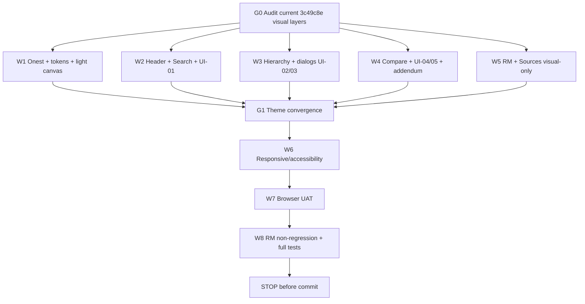

# UI Design Integration Handoff — Lumora Light Editorial System for PSA Classification Search

**Project:** PSA Statistical Classifications Search + RM Assistant  
**UI worktree:** `D:\dev\historical_phclassif-ui`  
**Current UI checkpoint:** `feature/ui-refinement-liquid-glass`  
**Current UI commit:** `3c49c8e3f22749e1cd48217ccd06d83643a3c9f9`  
**Accepted RM baseline:** `pre-staging-v10.1` / `79193fb6cd3f96f8733153a928f5026ee708f8e8`  
**Target branch:** `feature/ui-refinement-lumora-light`  
**Visual source:** user-supplied Lumora light-palette / Onest design specification  
**Purpose:** Replace the currently deployed dark/Instrument-Serif liquid-glass visual direction with a lighter, cleaner, Onest-only editorial utility interface while preserving the accepted UI-01–UI-05 interaction contracts and RM v10.1 behavior.

---

# 0. Core design decision

The current dark liquid-glass direction is no longer the target visual system.

The new visual system must be based on the supplied Lumora reference:

```text
near-white canvas
warm light surfaces
deep near-black ink
burnt-orange accent
Onest as the only primary typeface
large rounded cards
pill controls
quiet hairline borders
subtle spring-like motion
generous whitespace
clear hierarchy
```

The supplied Lumora specification is a **visual and interaction reference**, not a request to turn the PSA classification application into a marketing landing page.

Keep:

```text
R
Shiny
bslib
existing classification/RM architecture
existing UI-01 through UI-05 feature contracts
existing Shiny IDs
```

Do NOT migrate to:

```text
React
TypeScript
Vite
Tailwind
Framer Motion
Lenis
```

Do NOT add the Lumora marketing content:

```text
portfolio
services marketing copy
agency stats
request-project form
partner logos
remote hero photos
cursor-reveal canvas
marketing footer
fake live clock
careers/contact navigation
```

Translate the **design language**, not the marketing information architecture.

---

# 1. Typography — mandatory replacement

The current display-serif typography is rejected.

Remove Instrument Serif from the application.

The application should use **Onest** as the primary UI and display face:

```css
@import url('https://fonts.googleapis.com/css2?family=Onest:wght@400;500;600;700&display=swap');

:root {
  --font-ui: 'Onest', ui-sans-serif, system-ui, -apple-system, BlinkMacSystemFont, 'Segoe UI', sans-serif;
  --font-display: var(--font-ui);
}
```

No serif display headings.

Use weights intentionally:

```text
400  body / supporting copy
500  navigation / labels / compact headings
600  page headings / result labels / primary actions
700  only for rare strong emphasis or large watermark text
```

Requirements:

- codes remain highly legible;
- classification titles remain Onest;
- table headers remain Onest;
- RM transcript remains Onest;
- buttons/forms remain Onest;
- no mixed serif/sans visual tension;
- external font failure must gracefully fall back to system sans-serif.

---

# 2. Palette — replace dark dominant theme

Use the Lumora reference palette as the canonical visual tokens:

```css
:root {
  --lumora-background: #ffffff;
  --lumora-foreground: #111111;
  --lumora-ink: #0a0a0a;
  --lumora-muted: #8d8d8d;
  --lumora-subtle: #b6b6b6;
  --lumora-line: #e6e5e2;
  --lumora-surface: #f1f0ee;
  --lumora-surface-2: #e3e2df;

  --lumora-accent: #b15f2c;
  --lumora-accent-from: #cf8047;
  --lumora-accent-to: #97501f;

  --lumora-hero-from: #ecebe9;
  --lumora-hero-to: #c9c9c9;

  --lumora-radius-pill: 9999px;
  --lumora-radius-card: 2rem;
  --lumora-radius-card-sm: 1.25rem;
  --lumora-radius-control: .875rem;

  --lumora-shell: 88rem;
}
```

Default application canvas:

```text
#ffffff
```

Primary text:

```text
#111111
```

Use `#0a0a0a` for:

```text
high-emphasis cards
selected/verified panels where useful
primary buttons
modal/menu contrast surfaces
```

Use burnt orange `#b15f2c` for:

```text
focus
active markers
small icons
primary accent rails
selected relationships
important action affordances
```

Do not use orange as a large background everywhere.

---

# 3. Remove the current black/liquid-glass dominance

The existing UI commit may retain useful component structure, responsive logic, focus fixes, UI-01–UI-05 dialogs and tests.

Do NOT delete those functional improvements.

Replace the **visual treatment**:

```text
black page canvas
dark translucent glass everywhere
Instrument Serif headings
plum dominant accent
```

with the Lumora light system.

Glass may remain only as a restrained auxiliary effect, e.g.:

```text
navigation floating controls
small overlays
modal backdrop
```

but the main application should read as:

```text
clean white/light utility interface
```

rather than a dark glass dashboard.

---

# 4. Branch strategy

Work only in:

```text
D:\dev\historical_phclassif-ui
```

Starting state:

```text
feature/ui-refinement-liquid-glass
3c49c8e3f22749e1cd48217ccd06d83643a3c9f9
```

Create:

```text
feature/ui-refinement-lumora-light
```

from the current UI commit:

```powershell
git switch -c feature/ui-refinement-lumora-light
```

Do not develop directly in:

```text
D:\dev\historical_phclassif
D:\dev\historical_phclassif-rm-v10
```

Do not alter:

```text
feature/pre-staging-hardening
pre-staging-v10.1
```

---

# 5. Preserve all accepted functional UI work

The following accepted functionality must remain:

```text
UI-01 Search filter/sidebar refinement
UI-02 hierarchy browser
UI-03 PSOC/PSIC details and comparison dialogs
UI-04 Compare Editions relationship inspector
UI-05 correspondence guidance
canonical PSGC current-first release ordering
shared dialog focus restoration
mobile table local scrolling
View details actions
responsive hierarchy/modal behavior
```

The redesign must not regress them.

---

# 6. Header / main navigation

Translate the Lumora header into the PSA application.

Desktop concept:

```text
[ PSA mark / Statistical Classifications ]

[ Search ] [ PSOC + PSIC ] [ Compare Editions ] [ RM Assistant ] [ Sources ]

[ Menu / compact utility control if needed ]
```

Visual behavior:

- white or translucent-white header surface;
- thin `#e6e5e2` border;
- radius `.875rem` to pill where appropriate;
- black text;
- active tab represented by more than color alone:
  - dark ink fill + white text, OR
  - accent marker + weight + background;
- subtle hover lift no more than 2px;
- no dark full-page glass pill.

Mobile:

- compact menu trigger;
- full-width accessible menu/sheet;
- current section obvious;
- 44px practical hit targets;
- no horizontal overflow.

Do not add a live clock.

---

# 7. Search landing / hero area

Replace the current dark editorial hero with a **light Lumora-inspired utility hero**.

Suggested surface:

```text
background:
  linear-gradient(180deg, #ecebe9 0%, #f1f0ee 55%, #ffffff 100%);
```

Use:

```text
large Onest heading
short utility-focused subtitle
large pill search field
small current-system/current-edition context
```

No remote photo.

No canvas liquid-reveal.

No giant marketing watermark unless it improves the utility. If used, the watermark should be relevant, e.g.:

```text
CLASSIFICATIONS
```

at very low opacity and must never reduce readability.

Suggested heading hierarchy:

```text
Find the official classification code
```

or preserve the application's current approved title wording if already contractually pinned.

Search field:

- large pill;
- white surface;
- fine line border;
- subtle shadow;
- black query text;
- accent focus ring;
- existing input ID unchanged.

---

# 8. Search workspace

Desktop layout:

```text
light sidebar / filter card
main result table
selected-entry panel
```

## Sidebar

Lumora-style:

```text
background: #f1f0ee
border: 1px solid #e6e5e2
border-radius: 1.25rem or 2rem
```

Use compact uppercase or medium labels only where readable.

System selector must remain:

```text
acronym
full official title
```

No clipped options.

## Results

Main table on:

```text
#ffffff
```

Rows:

```text
hairline separators
very subtle alternating fill if needed
```

Selected row:

```text
#f1f0ee or warm accent-tinted fill
small burnt-orange rail / dot
```

Do not flood selected rows with orange.

Codes can use weight 600.

---

# 9. Dark ink cards — use selectively

The Lumora reference uses black cards as emphasis against a light page.

Apply this selectively to the PSA utility.

Good candidates:

```text
verified RM classification cards
important selected-entry summary
relationship summary header
modal action footer
empty-state instructional feature card
```

Do NOT make every surface black.

Ink-card recipe:

```css
background: #0a0a0a;
color: #fff;
border-radius: 1.25rem;
```

Secondary text:

```text
rgba(255,255,255,.55)
```

Orange accent only for small status markers/icons.

---

# 10. Buttons

Adopt Lumora pill-button behavior.

Primary:

```text
black fill
white text
rounded pill
optional small white arrow disc
```

Secondary:

```text
transparent / white
1px #e6e5e2 border
black text
```

Accent action when appropriate:

```text
burnt-orange fill
white text
```

Use subtle hover spring:

```text
scale <= 1.03
translate <= 2px
```

Disable hover transforms on touch media.

Preserve button IDs and event wiring.

---

# 11. Forms / selects

All selectize/native controls should use the Lumora control language:

```text
background: #fff or rgba(241,240,238,.5)
border: 1px solid #e6e5e2
border-radius: .875rem
padding generous enough for 40–44px controls
focus:
  border-color rgba(17,17,17,.3)
  outline 2px solid #b15f2c
```

Dropdown menus:

```text
white
soft shadow
1px line border
rounded .875rem
```

Long official titles wrap safely.

---

# 12. PSOC + PSIC

Use a light two-card composition.

Desktop:

```text
PSOC                         PSIC
[light rounded panel]        [light rounded panel]
```

Each panel:

- classification heading;
- result table;
- selected state;
- View details action close to selection summary.

When both selected:

- comparison action should be visually obvious;
- use black pill button or orange-accent action;
- do not imply equivalence.

The safeguard:

```text
A PSOC code does not imply an equivalent PSIC code, and vice versa.
```

must remain prominent.

Suggested safeguard surface:

```text
#f1f0ee
orange rail
black text
```

rather than a dark glass warning.

---

# 13. Hierarchy browser

Keep the existing hierarchy mechanics.

Visual translation:

Desktop:

```text
white modal
rounded 2rem
left tree pane on #f1f0ee
right detail pane white
```

Selected tree row:

```text
warm light fill
orange left rail or dot
font-weight 600
```

Expansion:

- opacity/translate only;
- no excessive animation.

Mobile:

- full-screen light sheet;
- fixed accessible header;
- close button;
- View in Search primary black pill.

Focus restoration and Escape behavior remain mandatory.

---

# 14. Details dialogs

Replace dark-glass dialog plates with Lumora light modal cards:

```text
white panel
2rem radius
soft shadow
fine line border
```

Top:

```text
small system label
large code
title
```

Metadata can use compact muted rows.

Primary action dark pill.

Close button light circular control.

On mobile:

```text
near-full-screen sheet
```

No bleed-through from page content.

---

# 15. Compare Editions — incorporate the pending follow-up changes

This design integration must also include the Compare Editions corrections from the prior follow-up addendum.

## Direction control

The Direction selector must be wide enough for:

```text
2019 PSIC → PSIC Revision 5 (2026)
```

Desktop:

```text
full available width
```

Mobile:

```text
100% width
stacked
no clipping
```

## Provenance presentation

Do not show Provenance as a separate primary user-facing metadata field.

Underlying provenance data remains intact.

Primary inspector content:

```text
Relationship
Confidence
Derived correspondence note
UN ISIC corroboration when verified
statistical-use safeguard
```

## Evidence copy

Do not display internal diagnostic details such as:

```text
section graph
normalized-token similarity
search method
class_prefix_continuity
internal ranking mechanics
```

Preferred concise wording when supported:

```text
Derived correspondence
This relationship was derived from verified classification correspondence evidence.

Corroboration
Supported by the official UN ISIC Rev.4 to Rev.5 correspondence.
```

If UN corroboration is absent:

```text
This relationship was derived from the verified classification correspondence.
```

Do not fabricate corroboration.

## Confidence

Show:

```text
High
Medium
Low
```

as ordinal text, not probability.

---

# 16. Compare Editions layout

Desktop:

```text
filters
  Direction full-width where needed

table | relationship inspector
```

The inspector should feel like a Lumora editorial information card:

```text
large code/title
relationship tag
confidence
short narrative
statistical-use note
```

Avoid dense metadata tables.

For split/merge:

- complete related group remains visible;
- use clean grouped cards/rows;
- preserve correspondence cardinality.

Mobile:

```text
filters stacked
table/list
inspector as sheet
```

---

# 17. Correspondence guidance UI-05

Use a light disclosure/panel.

Header:

```text
How to read this table
```

Inside:

```text
Relationship
Confidence
Derived correspondence
Statistical-use note
```

Do not restore a large page-expanding provenance explanation.

Use small information icons only where necessary.

---

# 18. RM Assistant styling

RM behavior is read-only in this phase.

Do not modify:

```text
assistant execution
turn state
clarification
render suppression
provider flow
retrieval
```

Visual target:

```text
white chat viewport
very light conversation background
user message: #f1f0ee
assistant natural text: white / minimal container
verified classification result: selective dark ink card
clarification options: light pills/cards with dark selected/hover state
```

Verified card hierarchy:

```text
system label
code
official label
level / status / edition
source
```

No serif.

No plum.

No `svg`.

No duplicate/empty assistant bubbles.

No raw tool traces.

---

# 19. Sources

Lumora-inspired source deck:

```text
white page
large rounded cards
#f1f0ee secondary surfaces
black headings
orange small source/status markers
```

Use dark ink cards only for strong summary/audit sections if useful.

No marketing-style portfolio imagery.

---

# 20. Motion

Use the reference motion **feel**, not its marketing animation volume.

No Lenis.

No canvas.

No full-screen fake loader.

No artificial 1300ms delay.

Allowed:

```text
section opacity + y 8–20px
dialogs opacity + scale .98 -> 1
buttons 1.02–1.03 hover scale
arrow translation 2–3px
small row fill transitions
```

Suggested curves:

```text
cubic-bezier(.22,1,.36,1)
cubic-bezier(.16,1,.3,1)
```

Reduced motion:

```css
@media (prefers-reduced-motion: reduce) {
  *, *::before, *::after {
    animation: none !important;
    transition-duration: .01ms !important;
    scroll-behavior: auto !important;
  }
}
```

Content must remain visible when motion is disabled.

---

# 21. Loader

Do NOT implement a fake Lumora `000 → 100` loader merely for aesthetics.

If a loading overlay is needed, it must reflect real Shiny/app readiness.

Preferred:

```text
small dark loading panel
PSA/classification identity
actual connection/loading state
```

No artificial minimum wait.

No scroll locking longer than necessary.

---

# 22. Adaptive sizing

The reference uses aggressive viewport-driven root font scaling.

Do not apply it blindly to the entire Shiny/Bootstrap document because it may destabilize DataTables, selectize, modals, and accessibility zoom.

Instead:

- use rem-based tokens;
- use `clamp()` for large headings/padding where appropriate;
- retain validated breakpoints;
- preserve browser zoom;
- do not override user text scaling.

Suggested breakpoints remain:

```text
1024
768
640
375
320
```

The visual proportions should resemble the reference without globally hijacking Bootstrap's root font size.

---

# 23. Responsive targets

Verify at:

```text
1440
1366
1024
768
640
375
320
```

Required:

```text
no page-level horizontal overflow
mobile menu usable
search hero compact enough
filters stacked cleanly
Direction full-width
PSOC/PSIC panels stack
hierarchy sheet works
details sheets work
Compare inspector works
RM transcript readable
Sources readable
status labels do not break mid-word
```

Local horizontal scroll is permitted only for data grids that genuinely require it.

---

# 24. Accessibility

Required:

```text
WCAG AA for functional text
Onest fallback remains usable
visible orange focus ring
focus restoration across dialogs
Escape close
status not conveyed by color alone
44px practical touch targets
screen-reader labels preserved
skip-link preserved where present
no text dependent on transparent backgrounds for contrast
reduced-motion support
```

Do not copy the reference's low-opacity text if it fails contrast in this app.

---

# 25. CSS architecture

Reuse/rework the existing UI stylesheets rather than adding an uncontrolled sixth/seventh theme layer.

Recommended ownership:

```text
www/ui-tokens.css
  -> replace dark/plum/serif tokens with Lumora palette and Onest

www/ui-glass.css
  -> reduce to auxiliary overlay/translucent helpers OR rename responsibility if necessary

www/ui-motion.css
  -> Lumora-like restrained motion

www/ui-filters.css
  -> light filter/select/table responsive treatment

www/ui-dialog.css
  -> white/light modal and inspector system

www/app.css
  -> legacy structural rules only where needed
```

Do not leave conflicting dark-theme rules active underneath the light theme.

The final cascade should be understandable.

---

# 26. Implementation DAG



---

# 27. Token discipline

Before editing:

- map current CSS file responsibilities;
- identify every Instrument Serif reference;
- identify every dark canvas/plum token;
- identify every `.psa-liquid-glass` use;
- determine which glass uses are structural versus purely visual.

Do not simply append a new theme override to the bottom of a giant stylesheet.

Prefer replacing/reconciling the token source and deleting obsolete conflicting visual rules where safe.

---

# 28. Tests

Add/update structural tests for:

```text
Onest import present
Instrument Serif absent
serif display tokens absent
Lumora palette tokens present
body/background is light
functional text is dark
burnt-orange focus/accent token present
existing UI IDs unchanged
UI-01 through UI-05 hooks remain
Direction full-width class exists
Provenance not rendered as standalone primary field
Relationship and Confidence remain
internal evidence jargon absent from normal inspector
UN corroboration conditional rendering
dialog focus hooks remain
mobile nowrap/status hooks remain
RM UI hooks unchanged
```

Avoid brittle screenshot/hex-only tests when semantic classes can be tested.

---

# 29. Browser UAT

Run the app and inspect:

```text
Search
PSOC + PSIC
Compare Editions
RM Assistant
Sources
Hierarchy browser
single details dialog
dual comparison dialog
```

At desktop and mobile sizes.

Specific acceptance:

## Search

- Onest feels natural.
- No awkward serif headings.
- hero is light and readable.
- filters readable.
- selected rows visible without being loud.

## Compare Editions

- Direction text fits.
- no separate provenance row.
- relationship details are narrative, not metadata-table heavy.
- confidence readable.
- UN ISIC corroboration concise.
- no internal debug wording.

## RM

If provider unavailable locally, at minimum verify unavailable state.

Actual transcript visual UAT remains required on keyed deployment.

---

# 30. RM non-regression

Run the accepted matrix:

```text
mayor -> 1111 / 84113

teacher -> 2330 / 8531
latter -> 85314
statistician at PSA -> 2122 / 8411

carpenter -> 7115
residential -> unresolved

outsourced janitor
-> wage payer first
-> agency pays -> 78200

palay
-> upland -> 6111 / 01123

corn -> 6112 / 01130

six-item batch
-> 8325, 9335, 8141, 5247, 2124, 3424

angkas after batch -> 8323
```

No RM behavior change permitted.

Semantic authority remains OFF.

---

# 31. Full engineering gate

Run:

```powershell
Rscript scripts/run_tests.R
Rscript -e "renv::status()"
git diff --check
git status --short
git diff --stat
```

Required:

```text
FAIL 0
WARN 0
SKIP 0
```

No dependency addition unless explicitly justified.

Regenerate `manifest.json` only through the canonical `rsconnect::writeManifest()` workflow if runtime files change.

---

# 32. Stop boundary

Do NOT:

```text
git commit
git push
git tag
git merge into feature/pre-staging-hardening
republish Connect Cloud
deploy production
merge main
enable semantic authority
change provider/model
```

Leave the Lumora-light candidate uncommitted for review.

---

# 33. Required final report

Return:

1. starting branch/HEAD;
2. new branch confirmation;
3. current-theme audit;
4. Instrument Serif removal;
5. Onest implementation;
6. palette/token implementation;
7. dark/glass retirement strategy;
8. header result;
9. Search hero result;
10. UI-01 result;
11. UI-02 result;
12. UI-03 result;
13. Compare Direction result;
14. Provenance presentation result;
15. Relationship-detail simplification;
16. confidence presentation;
17. UN ISIC corroboration result;
18. UI-05 result;
19. RM visual result;
20. Sources result;
21. button/control system;
22. motion result;
23. responsive matrix;
24. accessibility result;
25. files changed;
26. dependencies;
27. tests added/updated;
28. targeted tests;
29. browser UAT;
30. RM non-regression;
31. full tests;
32. renv status;
33. git diff check;
34. manifest status;
35. remaining visual issues;
36. ready for controlled commit?;
37. semantic authority confirmation;
38. RM behavior unchanged confirmation;
39. no commit/push/tag/merge/deploy confirmation.

Stop there.

---

# 34. Definition of done

This phase succeeds when the PSA application:

```text
uses Onest throughout
has a light Lumora-inspired editorial utility aesthetic
uses black ink cards selectively
uses burnt orange as restrained accent
retains all accepted UI-01 through UI-05 behavior
implements the Compare Editions simplification
is clean on mobile
preserves RM v10.1 behavior
keeps semantic authority OFF
```

The result should feel modern, calm, and highly legible rather than visually theatrical.

The statistical classification content remains the authority; the design supports it.
