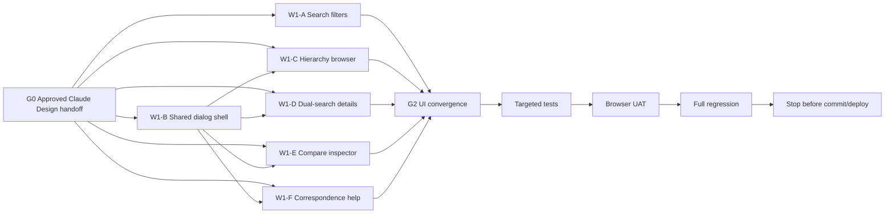

# PSA Statistical Classifications Search — UI Refinement Handoff (UI-01 to UI-05)

**Project:** PSA Statistical Classifications Search  
**Repository:** `D:\dev\historical_phclassif`  
**Branch:** `feature/pre-staging-hardening`  
**Design system:** Subtle Gradient  
**Purpose:** Refine discoverability, hierarchy browsing, detail inspection, and correspondence guidance without changing classification semantics, search authority, or RM grounding.

---

## 1. Recommended handoff sequence

This change set should go through **Claude Design first**, then **Claude Code**.

```text
Current UI
  ↓
Claude Design
  interaction + visual refinement
  ↓
Human approval
  ↓
Claude Code
  implementation on current branch
  ↓
Targeted UI tests
  ↓
Full regression
  ↓
Human visual UAT
  ↓
Stop before commit/deploy unless explicitly approved
```

Claude Design is the correct first handoff because UI-01 to UI-05 contain material interaction decisions: filter information architecture, hierarchy browsing, modal/dialog behavior, relationship inspection, contextual help, and responsive layouts.

Claude Code should treat the approved Claude Design handoff as the **presentation source of truth** and this Markdown file as the **functional/interaction contract**.

---

## 2. Non-negotiable contracts

Preserve:

- canonical classification codes and labels;
- current/archived semantics;
- Search behavior and result-count contracts;
- PSOC + PSIC independent state;
- PSOC = occupation / what the person does;
- PSIC = industry / establishment economic activity;
- PSCC hierarchy and cross-reference semantics;
- PSCC vs PSCCS distinction;
- PTSCS/PSCrCS component semantics;
- RM grounding: no retrieved/verified code = no authoritative code;
- accessibility;
- zero-horizontal-overflow contracts;
- Subtle Gradient design tokens unless the approved Claude Design handoff explicitly refines them.

Do not visually imply:
- PSOC automatically maps to PSIC;
- correspondence automatically permits redistribution of historical statistics;
- Split/Merged/Reclassified are errors;
- Confidence is a statistical probability.

---

# UI-01 — Search Filter Refinement

## Problem

The Search sidebar is cramped. Long classification names truncate. PSGC release rows have unnecessary divider lines, and the release list should prioritize the newest/current release.

## Required changes

### PSGC release list
- Remove per-row horizontal divider lines.
- Use spacing, hover state, selected-row state, radio state, and explicit `CURRENT` / `ARCHIVED` text.
- Do not rely on color alone.

### Release ordering
Sort newest/current to oldest using canonical effective-date/release-order metadata.

Do **not** sort display labels lexically.

### System selector
Show:
- acronym;
- full official title.

Preferred selected state:

```text
PSIC
Philippine Standard Industrial Classification
```

Dropdown options should use the same two-line treatment.

Prefer wrapping over ellipsis on normal desktop widths.

### Sidebar width
Desktop target: approximately 300–320 px, or the smallest width that keeps full titles readable while preserving the results/detail layout.

### Type-ahead
Preserve searchable/type-ahead behavior by acronym and title terms.

---

# UI-02 — Hierarchical Browse Dialog

## Problem

Hierarchical classifications are currently presented too flatly.

## Required interaction

Add a **Browse hierarchy** action for systems with genuine canonical hierarchy.

Open an in-app modal/dialog, not a separate browser popup.

### Desktop
Use a large hierarchy explorer, preferably:

```text
Hierarchy tree | Selected entry
```

Example:

```text
▾ A Agriculture...
  ▾ 01 Crop and Animal...
    ▾ 011 ...
      ▾ 0111 ...
        ● 01112 Growing of peanuts
```

Selected-entry pane shows:
- code;
- label;
- level;
- edition;
- status;
- source;
- `View in Search`.

### Tablet/mobile
- tablet: large dialog or slide-over;
- 375/320 px: full-screen dialog/sheet;
- no forced two-column layout.

### Lazy expansion
Render only top-level nodes initially. Expand children lazily.

### Search within hierarchy
A local hierarchy search should reveal matching nodes together with ancestors.

### View in Search
Selecting `View in Search`:
1. closes the dialog;
2. selects the canonical record in Search;
3. opens its normal detail state.

### Eligibility
Derive hierarchy from repository metadata/parent relationships.

Examples:
- PSIC;
- PSOC;
- PSGC;
- PSCC;
- other genuinely hierarchical systems.

Do not force PTSCS/PSCrCS into artificial trees.

---

# UI-03 — PSOC + PSIC Detail and Comparison Dialogs

## Problem

Selected PSOC/PSIC details appear below long tables and are easy to miss.

## Required changes

### Row selection
Clicking a row selects/highlights it but does not automatically open a modal.

Show an explicit:

```text
View details
```

action near the selected state.

### Single-record detail dialog
PSOC example:

```text
PSOC 2022 — Occupation details

6124
CHICKEN FARMER

Unit group · Current

Classification hierarchy
...

Source
Philippine Statistics Authority

[Close] [View in Search]
```

PSIC uses the equivalent industry structure.

### Dual-selection comparison
When one PSOC and one PSIC row are selected, enable:

```text
Compare selected details
```

Desktop:
- PSOC left;
- PSIC right.

Mobile:
- stacked sections.

Always state:

> A PSOC code does not imply an equivalent PSIC code, and vice versa.

### Below-table details
Remove or substantially reduce the current large permanent below-table detail sections once modal access exists.

---

# UI-04 — Compare Editions Relationship Inspector

## Problem

Relationship details appear below the correspondence table and are easy to miss.

## Required interaction

Use a dedicated **relationship inspector**.

### Desktop
Selecting a correspondence row opens/updates a right-side inspector while the table remains visible.

Suggested width: approximately 380–450 px.

### Tablet/mobile
- tablet: slide-over drawer;
- 375/320 px: full-screen relationship sheet/dialog.

### Preserve review state
Changing selection must not reset:
- query;
- pagination;
- direction;
- table scroll position.

### Inspector content
Show:
- source edition;
- source code/title;
- target edition;
- target code/title;
- relationship;
- provenance;
- confidence;
- hierarchy/level where relevant;
- statistical-use safeguard;
- contextual Ask RM action.

### Relationship-specific structural view

**Split**

```text
Old category
  ├─ New A
  ├─ New B
  └─ New C
```

Show the full verified split group, not one row as if it were one-to-one.

**Merged**

```text
Old A ─┐
Old B ─┼─ New category
Old C ─┘
```

Show all verified contributing sources.

**Reclassified**
Show move/recode structure.

**Continued / unchanged**
Show one-to-one continuity.

Use neutral/plum semantics, never error styling.

### Ask RM
Place:

```text
Ask RM to explain this relationship
```

inside the inspector.

Pass only verified selected correspondence context.

---

# UI-05 — Correspondence Terminology and Guidance

## Problem

The current Relationship / Provenance / Confidence explanations expand vertically and interrupt the review workflow.

## Required redesign

Replace the three large disclosures with one compact control:

```text
ⓘ How to read this table
```

### Help panel

#### Relationship — What changed?
Explain:
- Split;
- Merged;
- Reclassified;
- Continued / unchanged.

#### Provenance — Where did this mapping come from?
Use only provenance states actually supported by the implementation.

Examples may include:
- Official;
- Derived;
- Suggested.

#### Confidence — How strong is the supporting evidence?
Explain the supported states in plain language.

Do not present confidence as a statistical probability.

### Table-header help
Keep small info icons beside:
- Relationship;
- Provenance;
- Confidence.

These should open short tooltips/popovers, not large page-expanding panels.

### Inspector integration
UI-04 should repeat concise contextual explanations for the selected row.

### Statistical safeguard
Keep an explicit note:

> Correspondence metadata does not itself justify automatic redistribution of historical statistical values.

Use informational/neutral/plum styling, not error semantics.

---

## 3. Shared dialog/drawer system

UI-02, UI-03, UI-04, and UI-05 should share a consistent interaction shell where practical:

- Subtle Gradient tokens;
- consistent header/close pattern;
- focus management;
- Escape-to-close;
- backdrop behavior;
- responsive full-screen treatment;
- focus restoration.

Do not over-generalize if one universal component makes the UX harder to maintain.

---

## 4. Accessibility requirements

All dialogs/drawers/help panels must support:

- keyboard activation;
- visible focus;
- focus moves into modal when opened;
- focus trapping where modal;
- `Escape` closes;
- accessible title;
- accessible close label;
- `aria-modal="true"` where appropriate;
- focus returns to originating control after close;
- expand/collapse states exposed accessibly;
- no color-only semantics;
- mobile-friendly touch targets.

Hierarchy expansion must expose accessible expanded/collapsed state.

---

## 5. Responsive acceptance matrix

Verify:

```text
1440
1366
768
375
320
```

At every width:
- no page-level horizontal overflow;
- full system selector remains readable;
- PSGC release selector remains usable;
- hierarchy browser remains usable;
- PSOC+PSIC detail access remains discoverable;
- compare inspector remains usable;
- terminology help remains readable;
- long classification codes/titles wrap safely.

---

## 6. Functional non-regression

Do not change:
- search ranking/retrieval semantics;
- version-selection semantics;
- result counts/materialization caps;
- correspondence mappings;
- relationship/provenance/confidence data;
- RM grounding;
- PSOC/PSIC distinction;
- PSCC hierarchy/source-form logic;
- current/archived data;
- source provenance.

UI code may expose existing data more clearly but must not fabricate hierarchy or correspondence.

---

## 7. Graph-engineered implementation plan



### File-ownership rule
Before implementation, Claude Code must map each behavior to the current file owner.

Shared files such as:
- `app.R`;
- `www/app.css`;
- shared UI helpers;
- shared dialog helpers

must have one convergence owner.

Parallel agents should edit isolated modules/tests or return patch proposals.

---

## 8. Token-efficient worker protocol

Each worker receives only:
1. this specification;
2. approved Claude Design handoff;
3. owned files;
4. directly relevant tests.

Exploration rule:

```text
find exact UI function/id/class
-> open defining file
-> open direct dependencies
-> open targeted tests
-> stop
```

Each worker returns:
- files read;
- files changed/proposed;
- interaction contract implemented;
- functional selectors preserved;
- targeted tests;
- responsive findings;
- unresolved issue;
- handoff notes.

No parallel worker runs the full suite.

---

## 9. Claude Design deliverables before coding

### UI-01
- Search sidebar desktop;
- full-title System selector open/closed;
- PSGC release list;
- 375/320 mobile filter state.

### UI-02
- desktop hierarchy browser;
- mobile hierarchy browser;
- collapsed/expanded nodes;
- selected-entry state.

### UI-03
- PSOC single detail;
- PSIC single detail;
- dual comparison;
- mobile stacked comparison.

### UI-04
- desktop relationship inspector;
- Split;
- Merged;
- mobile full-screen inspector.

### UI-05
- compact help trigger;
- full help panel;
- header tooltips/popovers;
- terminology treatment inside UI-04.

Claude Design must not alter classification semantics.

---

## 10. Claude Code implementation gates

### Gate A — targeted tests
Add/update tests for:
- release ordering;
- system-title rendering;
- hierarchy eligibility;
- dialog open/close;
- `View in Search`;
- PSOC/PSIC comparison safeguard;
- correspondence inspector state preservation;
- Split/Merged grouping;
- terminology/help semantics;
- accessibility hooks.

### Gate B — browser UAT
Verify all five widths.

### Gate C — full regression
Run the project’s current full test command.

Required:

```text
FAIL 0
WARN 0
SKIP 0
```

Pass count may increase.

Then run:

```text
renv::status()
```

Do not regenerate `manifest.json` unless dependency state genuinely changes.

---

## 11. Stop condition

Do not:
- commit;
- push;
- tag;
- merge;
- deploy;
- republish Connect Cloud.

Return the engineering report first.

---

## 12. Required Claude Code final report

1. pre-flight state;
2. approved Claude Design handoff used;
3. owner map;
4. files changed;
5. UI-01 implementation;
6. UI-02 implementation;
7. UI-03 implementation;
8. UI-04 implementation;
9. UI-05 implementation;
10. shared dialog/drawer infrastructure;
11. responsive UAT matrix;
12. accessibility checks;
13. targeted tests;
14. full regression;
15. `renv::status()`;
16. deviations from approved design;
17. unresolved UX issues;
18. confirmation that no commit/push/tag/merge/deploy occurred.
