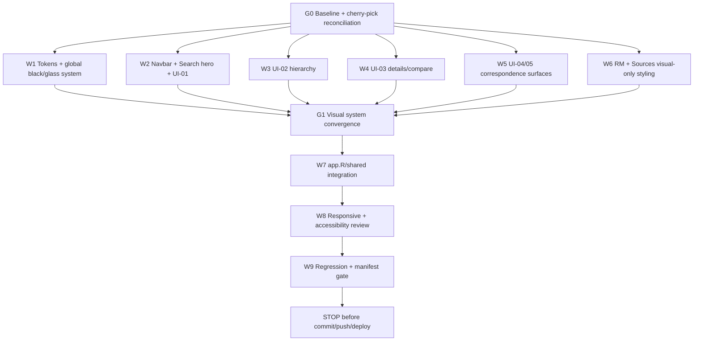

# UI Refinement — Liquid Glass / Editorial Black Interface Handoff

**Project:** PSA Statistical Classifications Search + RM Assistant  
**Repository:** `D:\dev\historical_phclassif`  
**Stable RM baseline:** `pre-staging-v10.1`  
**Stable RM commit:** `79193fb6cd3f96f8733153a928f5026ee708f8e8`  
**Existing UI checkpoint:** `feature/ui-refinement-ui01-ui05` @ `257c67a3e1351a8662f2a0baa494da7151a886d4`  
**Target:** Integrate UI-01 through UI-05 onto the accepted RM baseline, then restyle the application with a dark editorial “liquid glass” visual system inspired by the supplied reference prompt.

---

# 0. Core decision

The supplied React/Tailwind/Framer reference is a **visual-design reference**, not a request to migrate the application stack.

Keep the existing application architecture:

```text
R
Shiny
bslib
existing JavaScript helpers
existing classification registry/retrieval/RM architecture
```

Do **not** migrate the app to:

```text
React
TypeScript
Vite
Tailwind
framer-motion
lucide-react
```

Translate the reference aesthetic into the existing Shiny app using CSS, minimal JavaScript, bslib components, and the app’s existing icon system.

---

# 1. Non-negotiable functional protection

The accepted RM behavior at `pre-staging-v10.1` is now the functional authority.

The UI implementation must not alter:

```text
assistant execution
clarification lifecycle
RM deterministic rendering
RM turn state
RM routing
PSOC/PSIC coding rules
hybrid retrieval
semantic authority state
canonical verification
classification ranking
edition correspondence
provenance/confidence data
batch behavior
```

Semantic authority remains **OFF**.

The UI branch must preserve the live-accepted behavior, including:

```text
mayor -> 1111 + 84113
teacher clarification -> bounded state
latter -> 85314 with PSOC 2330 preserved
statistician at PSA -> 2122 + 8411
carpenter residential -> remains conservative
outsourcing -> wage payer first
no SVG transcript artifacts
no automatic contradictory LLM prose
```

---

# 2. Worktree and branch strategy

Work in the existing UI worktree:

```text
D:\dev\historical_phclassif-ui
```

Do not develop in:

```text
D:\dev\historical_phclassif
D:\dev\historical_phclassif-rm-v10
```

## 2.1 Start from the accepted RM baseline

The existing UI checkpoint was created from an older baseline, so do not continue directly on `257c67a` without reconciling it with `pre-staging-v10.1`.

Create a fresh UI integration branch in the UI worktree:

```text
feature/ui-refinement-liquid-glass
```

from:

```text
pre-staging-v10.1
79193fb6cd3f96f8733153a928f5026ee708f8e8
```

Then bring over the accepted UI checkpoint:

```text
257c67a3e1351a8662f2a0baa494da7151a886d4
```

Preferred method:

```text
cherry-pick the UI checkpoint onto the v10.1-based UI integration branch
```

Conflicts in `app.R`, `manifest.json`, or shared UI files must be resolved manually with this priority:

```text
1. preserve RM v10.1 behavior
2. preserve UI-01 to UI-05 behavior
3. apply the new liquid-glass visual layer
```

Never resolve an `app.R` conflict by blindly taking “ours” or “theirs”.

---

# 3. Visual direction

The target is a **dark editorial utility interface** with restrained liquid-glass surfaces.

The reference qualities to preserve are:

```text
near-black canvas
white editorial typography
serif display headings
subtle glass surfaces
fine luminous border treatment
soft radial glow
large rounded geometry
calm motion
high whitespace discipline
minimal visual noise
```

The resulting app must still feel like an official statistical classification utility, not a marketing landing page.

Do not add unrelated hero videos, newsletter forms, social icons, pricing links, sign-up/login controls, or marketing sections from the reference.

---

# 4. Typography

Use `Instrument Serif` only as a display/accent face.

In the main stylesheet:

```css
@import url('https://fonts.googleapis.com/css2?family=Instrument+Serif:ital@0;1&display=swap');
```

Add a resilient fallback:

```css
--font-display: 'Instrument Serif', Georgia, 'Times New Roman', serif;
--font-ui: Inter, ui-sans-serif, system-ui, -apple-system, BlinkMacSystemFont,
           'Segoe UI', sans-serif;
```

Use the display serif for:

```text
page hero headings
major section headings
selected editorial accents
italic emphasis
```

Do not use it for:

```text
classification codes
result tables
filters
forms
buttons
RM transcript body copy
metadata
```

Those remain a legible sans-serif UI font.

The app must remain usable if Google Fonts is blocked.

---

# 5. Global color and design tokens

Create a small token layer rather than scattering raw values.

Recommended starting values:

```css
:root {
  --psa-bg: #050505;
  --psa-bg-elevated: rgba(255, 255, 255, 0.025);
  --psa-panel: rgba(255, 255, 255, 0.035);
  --psa-panel-strong: rgba(255, 255, 255, 0.055);
  --psa-text: rgba(255, 255, 255, 0.96);
  --psa-text-muted: rgba(255, 255, 255, 0.62);
  --psa-text-subtle: rgba(255, 255, 255, 0.40);
  --psa-line: rgba(255, 255, 255, 0.10);
  --psa-line-strong: rgba(255, 255, 255, 0.18);
  --psa-focus: rgba(255, 255, 255, 0.88);
  --psa-plum: #8f668f;
  --psa-radius-sm: 12px;
  --psa-radius-md: 18px;
  --psa-radius-lg: 26px;
  --psa-radius-pill: 999px;
}
```

Keep plum as a restrained classification/correspondence accent where the existing design contract requires it.

Do not make plum the dominant background.

---

# 6. Liquid glass component

Create a reusable class with a project-specific name to avoid collisions:

```css
.psa-liquid-glass {
  background: rgba(255, 255, 255, 0.02);
  background-blend-mode: luminosity;
  backdrop-filter: blur(4px);
  -webkit-backdrop-filter: blur(4px);
  border: none;
  box-shadow:
    inset 0 1px 1px rgba(255, 255, 255, 0.10),
    0 18px 50px rgba(0, 0, 0, 0.20);
  position: relative;
  overflow: hidden;
}

.psa-liquid-glass::before {
  content: '';
  position: absolute;
  inset: 0;
  border-radius: inherit;
  padding: 1.4px;
  background: linear-gradient(
    180deg,
    rgba(255, 255, 255, 0.45) 0%,
    rgba(255, 255, 255, 0.15) 20%,
    rgba(255, 255, 255, 0) 40%,
    rgba(255, 255, 255, 0) 60%,
    rgba(255, 255, 255, 0.15) 80%,
    rgba(255, 255, 255, 0.45) 100%
  );
  -webkit-mask: linear-gradient(#fff 0 0) content-box,
                linear-gradient(#fff 0 0);
  -webkit-mask-composite: xor;
  mask-composite: exclude;
  pointer-events: none;
}
```

## 6.1 Accessibility fallback

Provide a non-backdrop-filter fallback:

```css
@supports not ((backdrop-filter: blur(4px)) or (-webkit-backdrop-filter: blur(4px))) {
  .psa-liquid-glass {
    background: rgba(20, 20, 20, 0.96);
  }
}
```

Do not depend on transparency for text contrast.

---

# 7. Ambient background

Do not use the remote marketing videos from the supplied reference.

Instead use a restrained black canvas plus static or very slow ambient radial gradients:

```text
black base
subtle top-center white glow
optional muted plum glow near lower corner
no high-contrast animation
```

Example concept:

```css
body::before {
  content: '';
  position: fixed;
  inset: 0;
  pointer-events: none;
  background:
    radial-gradient(ellipse at 50% -10%, rgba(255,255,255,.055), transparent 46%),
    radial-gradient(ellipse at 85% 70%, rgba(143,102,143,.05), transparent 42%);
  z-index: -1;
}
```

Respect `prefers-reduced-motion` for any animated ambience.

---

# 8. Floating navigation

Translate the reference pill navbar to the actual app.

Desktop:

```text
centered floating navigation shell
max-width aligned with content
rounded pill
liquid glass
logo/product title on left
existing primary tabs on right/center
```

Suggested visual structure:

```text
[ PSA Statistical Classifications ] [ Search | PSOC + PSIC | Compare Editions | RM Assistant | Sources ]
```

Requirements:

```text
preserve all existing tab/input IDs
preserve deep-link/session behavior
current tab clearly visible by more than color alone
keyboard navigation remains native
mobile collapses cleanly
no page-level horizontal overflow
```

Do not introduce marketing controls such as Sign Up or Login unless already required by app functionality.

---

# 9. Search landing / hero treatment

The Search page may borrow the reference’s centered editorial hero geometry.

Recommended hierarchy:

```text
small eyebrow: “Philippine Statistical Classifications”
large serif heading: product/search purpose
one large primary search field
small explanatory subtitle
then the utility/results workspace
```

The large search input should be:

```text
rounded pill or large rounded rectangle
liquid-glass shell
large click target
high-contrast placeholder
clear search icon/action
```

Do not bury filters below the fold on desktop.

After the hero/search area, transition into the functional two-column Search workspace.

---

# 10. UI-01 — Search filter refinement in the new visual system

Preserve all previously accepted UI-01 behavior:

```text
300–320px practical desktop sidebar
acronym + full official system title
search/type-ahead by acronym and title
canonical PSGC release ordering
CURRENT / ARCHIVED text labels
long title wrapping
375px and 320px usability
```

Restyle the sidebar as:

```text
.psa-liquid-glass
rounded-lg/rounded-3xl equivalent
low-contrast section separators
subtle label hierarchy
compact vertical rhythm
```

Avoid boxed cards inside boxed cards unless functionally necessary.

Inputs should use a dark translucent fill and strong focus ring.

---

# 11. UI-02 — Hierarchy browser

Preserve the accepted hierarchy browser behavior.

Restyle:

```text
desktop: large glass modal / centered workspace
mobile: full-screen dark sheet
left: hierarchy tree
right: selected-entry detail pane
```

Use a restrained glow/border on the selected hierarchy node.

Do not use flashy animations for node expansion.

Motion should be:

```text
120–180ms opacity/transform
no large spring movement
reduced-motion safe
```

Keep:

```text
lazy expansion
ancestor reveal
View in Search
accessible aria-expanded state
focus restoration
Escape close
```

---

# 12. UI-03 — PSOC + PSIC details/comparison

Preserve row-selection semantics and explicit View details actions.

Visual treatment:

```text
single details: large glass dialog
comparison: two glass columns inside one modal/sheet
codes prominent but sans-serif/monospace-like
labels large and readable
metadata compact and muted
```

The relationship safeguard must remain prominent:

```text
PSOC does not imply equivalent PSIC.
PSIC does not imply equivalent PSOC.
```

Do not reduce this safeguard to a low-contrast footnote.

---

# 13. UI-04 — Compare Editions inspector

Desktop:

```text
table remains visible
right-side glass inspector
inspector visually separated by spacing, not heavy borders
```

Mobile:

```text
full-screen or near-full-screen glass/dark sheet
```

Preserve:

```text
query
pagination
direction
selection
scroll/review state
Split/Merged/Reclassified/Continued behavior
provenance
confidence
statistical-use safeguard
Ask RM action
```

Relationship badges should be subtle and neutral/plum, not error-colored.

---

# 14. UI-05 — Correspondence terminology/help

Use a compact glass disclosure:

```text
ⓘ How to read this table
```

Inside, explain:

```text
Relationship
Provenance
Confidence
```

Use muted text and strong heading hierarchy.

Do not describe confidence as a statistical probability.

Retain the warning that correspondence metadata does not authorize automatic redistribution of historical statistics.

---

# 15. RM Assistant visual integration

The RM Assistant functionality is already live-accepted. Treat it as read-only from a behavior standpoint.

Only restyle the surface.

Recommended treatment:

```text
chat viewport on black canvas
assistant/user messages as restrained dark/glass surfaces
verified classification blocks as structured glass cards
code/label/status/source hierarchy retained
clarification options as compact accessible buttons/cards
```

Do not reintroduce:

```text
provider prose after deterministic coding
SVG placeholders
empty assistant bubbles
tool traces
raw JSON
```

Do not alter `assistant_handle_turn()` behavior.

---

# 16. Sources page

Convert the existing source card deck to the same visual language:

```text
large rounded glass cards
low-contrast metadata
clear official-title hierarchy
source/status/version badges
comfortable whitespace
```

Avoid decorative motion that distracts from source verification.

---

# 17. Motion system

Do not add Framer Motion.

Use CSS transitions and minimal existing JS only.

Recommended primitives:

```text
fade + y 8–16px on initial section reveal
opacity/scale 0.98 -> 1 for dialogs
hover scale no more than 1.01–1.02 for large surfaces
button hover background alpha change
```

Respect:

```css
@media (prefers-reduced-motion: reduce) {
  *, *::before, *::after {
    animation-duration: 0.01ms !important;
    animation-iteration-count: 1 !important;
    transition-duration: 0.01ms !important;
    scroll-behavior: auto !important;
  }
}
```

---

# 18. Responsive targets

Verify at:

```text
1440
1366
1024
768
375
320
```

Required:

```text
no page-level horizontal scrolling
navbar remains usable
Search hero does not consume excessive vertical space on mobile
sidebar becomes stacked/sheet where needed
hierarchy browser usable
PSOC/PSIC compare stacks vertically
Compare inspector remains usable
RM transcript readable
long official titles wrap safely
classification codes never clip
```

---

# 19. Accessibility

This aesthetic must not reduce usability.

Required:

```text
WCAG AA contrast for functional text
visible keyboard focus
focus entry/restoration for modal/sheet interfaces
Escape close
status not color-only
minimum practical touch targets
no information conveyed only through blur/transparency
reduced-motion support
screen-reader labels preserved
```

Use stronger opaque backgrounds behind small text where necessary.

---

# 20. Performance

Avoid making the app heavier for visual effect.

Do not add:

```text
video backgrounds
large remote image assets
canvas effects
WebGL
animation frameworks
new JS libraries
```

The only optional external visual dependency is the display font, with a local-system fallback.

Keep backdrop blur limited to major glass surfaces.

---

# 21. Shared CSS architecture

Prefer a small organized stylesheet structure rather than one huge append-only file.

Recommended responsibility split:

```text
www/ui-tokens.css       design tokens / typography / global canvas
www/ui-glass.css        liquid glass primitives / panels / pills
www/ui-motion.css       transitions / reduced-motion
www/ui-filters.css      Search/filter-specific refinements
www/ui-dialog.css       hierarchy/details/inspector modal system
```

If the repo already has equivalent files, extend them rather than duplicating responsibilities.

One convergence owner controls global CSS import order.

---

# 22. Implementation DAG



---

# 23. Git conflict protocol

During cherry-pick/reconciliation from the old UI checkpoint:

```text
app.R:
  preserve all v10.1 RM execution/clarification/rendering changes
  reapply only UI wiring from the UI checkpoint

manifest.json:
  do not hand-merge blindly
  resolve source/runtime files first
  regenerate using canonical rsconnect workflow

docs/UI_CONTRACT.md:
  preserve both accepted RM rendering rows and UI contract changes
```

After reconciliation, rerun the full RM matrix before doing visual styling.

If the RM matrix regresses, stop styling and fix the integration conflict first.

---

# 24. RM non-regression gate after UI integration

At minimum verify:

```text
mayor -> 1111 / 84113
teacher -> 2330 / 8531 -> latter -> 85314
statistician after teacher -> 2122 / 8411
carpenter -> residential remains unresolved
outsourced janitor -> wage payer first -> agency pays -> 78200
palay -> upland -> 01123
corn -> 6112 / 01130
six-item batch remains correct
angkas after batch -> 8323
```

No:

```text
svg
empty assistant bubbles
automatic contradictory provider prose
stale clarification contamination
```

---

# 25. UI testing

Add/update structural tests for:

```text
new stylesheet dependency loading
liquid glass class presence on intended major surfaces
navbar tab IDs preserved
Search input/filter IDs preserved
hierarchy modal IDs preserved
PSOC/PSIC detail action IDs preserved
Compare inspector IDs preserved
RM output IDs preserved
responsive helper classes
reduced-motion CSS
accessible focus/ARIA hooks
```

Do not write brittle tests asserting exact pixel values for every visual token.

---

# 26. Full engineering gate

Run:

```text
Rscript scripts/run_tests.R
Rscript -e "renv::status()"
git diff --check
git status --short
git diff --stat
```

Required:

```text
FAIL 0
WARN 0
SKIP 0
```

Regenerate `manifest.json` only through the canonical rsconnect workflow after the final runtime file inventory is settled.

---

# 27. Browser UAT still required

Claude Code may perform structural/local testing, but final visual acceptance requires browser review.

Browser UAT should review:

```text
1440 / 1366 desktop
768 tablet
375 / 320 mobile
normal browser
incognito
```

Check:

```text
visual hierarchy
glass readability
font fallback
responsive overflow
modal/sheet behavior
focus states
RM transcript integrity
Compare inspector usability
Search result density
```

---

# 28. Stop boundary

Do NOT:

```text
git commit
git push
git tag
git merge into feature/pre-staging-hardening
republish Connect Cloud
deploy production
enable semantic authority
change model/provider
```

Leave the integrated/restyled UI branch uncommitted for review.

---

# 29. Required report

Return:

1. starting UI worktree/branch/HEAD
2. pre-staging-v10.1 baseline verification
3. old UI checkpoint cherry-pick/reconciliation result
4. conflicts encountered
5. `app.R` RM-preservation review
6. manifest reconciliation method
7. global design tokens implemented
8. typography implementation
9. liquid-glass primitive implementation
10. navbar result
11. Search hero result
12. UI-01 result
13. UI-02 result
14. UI-03 result
15. UI-04 result
16. UI-05 result
17. RM visual-only result
18. Sources visual result
19. motion/reduced-motion result
20. responsive structural result
21. accessibility structural result
22. files changed
23. dependencies added (expected: none)
24. targeted UI tests
25. RM non-regression matrix
26. full test result
27. renv status
28. git diff check
29. manifest status
30. unresolved visual issues
31. browser UAT items still required
32. confirmation semantic authority remains OFF
33. confirmation RM behavior unchanged
34. confirmation no commit/push/tag/merge/deploy

Stop there.

---

# 30. Success definition

The phase succeeds when the app feels visually aligned with the supplied black editorial/liquid-glass reference while remaining recognizably an official statistical utility and preserving every accepted UI/RM functional contract.

The visual design may become more expressive. The classification authority must not.
